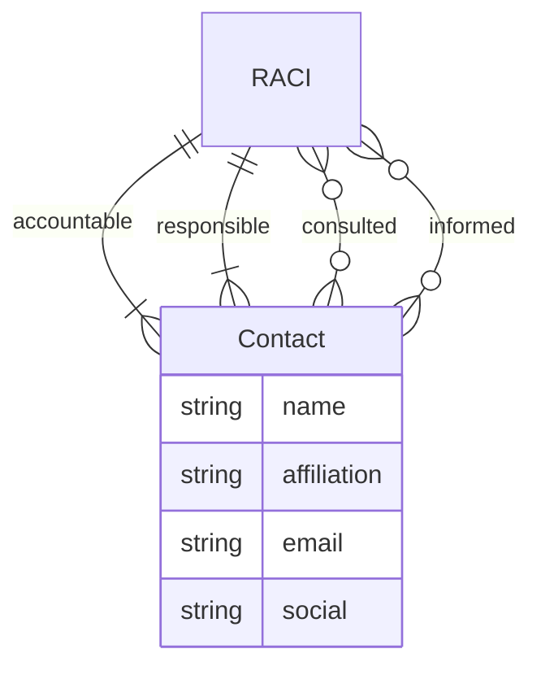

<GovernanceArtifact>

<Purpose>

People and organisations that govern, are interested in, or are affected by a
governed activity, and the role they hold.

</Purpose>

<Role>

A party register is one catalogue of *who*. Each record is a person or
organisation. How they relate is an attribute on that record, not a separate
type:

- **Interested** in the management system (ISO/IEC 27001 and 42001 Clause 4.2)
  — they [place requirements](/docs/artifacts/definitions/define/stakeholder-requirement).
- **Affected** by an AI system (ISO/IEC 42001 Annex A.5.4) — they feed
  [impact assessment](/docs/artifacts/definitions/decide/impact-assessment).
  Many affected parties have no governance duty.
- **Governance role** — sponsor, artefact owner, risk owner, approver,
  escalation. ISO/IEC 27001 Clause 5.3 and ISO/IEC 42001 Clauses 5.1 and 5.3
  asked for a separate role object; that is a field here.
- **RACI on an artefact** — responsible, accountable, consulted, informed.
  Gemara still serialises that assignment as `RACI` / `Contact` on policy,
  risk and measurement records.

A regulator can be interested and never accountable. A data subject can be
affected and only informed. Someone who both owns an AI system and is harmed
by it is one party with two relationship flags.

</Role>

<Examples>

<RevealItem title="FOSS contribution policy contacts" defaultOpen>

A FOSS contribution policy names OSPO as responsible, the guidelines owner as
accountable, Legal and line managers as consulted, and contributors as informed.
Downstream assessment and escalation know who to notify without re-deriving
ownership.

**Source:** [FOSS Contribution Policy](https://github.com/robmoffat/FOSS-Contribution-Gemara/blob/main/policy.yaml) `contacts`.

</RevealItem>

<RevealItem title="Risk owner for data leakage">

A data-leakage risk records an accountable risk owner and responsible control
operators. Severity and appetite alone do not say who must act when the risk
changes. The owner is a party whose governance role is *risk owner*.

**Source:** Risk `owner` on [Risk](/docs/artifacts/definitions/decide/risk) catalogues that adopt Gemara RACI.

</RevealItem>

<RevealItem title="Affected users of an AI system">

An AIMS records customers and data subjects as affected parties of a scoring
system. They place no requirement on the management system and hold no
approval authority; they still appear in the same register so impact
assessment can name them.

</RevealItem>

</Examples>

<LinksUpstream>

- [Organisation Context](/docs/artifacts/definitions/define/organisation-context)
- Organisational role catalogues, OSPO mandates, risk-owner registers, affected-person lists

</LinksUpstream>

<LinksDownstream>

- [Stakeholder Requirement](/docs/artifacts/definitions/define/stakeholder-requirement)
- [Impact Assessment](/docs/artifacts/definitions/decide/impact-assessment)
- [Policy](/docs/artifacts/definitions/decide/policy) `contacts`
- [Risk](/docs/artifacts/definitions/decide/risk) `owner`
- [Communication Requirement](/docs/artifacts/definitions/cross-cutting/communication-requirement)
- Measurement artefacts that record RACI on findings or audits

</LinksDownstream>

<AntiPatterns>

<RevealItem title="Three registers for the same people">

An interested-party list, an affected-party list and a RACI spreadsheet that
all name the same humans. One party, several relationship flags.

</RevealItem>

<RevealItem title="Accountable without responsible">

Naming a senior owner with nobody listed as responsible for the work. A RACI
assignment on an artefact still needs both accountable and responsible
contacts.

</RevealItem>

<RevealItem title="RACI as free text">

Embedding “owned by Security” in a description field instead of structured
contacts. Nothing downstream can route or attest ownership.

</RevealItem>

<RevealItem title="Role without a party">

Recording “executive sponsor” as a floating job title with no person or
organisation attached. Governance role is an attribute of a party.

</RevealItem>

</AntiPatterns>

<RelatedFactors>

- [Governance Has Owners](/docs/factors/governance-has-owners) — RACI is how ownership is expressed on artefacts
- [Build a Governance Twin](/docs/factors/build-a-governance-twin) — owners bind to twins and published artefacts
- [Evidence by Default](/docs/factors/evidence-by-default) — attributable decisions need named parties
- [Context In, Decisions Out](/docs/factors/context-in-decisions-out) — affected parties are context, not implied by the decision record

</RelatedFactors>

<EntityRelationshipDiagram>

Gemara today serialises the assignment as `RACI` attached to other artefacts.

</EntityRelationshipDiagram>

<References>

- [Gemara base types — RACI](https://gemara.openssf.org/schema/base.html)
- [Gemara](/docs/tools/gemara)
- [ISO/IEC 27001 Analysis](/docs/artifacts/iso-iec/iso27001/gap-analysis) — Clauses 4.2 and 5.3
- [ISO/IEC 42001 Analysis](/docs/artifacts/iso-iec/iso42001/gap-analysis) — Clauses 4.2, 5.1, 5.3 and Annex A.5.4

</References>

</GovernanceArtifact>
