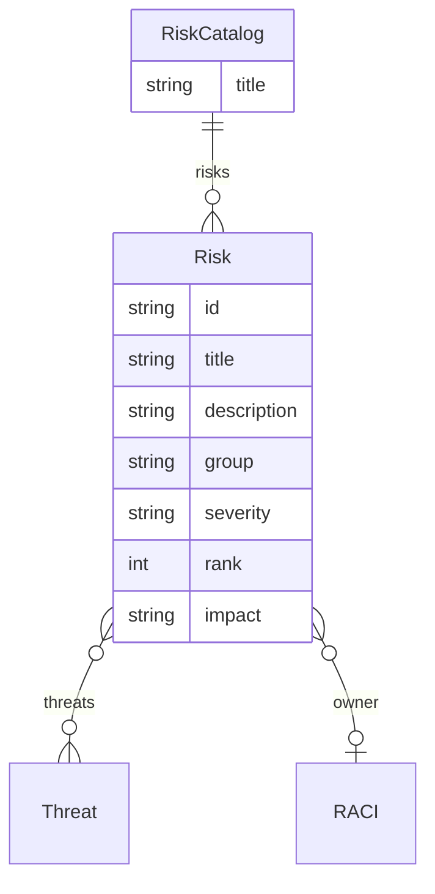

<GovernanceArtifact>

<Purpose>

Organizational risk categories, severity levels, and risk appetite definitions.

</Purpose>

<Role>

Risks are how the organisation talks about exposure it owns—severity, appetite,
owners and threats that materialise them. 

</Role>

<Examples>

<RevealItem title="Disclosure of non-public or sensitive information" defaultOpen>

A FOSS risk catalog records data-leakage as High severity under an Information
Protection group with Low appetite, owned jointly by contributors and project
administrators, and linked to the sensitive-data-disclosure threat. Policy lists
it as a mitigated risk with assessment and enforcement methods. That
organisational category aligns with FINOS OSR *Data Leakage Risk*.

**Source:** [Disclosure of Non-Public or Sensitive Information](https://github.com/robmoffat/FOSS-Contribution-Gemara/blob/main/risk.yaml) (`data-leakage`) in *FOSS Contribution Risk Catalog*; [Data Leakage Risk](https://osr.finos.org/docs/bok/risks/data-leakage-risk) in [*FINOS Open Source Readiness*](https://osr.finos.org/docs/bok/risks/introduction).

</RevealItem>

<RevealItem title="Legal risk (open source)">

License non-compliance, unauthorized IP publication, contributor-agreement
obligations and export-control failures are Layer 2 threats that materialise as
organisational *Legal Risk*—consequences from actions that violate laws,
regulations or binding agreements.

**Source:** [Legal Risk](https://osr.finos.org/docs/bok/risks/legal-risk) in [*FINOS Open Source Readiness*](https://osr.finos.org/docs/bok/risks/introduction); compare [Legal Risk](https://riskfirst.org/risks/Legal-Risk) in [*Risk First*](https://riskfirst.org/risks/Start) (IP, licensing, contracts).

</RevealItem>

<RevealItem title="Reputational risk">

Harm to organisational credibility from contribution quality, public conduct or
abandoned projects. OSR treats this as a first-class open-source risk; Risk First
frames the same exposure as reputational harm attendant to how the organisation
shows up externally.

**Source:** [Reputational Risk](https://osr.finos.org/docs/bok/risks/reputational-risk) in [*FINOS Open Source Readiness*](https://osr.finos.org/docs/bok/risks/introduction); [Reputational Risk](https://riskfirst.org/risks/Reputational-Risk) in [*Risk First*](https://riskfirst.org/risks/Start).

</RevealItem>

<RevealItem title="Security risk">

Risk First names *Security Risk* as loss from hostile agents and events inside
or outside the system—a Layer 3 category under which contribution and platform
threats (credential disclosure, supply-chain compromise) roll up for owners and
appetite.

**Source:** [Security Risk](https://riskfirst.org/risks/Security-Risk) in [*Risk First*](https://riskfirst.org/risks/Start); see also the [glossary of risk types](https://riskfirst.org/risks/Glossary-Of-Risk-Types).

</RevealItem>

<RevealItem title="Operational risk">

Loss from inadequate or failed processes, people, systems or external events.
Both OSR and Risk First use this umbrella for process and control failures that
governance is meant to reduce—distinct from any single Layer 2 threat title.

**Source:** [Operational Risk](https://osr.finos.org/docs/bok/risks/operational-risk) in [*FINOS Open Source Readiness*](https://osr.finos.org/docs/bok/risks/introduction); [Operational Risk](https://riskfirst.org/risks/Operational-Risk) in [*Risk First*](https://riskfirst.org/risks/Start).

</RevealItem>

</Examples>

<LinksUpstream>

- [Threat](/docs/artifacts/definitions/assess/threat) — Layer 2 opportunities for harm
  that materialise as organisational exposure the business owns
- External risk taxonomies such as [FINOS OSR Risks](https://osr.finos.org/docs/bok/risks/introduction)
  and [Risk First](https://riskfirst.org/risks/Start)
</LinksUpstream>

<LinksDownstream>

- [Policy](/docs/artifacts/definitions/decide/policy) `risks.mitigated` / `risks.accepted`
- [Party Register](/docs/artifacts/definitions/cross-cutting/party-register) as optional `owner`

</LinksDownstream>

<AntiPatterns>

<RevealItem title="Risks with no owners">

A severity label and no accountable human. Appetite without ownership is a
spreadsheet, not governance.

</RevealItem>

<RevealItem title="Threat catalogue renamed as risk">

Copying Layer 2 threat titles into Layer 3 without organisational severity,
appetite or owners. The layers collapse.

</RevealItem>

</AntiPatterns>

<RelatedFactors>

- [Governance Has Owners](/docs/factors/governance-has-owners) — risk owners are mandatory
- [Build a Governance Twin](/docs/factors/build-a-governance-twin) — risks bind to the activity twin
- [Govern Sensitive Activities](/docs/factors/govern-sensitive-activities) — risk follows the activity

</RelatedFactors>

<EntityRelationshipDiagram>

</EntityRelationshipDiagram>

<References>

- [Gemara Risk Catalog schema](https://gemara.openssf.org/schema/riskcatalog.html)
- [FINOS Open Source Readiness — Risks](https://osr.finos.org/docs/bok/risks/introduction)
- [Risk First — Software Development Risks](https://riskfirst.org/risks/Start)
- [Gemara](/docs/tools/gemara)

</References>

</GovernanceArtifact>
