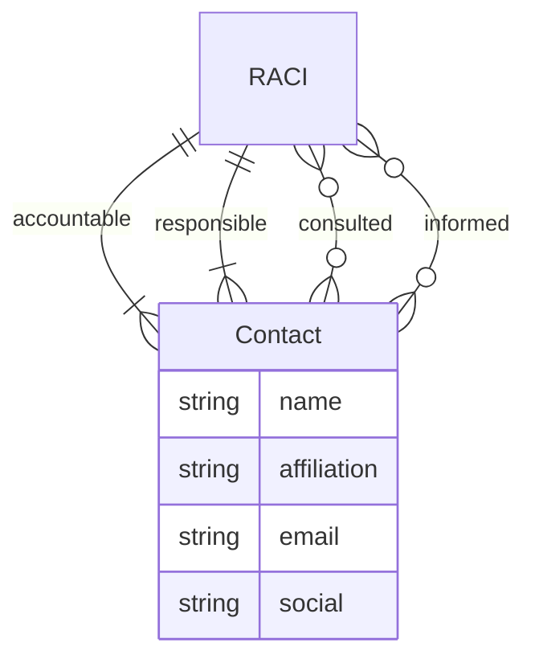

<GovernanceArtifact
  title="RACI"
  gemaraType="RACI"
  layer="cross"
  gemaraUrl="https://gemara.openssf.org/schema/base.html"
>

<Purpose>

Roles responsible for managing a governance artefact: who is responsible,
accountable, consulted and informed.

</Purpose>

<Role>

RACI is a shared Gemara base type, not a catalogue of its own. Other artefacts
attach it where ownership must be explicit—policy `contacts`, risk `owner`, and
similar fields on measurement logs. It keeps accountability machine-readable
instead of implied by org charts or tribal knowledge.

</Role>

<Examples>

<RevealItem title="FOSS contribution policy contacts" defaultOpen>

A FOSS contribution policy names OSPO as responsible, the guidelines owner as
accountable, Legal and line managers as consulted, and contributors as informed.
Downstream assessment and escalation know who to notify without re-deriving
ownership.

**Source:** [FOSS Contribution Policy](https://github.com/robmoffat/FOSS-Contribution-Gemara/blob/main/policy.yaml) `contacts`.

</RevealItem>

<RevealItem title="Risk owner for data leakage">

A data-leakage risk records an accountable risk owner and responsible control
operators. Severity and appetite alone do not say who must act when the risk
changes.

**Source:** Risk `owner` on [Risk](/docs/artifacts/definitions/risk) catalogues that adopt Gemara RACI.

</RevealItem>

</Examples>

<LinksUpstream>

- Organisational role catalogues, OSPO mandates, risk-owner registers

</LinksUpstream>

<LinksDownstream>

- [Policy](/docs/artifacts/definitions/policy) `contacts`
- [Risk](/docs/artifacts/definitions/risk) `owner`
- Measurement artefacts that record RACI on findings or audits

</LinksDownstream>

<AntiPatterns>

<RevealItem title="Accountable without responsible">

Naming a senior owner with nobody listed as responsible for the work. RACI
requires both accountable and responsible contacts.

</RevealItem>

<RevealItem title="RACI as free text">

Embedding “owned by Security” in a description field instead of structured
contacts. Nothing downstream can route or attest ownership.

</RevealItem>

</AntiPatterns>

<RelatedFactors>

- [Governance Has Owners](/docs/factors/governance-has-owners) — RACI is how ownership is expressed on artefacts
- [Build a Governance Twin](/docs/factors/build-a-governance-twin) — owners bind to twins and published artefacts
- [Evidence by Default](/docs/factors/evidence-by-default) — attributable decisions need named parties

</RelatedFactors>

<GemaraStructure>

</GemaraStructure>

<References>

- [Gemara base types — RACI](https://gemara.openssf.org/schema/base.html)
- [Gemara](/docs/tools/gemara)

</References>

</GovernanceArtifact>
