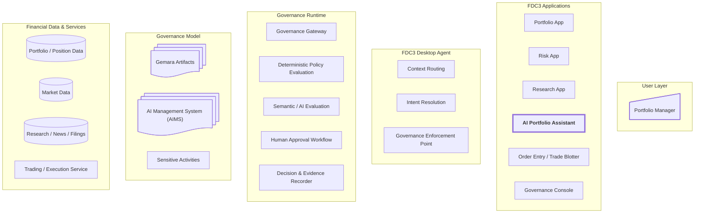

## Diagram

## Key

### User Layer

| Component             | Purpose                                                                                                             |
| --------------------- | ------------------------------------------------------------------------------------------------------------------- |
| **Portfolio Manager** | Human participant in the governed workflow. Retains authority for activities requiring human judgement or approval. |

### FDC3 Applications

| Component                       | Purpose                                                                                                                                              |
| ------------------------------- | ---------------------------------------------------------------------------------------------------------------------------------------------------- |
| **AI Portfolio Assistant**      | **The primary subject of governance in the demo.** Consumes FDC3 context and raises FDC3 intents to use capabilities supplied by other applications. |
| **Portfolio App**               | Displays portfolios, positions and holdings, and shares the user's current portfolio selection through FDC3.                                         |
| **Risk App**                    | Provides deterministic portfolio risk analysis, including exposure, concentration and stress scenarios.                                              |
| **Research App**                | Provides research and supporting information about portfolios and instruments.                                                                       |
| **Order Entry / Trade Blotter** | Receives proposed orders for human review and, where authorised, submission.                                                                         |
| **Governance Console**          | Allows users to inspect governed activities, decisions and supporting evidence.                                                                      |

### Desktop Agent

| Component                        | Purpose                                                                                                  |
| -------------------------------- | -------------------------------------------------------------------------------------------------------- |
| **Context Routing**              | Routes FDC3 contexts such as the selected portfolio or instrument between applications.                  |
| **Intent Resolution**            | Resolves FDC3 requests for capabilities to applications capable of handling them.                        |
| **Governance Enforcement Point** | Ensures sensitive requests are checked by the Governance Gateway before the Desktop Agent forwards them. |

### Governance Runtime

| Component                           | Purpose                                                                                                            |
| ----------------------------------- | ------------------------------------------------------------------------------------------------------------------ |
| **Governance Gateway**              | Evaluates proposed sensitive activities and returns decisions such as **ALLOW**, **DENY** or **REQUIRE APPROVAL**. |
| **Deterministic Policy Evaluation** | Evaluates objective rules such as permissions, approved models, data freshness and explicit authority limits.      |
| **Semantic / AI Evaluation**        | Evaluates requirements requiring interpretation or judgement.                                                      |
| **Human Approval Workflow**         | Routes activities requiring explicit human authority or approval.                                                  |
| **Decision & Evidence Recorder**    | Records evaluations, decisions and supporting evidence for traceability, audit and review.                         |

### Governance Model

| Component                       | Purpose                                                                                                      |
| ------------------------------- | ------------------------------------------------------------------------------------------------------------ |
| **Gemara Artifacts**            | Machine-readable artifacts describing governance requirements and their relationships.                       |
| **AI Management System (AIMS)** | The organisational governance framework within which the AI is managed, aligned to ISO/IEC 42001.            |
| **Sensitive Activities**        | Activities subject to governance, such as recommendation generation, order construction and trade execution. |

### Financial Data and Services

| Component                       | Purpose                                                                                      |
| ------------------------------- | -------------------------------------------------------------------------------------------- |
| **Portfolio / Position Data**   | Source data containing portfolio holdings and positions.                                     |
| **Market Data**                 | Pricing and other market information used for analysis and risk calculations.                |
| **Research / News / Filings**   | Information sources used by the Research App and AI Assistant.                               |
| **Trading / Execution Service** | External capability through which authorised orders can ultimately be submitted or executed. |

## Architectural Separation

The important architectural boundary is:

**FDC3 applications make ordinary FDC3 requests; the Desktop Agent enforces governance; the Governance Gateway makes the decision.**

That keeps the AI Assistant and the individual business applications free from embedded governance logic, while ensuring consequential inter-application actions cannot bypass the governance layer.
