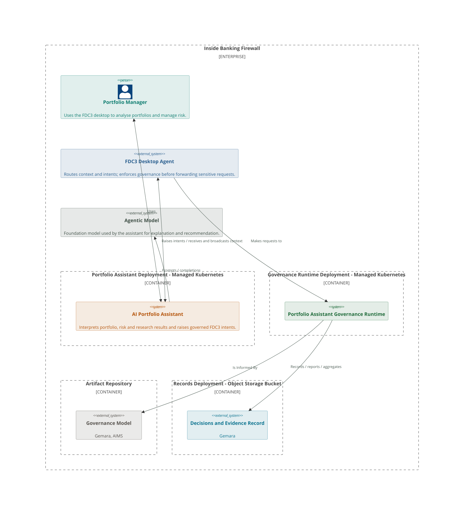

# AI Portfolio Assistant Deployment

High-level deployment context for the AI Portfolio Assistant: what runs inside
the banking firewall, and how the portfolio manager, FDC3 desktop agent and
agentic model relate to the assistant.

## Diagram

## Key

| Component | Purpose | Governance twin |
| --- | --- | --- |
| **Portfolio Manager** | Human user of the desktop. Retains authority for recommendations that require approval and for any path toward order proposal or execution. | — |
| **Portfolio Assistant Deployment (Managed Kubernetes)** | Hosts the AI Portfolio Assistant workload inside the banking firewall. | [CCC Managed Kubernetes](https://ccc.finos.org/catalogs/orchestration/k8s) (shared host) |
| **AI Portfolio Assistant** | Governed AI service that combines deterministic app results with model interpretation. Does not perform financial calculations itself. | [AI Portfolio Assistant](./gemara/components/ai-portfolio-assistant/) |
| **Governance Runtime Deployment (Managed Kubernetes)** | Hosts the Portfolio Assistant Governance Runtime as a separate Kubernetes deployment. | [CCC Managed Kubernetes](https://ccc.finos.org/catalogs/orchestration/k8s) (shared host) |
| **Governance Runtime** | Evaluates proposed sensitive activities (ALLOW / DENY / REQUIRE APPROVAL) and records / reports / aggregates evidence against the Evidence Record. | [Governance Runtime](./gemara/components/governance-runtime/) |
| **Artifact Repository (Governance Model)** | Object store / registry that hosts and serves versioned Governance Model releases (lexicon → policy) and the AIMS envelope for all Gemara components. | [Artifact Repository](./gemara/components/artifact-repository/) |
| **Records Deployment (Decisions and Evidence Record)** | Object-storage bucket that holds evaluation and enforcement evidence; store posture from CCC Object Storage (writers are the Governance Runtime). | [CCC Object Storage](../ccc-obj-stor/) |
| **FDC3 Desktop Agent** | Interoperability layer for context and intents; calls the Governance Runtime before forwarding sensitive requests. | Out of scope for twins |
| **Agentic Model** | External foundation-model capability used for language and reasoning. Subject to model-provider and data-handling controls in the AIMS. | Out of scope for twins |
| **Inside Banking Firewall** | Trust boundary for portfolio data, desktop applications and the assistant runtime. Model access may still cross this boundary under supplier controls. | — |
