import styles from '@site/src/components/ArtifactLayerMap/styles.module.css';

# FOSS Contribution

Machine-readable governance for employee contribution to Free and Open Source
Software, expressed with the [Gemara](/docs/artifacts/gemara) model. Based on
FINOS'
[Open Source Readiness Reference FOSS Policy](https://osr.finos.org/docs/bok/Artifacts/Reference-FOSS-Policy).

## How the artifacts connect

```mermaid
flowchart LR
  Lexicon -->|terms for| Principles
  Lexicon -->|terms for| Guidance
  Principles -->|orient| Guidance
  Vectors -->|cited by| Guidance
  Vectors -->|attack path for| Threats
  Capabilities -->|enable| Threats

  Guidance -->|implemented by| Controls
  Threats -->|mitigated by| Controls
  Threats -->|materialise as| Risks

  Controls -->|imported by| Policy
  Risks -->|mitigated by| Policy
  Guidance -->|informs| Policy

  Policy -->|governs| SensitiveActivity["Sensitive Activity"]
  SensitiveActivity -->|inspected by| EvaluationLog["Evaluation Log"]
  EvaluationLog -->|justifies| EnforcementLog["Enforcement Log"]

  style Lexicon fill:#e1efed,stroke:#0d7c6f,color:#0d7c6f
  style Principles fill:#e1efed,stroke:#0d7c6f,color:#0d7c6f
  style Vectors fill:#e1efed,stroke:#0d7c6f,color:#0d7c6f
  style Guidance fill:#e1efed,stroke:#0d7c6f,color:#0d7c6f

  style Capabilities fill:#e5ebf1,stroke:#2a5f8f,color:#2a5f8f
  style Threats fill:#e5ebf1,stroke:#2a5f8f,color:#2a5f8f
  style Controls fill:#e5ebf1,stroke:#2a5f8f,color:#2a5f8f

  style Risks fill:#e4ede7,stroke:#1f6b3a,color:#1f6b3a
  style Policy fill:#e4ede7,stroke:#1f6b3a,color:#1f6b3a

  style SensitiveActivity fill:#f5ebe1,stroke:#b45309,color:#b45309
  style EvaluationLog fill:#e2eef1,stroke:#0e7490,color:#0e7490
  style EnforcementLog fill:#f2e6e2,stroke:#9a3412,color:#9a3412

  click Lexicon "./lexicon" "Lexicon"
  click Principles "./principles-catalog" "Principles"
  click Vectors "./vectors-catalog" "Vectors"
  click Guidance "./guidance-catalog" "Guidance"
  click Capabilities "./capabilities-catalog" "Capabilities"
  click Threats "./threats-catalog" "Threats"
  click Controls "./controls-catalog" "Controls"
  click Risks "./risks-catalog" "Risks"
  click Policy "./policy" "Policy"
  click SensitiveActivity "/docs/artifacts/definitions/operate/sensitive-activity" "Sensitive Activity"
  click EvaluationLog "./evaluation-commons-lang-pr482" "Evaluation Log"
  click EnforcementLog "./enforcement-internal-tools-pr417" "Enforcement Log"
```

## Artifacts by layer

  

    

      1
      Define
      What good looks like
    

    

      <a className={styles.chip} href="./lexicon">Lexicon</a>
      <a className={styles.chip} href="./principles-catalog">Principles</a>
      <a className={styles.chip} href="./vectors-catalog">Vectors</a>
      <a className={styles.chip} href="./guidance-catalog">Guidance</a>
    

  

  

    

      2
      Assess
      What could go wrong and what would stop it
    

    

      <a className={styles.chip} href="./capabilities-catalog">Capabilities</a>
      <a className={styles.chip} href="./threats-catalog">Threats</a>
      <a className={styles.chip} href="./controls-catalog">Controls</a>
    

  

  

    

      3
      Decide
      What we accept and what we require
    

    

      <a className={styles.chip} href="./risks-catalog">Risks</a>
      <a className={styles.chip} href="./policy">Policy</a>
    

  

  

    

      4
      Operate
      The activity and resources being governed
    

    

      <a className={styles.chip} href="/docs/artifacts/definitions/operate/sensitive-activity">Sensitive Activity: Contribute to Open Source</a>
    

  

  

    

      5
      Evaluate
      Whether the requirements are met
    

    

      <a className={styles.chip} href="./evaluation-commons-lang-pr482">commons-lang PR #482 (Passed)</a>
      <a className={styles.chip} href="./evaluation-internal-tools-pr417">internal-tools PR #417 (Failed)</a>
    

  

  

    

      6
      Enforce
      What happens when they are not
    

    

      <a className={styles.chip} href="./enforcement-internal-tools-pr417">internal-tools PR #417 (Enforced)</a>
    

  

