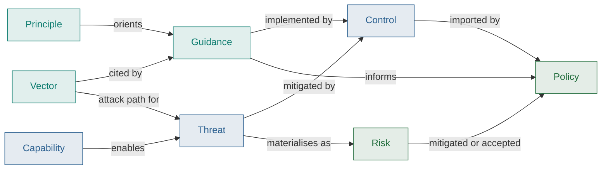
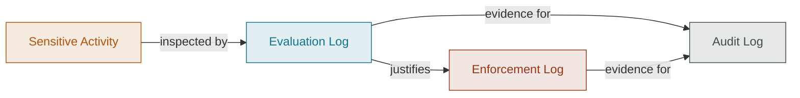

# Gemara Artifacts

[Gemara](https://gemara.openssf.org) is the OpenSSF model and schemas this site
uses for typed, linkable governance records. This is the
[artifact catalogue](/docs/artifacts/definitions/) under the names Gemara gives
it, in the order governance runs: definitions first, then the activity being
governed, then the records that activity produces.

## How the artifacts connect

Principles, vectors and guidance feed controls and risks; policy imports those
controls and treats the risks.

Evaluation inspects an activity instance against policy and controls;
enforcement acts on those results; audit reviews both as evidence of programme
conformance.

## Gemara artifacts by layer

<ArtifactLayerMap filter="gemara" />