# ISO/IEC 27001 Artifacts

[ISO/IEC 27001](https://www.iso.org/standard/27001) sets out what an organisation
must have in place to run an Information Security Management System (ISMS): the
governance covering its information security, and the ownership, scope and review
that keep that governance honest. This is everything an ISMS under the names the standard
gives them — including the ISO/IEC 27005 risk overlay.

## When should I use this?

When your governance has to satisfy somebody outside the team that runs it: a
certification audit, a customer's due-diligence questionnaire, a contractual
security obligation. ISO/IEC 27001 is what those people ask for by name, and
this is the vocabulary they arrive with, so the view lists each artifact under
the name the standard uses rather than its catalogue title.

It is also where to start if you already run an ISMS and want to know which of
these artifacts you are keeping, which you are keeping under another name, and
which are missing.

## Isn't Gemara enough?

For running the governance, largely yes. [Gemara](/docs/artifacts/gemara) models
the principles, guidance, controls, risks and policy you operate, in schemas a
machine can read and a pipeline can act on. What it does not model is the
management system around that work — who owns it, what falls inside its scope,
which objectives it is measured against, how it gets reviewed, and what happens
when it falls short. ISO/IEC 27001 is exactly that envelope, and unlike Gemara it
is certifiable.

So the two are additive rather than alternatives. Some of the artifacts here are
management-system objects the standard adds; the rest are ones it shares with
Gemara under a different name.

## How the artifacts connect

Context frames the scope, the resources in scope are assessed for risk, the
Statement of Applicability selects the controls policy imports, and reviews and
incidents raise corrective action.

```mermaid
flowchart LR
  GovernanceContext["Governance Context"] -->|frames| GovernanceScope["Governance Scope"]
  GovernanceContext -->|identifies| InterestedParty["Interested Party"]
  InterestedParty -->|places| Obligation
  InterestedParty -->|reached through| CommunicationPlan["Communication Plan"]
  InterestedParty -->|qualified by| CompetenceRecord["Competence Record"]

  GovernanceScope -->|covers| GovernedResource["Governed Resource"]
  GovernedResource -->|subject of| RiskAssessment["Risk Assessment"]
  Threat["Information Security Threat"] -->|assessed in| RiskAssessment
  RiskAssessment -->|rates| Risk["Information Security Risk"]

  Obligation -->|addressed in| ApplicabilityProfile["Applicability Profile"]
  Risk -->|treated in| ApplicabilityProfile
  ApplicabilityProfile -->|selects| Control["Information Security Control"]
  Control -->|imported by| Policy["Information Security Policy"]
  Risk -->|mitigated or accepted| Policy

  Obligation -->|sets| ObjectiveMetric["Objective Metric"]
  ObjectiveMetric -->|input to| ManagementReview["Management Review"]
  ManagementReview -->|raises| CorrectiveAction["Corrective Action"]
  Incident -->|raises| CorrectiveAction

  %% Layer 1 — Define (--gf-band-define-soft)
  style GovernanceContext fill:#e1efed,stroke:#0d7c6f,color:#0d7c6f
  style GovernanceScope fill:#e1efed,stroke:#0d7c6f,color:#0d7c6f
  style Obligation fill:#e1efed,stroke:#0d7c6f,color:#0d7c6f
  style ObjectiveMetric fill:#e1efed,stroke:#0d7c6f,color:#0d7c6f

  %% Layer 2 — Assess (--gf-band-assess-soft)
  style Threat fill:#e5ebf1,stroke:#2a5f8f,color:#2a5f8f
  style ApplicabilityProfile fill:#e5ebf1,stroke:#2a5f8f,color:#2a5f8f
  style Control fill:#e5ebf1,stroke:#2a5f8f,color:#2a5f8f

  %% Layer 3 — Decide (--gf-band-decide-soft)
  style RiskAssessment fill:#e4ede7,stroke:#1f6b3a,color:#1f6b3a
  style Risk fill:#e4ede7,stroke:#1f6b3a,color:#1f6b3a
  style Policy fill:#e4ede7,stroke:#1f6b3a,color:#1f6b3a

  %% Layer 4 — Operate (--gf-band-operate-soft)
  style GovernedResource fill:#f5ebe1,stroke:#b45309,color:#b45309
  style Incident fill:#f5ebe1,stroke:#b45309,color:#b45309

  %% Layer 5 — Evaluate (--gf-band-evaluate-soft)
  style ManagementReview fill:#e2eef1,stroke:#0e7490,color:#0e7490

  %% Layer 6 — Enforce (--gf-band-enforce-soft)
  style CorrectiveAction fill:#f2e6e2,stroke:#9a3412,color:#9a3412

  %% Cross-cutting (--gf-band-cross-soft)
  style InterestedParty fill:#eaeae9,stroke:#57534e,color:#57534e
  style CommunicationPlan fill:#eaeae9,stroke:#57534e,color:#57534e
  style CompetenceRecord fill:#eaeae9,stroke:#57534e,color:#57534e

  click GovernanceContext "/docs/artifacts/definitions/define/organisation-context" "Governance Context"
  click GovernanceScope "/docs/artifacts/definitions/define/aims-scope" "Governance Scope"
  click InterestedParty "/docs/artifacts/definitions/cross-cutting/party-register" "Interested Party"
  click Obligation "/docs/artifacts/definitions/define/stakeholder-requirement" "Obligation"
  click CommunicationPlan "/docs/artifacts/definitions/cross-cutting/communication-requirement" "Communication Plan"
  click CompetenceRecord "/docs/artifacts/definitions/cross-cutting/competence-record" "Competence Record"
  click GovernedResource "/docs/artifacts/definitions/operate/governed-resource" "Governed Resource"
  click RiskAssessment "/docs/artifacts/definitions/decide/risk-assessment" "Risk Assessment"
  click Threat "/docs/artifacts/definitions/assess/threat" "Information Security Threat"
  click Risk "/docs/artifacts/definitions/decide/risk" "Information Security Risk"
  click ApplicabilityProfile "/docs/artifacts/definitions/assess/applicability-profile" "Applicability Profile"
  click Control "/docs/artifacts/definitions/assess/control" "Information Security Control"
  click Policy "/docs/artifacts/definitions/decide/policy" "Information Security Policy"
  click ObjectiveMetric "/docs/artifacts/definitions/define/management-objective" "Objective Metric"
  click ManagementReview "/docs/artifacts/definitions/evaluate/management-review" "Management Review"
  click CorrectiveAction "/docs/artifacts/definitions/enforce/corrective-action" "Corrective Action"
  click Incident "/docs/artifacts/definitions/operate/incident" "Incident"
```

## ISO/IEC 27001 artifacts by layer

<ArtifactLayerMap filter="iso27001" />

Where a page covers a concern both standards name, its title follows ISO/IEC
42001 and the header shows both names. Clause-by-clause coverage, Annex A and
the ISO/IEC 27005 mapping are in the
[ISO/IEC 27001 analysis](/docs/artifacts/iso-iec/iso27001/gap-analysis), and the structure
is encoded as Gemara guidance in the
[guidance catalog](/docs/artifacts/iso-iec/iso27001/guidance-catalog).

For the AIMS view of the same set, see
[ISO/IEC 42001](/docs/artifacts/iso-iec/iso42001).
