# ISO/IEC 42001 Artifacts

[ISO/IEC 42001](https://www.iso.org/standard/81230.html) sets out what an
organisation must have in place to run an Artificial Intelligence Management
System (AIMS): the governance covering the AI systems it builds or uses, and the
ownership, scope and review that keep that governance honest. This is everything
an AIMS needs under the names the standard gives them.

Some of these are management-system objects the standard adds; others are
artifacts it shares with Gemara under a different name. AI Risk is the Risk
catalogue, AI Policy is Policy. Two terms can also land on one artifact:
Interested Party and Affected Party are both roles in the
[Party Register](/docs/artifacts/definitions/cross-cutting/party-register).

## How the artifacts connect

Context frames the scope, the AI systems in scope are assessed for impact and
then risk, the Statement of Applicability selects the controls policy imports,
and reviews and incidents raise corrective action.

```mermaid
flowchart LR
  OrganisationContext["Organisation Context"] -->|frames| AIMSScope["AIMS Scope"]
  OrganisationContext -->|identifies| InterestedParty["Interested Party"]
  InterestedParty -->|places| StakeholderRequirement["Stakeholder Requirement"]
  InterestedParty -->|reached through| CommunicationRequirement["Communication Requirement"]
  InterestedParty -->|qualified by| CompetenceRecord["Competence Record"]

  AIMSScope -->|covers| AISystem["AI System"]
  AISystem -->|trained on| Dataset
  AISystem -->|built with| ToolResource["Tool Resource"]
  AISystem -->|supplied under| SupplierAssurance["Supplier Assurance"]
  SupplierAssurance -->|bound by| GovernanceContract["Governance Contract"]

  AISystem -->|subject of| ImpactAssessment["Impact Assessment"]
  AffectedParty["Affected Party"] -->|input to| ImpactAssessment
  ImpactAssessment -->|feeds| RiskAssessment["Risk Assessment"]
  RiskAssessment -->|rates| AIRisk["AI Risk"]

  StakeholderRequirement -->|addressed in| ApplicabilityProfile["Applicability Profile"]
  AIRisk -->|treated in| ApplicabilityProfile
  ApplicabilityProfile -->|selects| AIControl["AI Control"]
  AIControl -->|imported by| AIPolicy["AI Policy"]
  AIRisk -->|mitigated or accepted| AIPolicy

  StakeholderRequirement -->|sets| ManagementObjective["Management Objective"]
  ManagementObjective -->|input to| ManagementReview["Management Review"]
  AuditProgramme["Audit Programme"] -->|input to| ManagementReview
  ManagementReview -->|raises| CorrectiveAction["Corrective Action"]
  Incident -->|raises| CorrectiveAction
  Incident -->|triggers| ReportingObligation["Reporting Obligation"]

  %% Layer 1 — Define (--gf-band-define-soft)
  style OrganisationContext fill:#e1efed,stroke:#0d7c6f,color:#0d7c6f
  style AIMSScope fill:#e1efed,stroke:#0d7c6f,color:#0d7c6f
  style StakeholderRequirement fill:#e1efed,stroke:#0d7c6f,color:#0d7c6f
  style ManagementObjective fill:#e1efed,stroke:#0d7c6f,color:#0d7c6f

  %% Layer 2 — Assess (--gf-band-assess-soft)
  style ApplicabilityProfile fill:#e5ebf1,stroke:#2a5f8f,color:#2a5f8f
  style AIControl fill:#e5ebf1,stroke:#2a5f8f,color:#2a5f8f

  %% Layer 3 — Decide (--gf-band-decide-soft)
  style ImpactAssessment fill:#e4ede7,stroke:#1f6b3a,color:#1f6b3a
  style RiskAssessment fill:#e4ede7,stroke:#1f6b3a,color:#1f6b3a
  style AIRisk fill:#e4ede7,stroke:#1f6b3a,color:#1f6b3a
  style AIPolicy fill:#e4ede7,stroke:#1f6b3a,color:#1f6b3a

  %% Layer 4 — Operate (--gf-band-operate-soft)
  style AISystem fill:#f5ebe1,stroke:#b45309,color:#b45309
  style Dataset fill:#f5ebe1,stroke:#b45309,color:#b45309
  style ToolResource fill:#f5ebe1,stroke:#b45309,color:#b45309
  style Incident fill:#f5ebe1,stroke:#b45309,color:#b45309

  %% Layer 5 — Evaluate (--gf-band-evaluate-soft)
  style ManagementReview fill:#e2eef1,stroke:#0e7490,color:#0e7490

  %% Layer 6 — Enforce (--gf-band-enforce-soft)
  style CorrectiveAction fill:#f2e6e2,stroke:#9a3412,color:#9a3412

  %% Layer 7 — Assure (--gf-band-assure-soft)
  style AuditProgramme fill:#e7e9e8,stroke:#3f4f46,color:#3f4f46
  style ReportingObligation fill:#e7e9e8,stroke:#3f4f46,color:#3f4f46

  %% Cross-cutting (--gf-band-cross-soft)
  style InterestedParty fill:#eaeae9,stroke:#57534e,color:#57534e
  style AffectedParty fill:#eaeae9,stroke:#57534e,color:#57534e
  style CommunicationRequirement fill:#eaeae9,stroke:#57534e,color:#57534e
  style CompetenceRecord fill:#eaeae9,stroke:#57534e,color:#57534e
  style SupplierAssurance fill:#eaeae9,stroke:#57534e,color:#57534e
  style GovernanceContract fill:#eaeae9,stroke:#57534e,color:#57534e

  click OrganisationContext "/docs/artifacts/definitions/define/organisation-context" "Organisation Context"
  click AIMSScope "/docs/artifacts/definitions/define/aims-scope" "AIMS Scope"
  click InterestedParty "/docs/artifacts/definitions/cross-cutting/party-register" "Interested Party"
  click AffectedParty "/docs/artifacts/definitions/cross-cutting/party-register" "Affected Party"
  click StakeholderRequirement "/docs/artifacts/definitions/define/stakeholder-requirement" "Stakeholder Requirement"
  click CommunicationRequirement "/docs/artifacts/definitions/cross-cutting/communication-requirement" "Communication Requirement"
  click CompetenceRecord "/docs/artifacts/definitions/cross-cutting/competence-record" "Competence Record"
  click AISystem "/docs/artifacts/definitions/operate/ai-system" "AI System"
  click Dataset "/docs/artifacts/definitions/operate/dataset" "Dataset"
  click ToolResource "/docs/artifacts/definitions/operate/tool-resource" "Tool Resource"
  click SupplierAssurance "/docs/artifacts/definitions/cross-cutting/supplier-assurance" "Supplier Assurance"
  click GovernanceContract "/docs/artifacts/definitions/cross-cutting/governance-contract" "Governance Contract"
  click ImpactAssessment "/docs/artifacts/definitions/decide/impact-assessment" "Impact Assessment"
  click RiskAssessment "/docs/artifacts/definitions/decide/risk-assessment" "Risk Assessment"
  click AIRisk "/docs/artifacts/definitions/decide/risk" "AI Risk"
  click ApplicabilityProfile "/docs/artifacts/definitions/assess/applicability-profile" "Applicability Profile"
  click AIControl "/docs/artifacts/definitions/assess/control" "AI Control"
  click AIPolicy "/docs/artifacts/definitions/decide/policy" "AI Policy"
  click ManagementObjective "/docs/artifacts/definitions/define/management-objective" "Management Objective"
  click ManagementReview "/docs/artifacts/definitions/evaluate/management-review" "Management Review"
  click AuditProgramme "/docs/artifacts/definitions/assure/audit-programme" "Audit Programme"
  click CorrectiveAction "/docs/artifacts/definitions/enforce/corrective-action" "Corrective Action"
  click Incident "/docs/artifacts/definitions/operate/incident" "Incident"
  click ReportingObligation "/docs/artifacts/definitions/assure/reporting-obligation" "Reporting Obligation"
```

## ISO/IEC 42001 artifacts by layer

<ArtifactLayerMap filter="iso42001" />

Clause-by-clause and Annex A coverage is in the
[ISO/IEC 42001 analysis](/docs/artifacts/iso42001/gap-analysis).

For the ISMS view of the same set, see
[ISO/IEC 27001](/docs/artifacts/iso27001).
