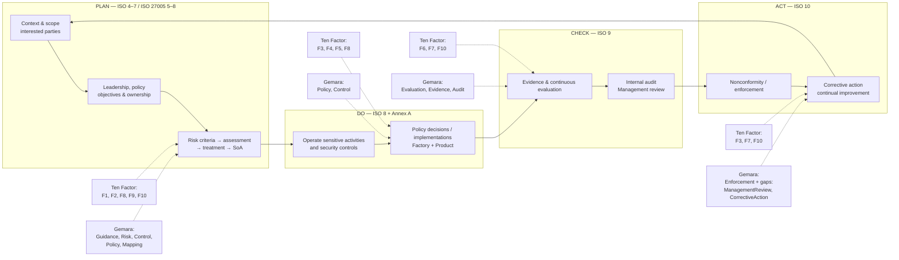

# ISO/IEC 27001:2022 and ISO/IEC 27005:2022 mapped to Ten Factor Governance and OpenSSF Gemara

## Executive summary

ISO/IEC 27001:2022 defines the requirements for an Information Security Management System (ISMS): an organisation must establish, implement, maintain and continually improve a system for managing information-security risk. ISO describes that system as deliberately holistic, covering people, policies, technology and organisational processes rather than merely technical security controls. ISO/IEC 27005:2022 is the companion risk-management guidance: it elaborates how to establish risk context and criteria, identify and analyse risk, evaluate it, choose treatments, determine controls, produce the Statement of Applicability (SoA), obtain risk-owner approval and residual-risk acceptance, monitor the resulting risks and continually improve the process. citeturn17view0turn19view2turn17view1

The comparison finds a **strong architectural affinity but not equivalence**:

> **Ten Factor Governance describes how governance should become operable. Gemara supplies machine-readable governance artefacts. ISO/IEC 27001/27005 additionally specifies the organisational management system that must operate those artefacts.**

Ten Factor Governance is deliberately activity-centred: governance attaches to risk-creating activities; those activities acquire a machine-readable Governance Twin; governance artefacts are versioned, tested and promoted; evidence is produced by default; governance runs continuously; dependencies are governed; artefacts compose; and governance has accountable owners. citeturn17view2turn18view0turn18view1turn18view2 Gemara complements this with explicit schemas for Guidance, Controls, Threats, Risks, Policy, mappings, evaluations, enforcement and audits. citeturn17view3turn18view11turn18view12turn17view4

The result is strongest in the middle of the ISO lifecycle:

**requirement → risk → control → policy → implementation → evaluation → evidence → finding → enforcement → audit.**

It is weakest around the **management-system envelope** surrounding that lifecycle. Neither Ten Factor nor Gemara presently gives first-class treatment to all of:

- organisational context and interested parties;
- formal ISMS scope;
- security objectives and measurable targets;
- competence, awareness and communications;
- resource planning;
- a formal Statement of Applicability;
- the richer ISO/IEC 27005 risk-assessment semantics of criteria, method, scenario, consequence, likelihood, inherent/residual risk and treatment approval;
- asset/system inventories;
- management review;
- nonconformity, root-cause analysis and corrective-action effectiveness;
- structured incident, continuity, personnel and physical-security records.

This does **not** imply that the Ten Factors are incorrect. They largely concern a different architectural layer. For example, Factor VI says evidence should be the normal output of governed activity, Factor VII advocates governance throughout build, integration and production rather than point-in-time review, and Factor X requires accountable ownership. Those are excellent ways to make ISO controls operational, but they do not themselves create an ISO-complete ISMS. citeturn18view5turn18view6turn18view9

Gemara is closer to being an implementation substrate. Its Control Catalog has controls with assessment requirements; Risk Catalog provides risk, impact/severity and ownership constructs; Policy includes scope, RACI-style contacts, imports and accepted/mitigated risks; Evaluation Log ties assessments to requirements and evidence; Enforcement Log records actions resulting from non-compliance; and Audit Log represents formal assurance activity and evidence. citeturn18view12turn17view4turn17view5turn17view6turn17view7turn17view8 The principal recommendation is therefore **not** to turn Gemara into an ISO-specific schema library, but to add a small set of generic management-system primitives and publish ISO/IEC 27001/27005 as a Gemara profile/catalogue over those primitives.

### Coverage terminology

The assessments below use:

| Level | Meaning |
|---|---|
| **Full** | The central concern has a direct mechanism capable of representing/operating it. This does **not** imply ISO conformity by itself. |
| **Partial** | There is direct treatment, but significant ISO-required semantics or process remain outside the model. |
| **Conceptual** | The principle/schema could host or encourage the control, but contains no first-class semantics for the subject. |
| **Missing** | There is no meaningful first-class treatment beyond storing arbitrary prose/control text. |

A particularly important distinction is that **Gemara Control Catalog can encode virtually any Annex A control**. That alone is classified below as *Conceptual*, not *Full*: representing “maintain secure backups” as a control is different from having structured backup assets, schedules, recovery tests and evidence. Gemara becomes Partial or Full where its native semantics address the substance of the ISO concern. citeturn18view12turn17view6

## Scope, sources and reference model

This document maps the base **ISO/IEC 27001:2022** management-system clauses 4–10, the **93 Annex A controls** in the four 2022 themes, and the additional risk-management concerns made explicit by **ISO/IEC 27005:2022**. ISO's public material confirms that ISO/IEC 27001:2022 is the current third edition and defines ISMS requirements; the current standard has also received **Amendment 1:2024, Climate action changes**. Organisations implementing the current ISO text should therefore account for that amendment even though the requested baseline here is the 2022 edition. citeturn17view0

The user has not supplied licensed copies of the standards. Accordingly, this report does **not** reproduce normative ISO text. Clause structure and ISO/IEC 27005 detail are based on ISO's public pages and its authorised public preview; the Annex A names and four-theme structure are corroborated against public 2022 control listings. The 2022 Annex A set contains 93 controls split among organisational, people, physical and technological themes. citeturn17view1turn19view1

The ISO/IEC 27005 public preview is particularly useful because its contents explicitly expose the risk-management structure: context and interested parties; risk criteria and acceptance criteria; method selection; risk identification and ownership; consequence and likelihood analysis; risk evaluation and prioritisation; treatment options and necessary controls; comparison with Annex A; SoA; treatment plan; risk-owner approval; residual-risk acceptance; operational execution; communication, documentation, monitoring, management review, corrective action and continual improvement. It also states that the 2022 revision introduced risk-scenario concepts and contrasts event-based and asset-based risk identification. citeturn17view1 ISO separately describes 27005 as covering the complete cycle of assessment, treatment, communication, monitoring and review. citeturn19view2

For compactness, the tables use these Ten Factor references:

**[F1 — Govern Sensitive Activities](https://tenfactorgovernance.org/docs/factors/govern-sensitive-activities/)** · **[F2 — Build a Governance Twin](https://tenfactorgovernance.org/docs/factors/build-a-governance-twin/)** · **[F3 — Governance is Version Controlled](https://tenfactorgovernance.org/docs/factors/governance-is-version-controlled/)** · **[F4 — Govern the Factory and the Product Separately](https://tenfactorgovernance.org/docs/factors/govern-factory-and-product-separately/)** · **[F5 — Context In, Decisions Out](https://tenfactorgovernance.org/docs/factors/context-in-decisions-out/)** · **[F6 — Evidence by Default](https://tenfactorgovernance.org/docs/factors/evidence-by-default/)** · **[F7 — Continuous Governance](https://tenfactorgovernance.org/docs/factors/continuous-governance/)** · **[F8 — Govern Dependencies](https://tenfactorgovernance.org/docs/factors/govern-dependencies/)** · **[F9 — Governance Is Composable](https://tenfactorgovernance.org/docs/factors/governance-is-composable/)** · **[F10 — Governance Has Owners](https://tenfactorgovernance.org/docs/factors/governance-has-owners/)**. The site also explicitly describes its governance artefacts as Definitions, Sensitive Activity, and Measures such as evaluation, enforcement and audit. citeturn18view0turn18view10

The principal Gemara references are **[Guidance Catalog](https://gemara.openssf.org/schema/guidancecatalog.html)**, **[Control Catalog](https://gemara.openssf.org/schema/controlcatalog.html)**, **[Threat Catalog](https://gemara.openssf.org/schema/threatcatalog.html)**, **[Risk Catalog](https://gemara.openssf.org/schema/riskcatalog.html)**, **[Policy](https://gemara.openssf.org/schema/policy.html)**, **[Mapping Document](https://gemara.openssf.org/schema/mappingdocument.html)**, **[Evaluation Log](https://gemara.openssf.org/schema/evaluationlog.html)**, **[Enforcement Log](https://gemara.openssf.org/schema/enforcementlog.html)**, **[Audit Log](https://gemara.openssf.org/schema/auditlog.html)** and **[Metadata](https://gemara.openssf.org/schema/metadata.html)**. Gemara's schema catalogue explicitly positions these as interoperable GRC artefacts across its layered model. citeturn17view3turn18view11turn18view14

## ISO/IEC 27005 risk overlay and PDCA mapping

ISO/IEC 27005 should not be treated as another control framework beside ISO/IEC 27001. ISO says explicitly that it supports implementation of an ISO/IEC 27001 ISMS, and its 2022 preview states that its guidance addresses the risk requirements in ISO/IEC 27001 Clause 6.1 and Clause 8. citeturn19view2turn17view1 In practical terms, it supplies much of the detail that should sit underneath 27001's relatively compact requirements for risk assessment and treatment.

### Detailed ISO/IEC 27005 concerns

| ISO/IEC 27005 area | Concern | Ten Factor | Gemara | Coverage | Principal gap / addition |
|---|---|---|---|---|---|
| **5.1 Risk-management process** | Define a coherent information-security risk process. | [F1](https://tenfactorgovernance.org/docs/factors/govern-sensitive-activities/), [F2](https://tenfactorgovernance.org/docs/factors/build-a-governance-twin/), [F7](https://tenfactorgovernance.org/docs/factors/continuous-governance/) | [Risk](https://gemara.openssf.org/schema/riskcatalog.html), [Policy](https://gemara.openssf.org/schema/policy.html) | **TF Partial; G Partial** | Neither defines a complete risk-process instance. Add `RiskAssessment`/process metadata. |
| **5.2 Risk-management cycles** | Risk management is repeated as context and systems change. | [F3](https://tenfactorgovernance.org/docs/factors/governance-is-version-controlled/), [F7](https://tenfactorgovernance.org/docs/factors/continuous-governance/) | [Evaluation](https://gemara.openssf.org/schema/evaluationlog.html), [Risk](https://gemara.openssf.org/schema/riskcatalog.html) | **TF Full; G Partial** | Gemara needs review triggers/cadence and risk-history links. |
| **6.1 Organisational considerations** | Establish business/organisational context for risk. | [F1](https://tenfactorgovernance.org/docs/factors/govern-sensitive-activities/), [F8](https://tenfactorgovernance.org/docs/factors/govern-dependencies/) | [Policy](https://gemara.openssf.org/schema/policy.html) scope | **TF Partial; G Partial** | Add `GovernanceContext`: internal/external issues, objectives, jurisdictions, dependencies. |
| **6.2 Interested-party requirements** | Identify stakeholder and external requirements. | [F8](https://tenfactorgovernance.org/docs/factors/govern-dependencies/), [F9](https://tenfactorgovernance.org/docs/factors/governance-is-composable/) | [Guidance](https://gemara.openssf.org/schema/guidancecatalog.html), [Mapping](https://gemara.openssf.org/schema/mappingdocument.html) | **TF Conceptual; G Partial** | `InterestedParty` + `Obligation`/requirement references. |
| **6.3 Applying risk assessment** | Define where/how assessment applies. | [F1](https://tenfactorgovernance.org/docs/factors/govern-sensitive-activities/), [F2](https://tenfactorgovernance.org/docs/factors/build-a-governance-twin/) | [Risk](https://gemara.openssf.org/schema/riskcatalog.html), [Policy](https://gemara.openssf.org/schema/policy.html) | **Partial** | Explicit assessment scope, trigger and subject needed. |
| **6.4 Risk criteria** | Establish and maintain criteria against which risk is measured/evaluated. | [F3](https://tenfactorgovernance.org/docs/factors/governance-is-version-controlled/), [F10](https://tenfactorgovernance.org/docs/factors/governance-has-owners/) | [Risk](https://gemara.openssf.org/schema/riskcatalog.html) appetite/severity | **TF Conceptual; G Partial** | Add versioned `RiskCriteria`, scale, thresholds and method. |
| **6.4.2 Risk-acceptance criteria** | State when risk can be retained and under whose authority. | [F10](https://tenfactorgovernance.org/docs/factors/governance-has-owners/) | [Risk](https://gemara.openssf.org/schema/riskcatalog.html), [Policy](https://gemara.openssf.org/schema/policy.html) accepted risks | **TF Partial; G Partial** | Acceptance authority, threshold, expiry and approval evidence. |
| **6.4.3 Assessment criteria** | Make assessments repeatable and comparable. | [F3](https://tenfactorgovernance.org/docs/factors/governance-is-version-controlled/), [F7](https://tenfactorgovernance.org/docs/factors/continuous-governance/) | [Risk](https://gemara.openssf.org/schema/riskcatalog.html), [Evaluation](https://gemara.openssf.org/schema/evaluationlog.html) | **Partial** | Assessment methodology/version is not first-class. |
| **6.5 Appropriate method** | Choose and document a risk-assessment method appropriate to context. | [F3](https://tenfactorgovernance.org/docs/factors/governance-is-version-controlled/) | — | **TF Conceptual; G Missing** | `assessment-method`, methodology/version/reference fields. |
| **7.2 Risk identification** | Identify and describe risks systematically. | [F1](https://tenfactorgovernance.org/docs/factors/govern-sensitive-activities/), [F2](https://tenfactorgovernance.org/docs/factors/build-a-governance-twin/) | [Risk](https://gemara.openssf.org/schema/riskcatalog.html), [Threat](https://gemara.openssf.org/schema/threatcatalog.html) | **TF Partial; G Partial** | Add explicit risk scenario, source/event and affected resource. |
| **7.2.2 Risk owners** | Assign ownership. | [F10](https://tenfactorgovernance.org/docs/factors/governance-has-owners/) | [Risk](https://gemara.openssf.org/schema/riskcatalog.html) RACI owner | **Full** | Clarify risk owner versus artefact owner/approver. |
| **7.3.2 Consequences** | Assess potential consequences/impact. | [F1](https://tenfactorgovernance.org/docs/factors/govern-sensitive-activities/) | [Risk](https://gemara.openssf.org/schema/riskcatalog.html) impact/severity | **TF Partial; G Partial** | Explicit consequence dimensions and pre/post-control values. |
| **7.3.3 Likelihood** | Assess likelihood. | — | [Risk](https://gemara.openssf.org/schema/riskcatalog.html) does not provide equivalent rich likelihood semantics | **TF Missing; G Partial/Missing** | Add `likelihood` scale/value/rationale. |
| **7.3.4 Risk level** | Combine analysis into a risk level. | [F1](https://tenfactorgovernance.org/docs/factors/govern-sensitive-activities/) | [Risk](https://gemara.openssf.org/schema/riskcatalog.html) severity/rank | **TF Conceptual; G Partial** | Distinguish inherent/current/residual level. |
| **7.4 Risk evaluation** | Compare analysis with criteria and prioritise treatment. | [F7](https://tenfactorgovernance.org/docs/factors/continuous-governance/), [F10](https://tenfactorgovernance.org/docs/factors/governance-has-owners/) | [Risk](https://gemara.openssf.org/schema/riskcatalog.html) appetite/rank | **Partial** | Formal criterion comparison and disposition. |
| **8.2 Treatment options** | Decide whether/how to modify, retain, avoid or otherwise address risk. | [F2](https://tenfactorgovernance.org/docs/factors/build-a-governance-twin/), [F10](https://tenfactorgovernance.org/docs/factors/governance-has-owners/) | [Policy](https://gemara.openssf.org/schema/policy.html) accepted/mitigated risks | **Partial** | Structured treatment-option vocabulary, target risk and due date. |
| **8.3 Necessary controls** | Derive controls from risk treatment, not merely from a checklist. | [F2](https://tenfactorgovernance.org/docs/factors/build-a-governance-twin/), [F9](https://tenfactorgovernance.org/docs/factors/governance-is-composable/) | [Control](https://gemara.openssf.org/schema/controlcatalog.html), [Mapping](https://gemara.openssf.org/schema/mappingdocument.html) | **Partial–Full** | Make `treats-risk` relationship canonical rather than merely a mapping convention. |
| **8.4 Compare with Annex A** | Check chosen controls against the reference set so none necessary are overlooked. | [F9](https://tenfactorgovernance.org/docs/factors/governance-is-composable/) | [Control](https://gemara.openssf.org/schema/controlcatalog.html), [Mapping](https://gemara.openssf.org/schema/mappingdocument.html) | **Partial** | ISO profile/catalogue can close this without core-schema changes. |
| **8.5 Statement of Applicability** | Record applicable controls, implementation status and justification for inclusion/exclusion. | [F3](https://tenfactorgovernance.org/docs/factors/governance-is-version-controlled/), [F9](https://tenfactorgovernance.org/docs/factors/governance-is-composable/), [F10](https://tenfactorgovernance.org/docs/factors/governance-has-owners/) | [Policy](https://gemara.openssf.org/schema/policy.html) imports/exclusions + [Mapping](https://gemara.openssf.org/schema/mappingdocument.html) | **Partial** | Add generic `ApplicabilityProfile`; this is one of the clearest gaps. |
| **8.6 Treatment plan** | Plan actions, owners, approval and residual-risk disposition. | [F7](https://tenfactorgovernance.org/docs/factors/continuous-governance/), [F10](https://tenfactorgovernance.org/docs/factors/governance-has-owners/) | [Policy](https://gemara.openssf.org/schema/policy.html), [Enforcement](https://gemara.openssf.org/schema/enforcementlog.html) | **Partial** | Treatment action, due date, target risk, dependencies and status. |
| **8.6.2 Risk-owner approval** | Risk owner approves treatment. | [F10](https://tenfactorgovernance.org/docs/factors/governance-has-owners/) | Risk RACI + Policy contacts | **Partial** | Signed/versioned approval event. |
| **8.6.3 Residual-risk acceptance** | Explicitly accept remaining risk. | [F10](https://tenfactorgovernance.org/docs/factors/governance-has-owners/) | [Policy](https://gemara.openssf.org/schema/policy.html) accepted risk + justification | **Partial** | First-class residual risk value, accepting authority, time limit/review trigger. |
| **9 Risk operation** | Actually execute assessment and treatment processes. | [F7](https://tenfactorgovernance.org/docs/factors/continuous-governance/) | [Evaluation](https://gemara.openssf.org/schema/evaluationlog.html), [Enforcement](https://gemara.openssf.org/schema/enforcementlog.html) | **Partial** | Explicit risk-assessment execution log would tighten provenance. |
| **10.3 Communication/consultation** | Communicate risk with appropriate stakeholders. | [F10](https://tenfactorgovernance.org/docs/factors/governance-has-owners/) | Policy contacts | **Conceptual/Partial** | `CommunicationPlan`/consultation record. |
| **10.4 Documented information** | Retain process and result information. | [F3](https://tenfactorgovernance.org/docs/factors/governance-is-version-controlled/), [F6](https://tenfactorgovernance.org/docs/factors/evidence-by-default/) | [Metadata](https://gemara.openssf.org/schema/metadata.html), evaluation/audit evidence | **Partial** | Retention, approval, distribution and authoritative-record controls. |
| **10.5 Monitoring/review** | Monitor changes in factors influencing risk and reassess. | [F6](https://tenfactorgovernance.org/docs/factors/evidence-by-default/), [F7](https://tenfactorgovernance.org/docs/factors/continuous-governance/) | [Evaluation](https://gemara.openssf.org/schema/evaluationlog.html), [Audit](https://gemara.openssf.org/schema/auditlog.html) | **Partial–Full** | Risk-specific trigger/review event is missing. |
| **10.6 Management review** | Management reviews risk management within ISMS governance. | [F7](https://tenfactorgovernance.org/docs/factors/continuous-governance/), [F10](https://tenfactorgovernance.org/docs/factors/governance-has-owners/) | [Audit](https://gemara.openssf.org/schema/auditlog.html) is related but not equivalent | **TF Conceptual; G Missing** | Add `ManagementReview`. |
| **10.7 Corrective action** | Correct failures and causes. | [F7](https://tenfactorgovernance.org/docs/factors/continuous-governance/), [F10](https://tenfactorgovernance.org/docs/factors/governance-has-owners/) | [Enforcement](https://gemara.openssf.org/schema/enforcementlog.html), [Audit](https://gemara.openssf.org/schema/auditlog.html) | **Partial** | Add root cause, systemic issue, effectiveness test and closure. |
| **10.8 Continual improvement** | Improve the management/risk process using results and change. | [F3](https://tenfactorgovernance.org/docs/factors/governance-is-version-controlled/), [F7](https://tenfactorgovernance.org/docs/factors/continuous-governance/), [F10](https://tenfactorgovernance.org/docs/factors/governance-has-owners/) | Evaluation → Enforcement → Audit can support it | **TF Full conceptually; G Partial** | Explicit feedback edges from review/action to changed risk/control/policy. |

The central Gemara risk gap is therefore quite precise. `RiskCatalog` already contains useful concepts including risk categories, appetite, severity/impact, ranking, RACI ownership and threat mappings, while `Policy` can describe accepted and mitigated risks. citeturn17view4turn17view5 ISO/IEC 27005, however, makes **risk criteria, method, risk scenarios, consequence, likelihood, risk level, treatment options, SoA, treatment approval and residual-risk acceptance** part of a much richer lifecycle. citeturn17view1

### PDCA as an executable governance lifecycle

The following is an architectural mapping rather than wording from ISO. ISO/IEC 27001 establishes and continually improves an ISMS, while 27005 elaborates its iterative risk lifecycle; Ten Factor and Gemara artefacts can make the corresponding activities executable and traceable. citeturn17view0turn19view2



The most conspicuous discontinuity is the final loop. Ten Factor's **Continuous Governance** explicitly expects governance to evolve using operational experience and continuous feedback, and **Governance Has Owners** says owners should evolve governance based on evidence and incidents. citeturn18view6turn18view9 Gemara has the operational ingredients—evaluation, enforcement and audit—but lacks first-class `ManagementReview` and `CorrectiveAction` objects that close the ISO management loop. citeturn17view6turn17view7turn17view8

## Complete ISO/IEC 27001 clause and Annex A mapping

The table below is intentionally comprehensive at the **control-area level**: every management-system clause from 4–10 is represented, followed by every 2022 Annex A control. The summaries are concise descriptions of the concerns rather than reproductions of copyrighted ISO requirements. ISO states that the ISMS protects confidentiality, integrity and availability through risk management; the Annex A identifiers and names follow the publicly documented 2022 set. citeturn17view0turn19view1

### Context of the organisation

| ISO clause/control | ISO concern / requirement summary | Ten Factor references | Gemara references | Coverage level | Gap notes | Recommended additions |
|---|---|---|---|---|---|---|
| **4.1 Organisation and its context** | Understand internal/external issues relevant to the ISMS. | [F1](https://tenfactorgovernance.org/docs/factors/govern-sensitive-activities/), [F8](https://tenfactorgovernance.org/docs/factors/govern-dependencies/) | [Policy](https://gemara.openssf.org/schema/policy.html) scope | **TF Partial; G Partial** | Activity/dependency context exists, but not organisational context as a governed object. | `GovernanceContext { internal-issues, external-issues, objectives, jurisdictions }`; clarify F1 scope can include governance/management activities. |
| **4.2 Interested parties** | Identify relevant stakeholders and their information-security requirements. | [F8](https://tenfactorgovernance.org/docs/factors/govern-dependencies/), [F9](https://tenfactorgovernance.org/docs/factors/governance-is-composable/) | [Guidance](https://gemara.openssf.org/schema/guidancecatalog.html), [Mapping](https://gemara.openssf.org/schema/mappingdocument.html) | **TF Conceptual; G Partial** | Obligations can be guidance, but stakeholder/requirement provenance is absent. | `InterestedParty`/`Obligation` records; expand F8 from dependencies to dependency *and obligation sources*. |
| **4.3 ISMS scope** | Determine organisational and technical boundaries/applicability of the ISMS. | [F1](https://tenfactorgovernance.org/docs/factors/govern-sensitive-activities/), [F2](https://tenfactorgovernance.org/docs/factors/build-a-governance-twin/) | [Policy](https://gemara.openssf.org/schema/policy.html) scope | **Partial** | Governance Twin is intentionally scoped to an activity, not an enterprise ISMS boundary. | `GovernanceScope { organisations, locations, systems, activities, exclusions, interfaces }`. |
| **4.4 ISMS and processes** | Establish, implement, maintain and improve the ISMS and interacting processes. | All factors, especially [F2](https://tenfactorgovernance.org/docs/factors/build-a-governance-twin/), [F7](https://tenfactorgovernance.org/docs/factors/continuous-governance/), [F10](https://tenfactorgovernance.org/docs/factors/governance-has-owners/) | Entire [Gemara schema model](https://gemara.openssf.org/schema/) | **Conceptual/Partial** | The governance pipeline is modelled; the management system itself is not. | Define an `ISMSProfile`/generic `GovernanceSystem` composed from existing artefacts. |

### Leadership

| ISO clause/control | ISO concern / requirement summary | Ten Factor references | Gemara references | Coverage level | Gap notes | Recommended additions |
|---|---|---|---|---|---|---|
| **5.1 Leadership and commitment** | Top management must direct, support and integrate information-security governance. | [F10](https://tenfactorgovernance.org/docs/factors/governance-has-owners/), [F7](https://tenfactorgovernance.org/docs/factors/continuous-governance/) | Policy contacts/RACI | **TF Partial; G Partial** | Ownership is not equivalent to executive leadership commitment/accountability. | Extend F10 to distinguish `accountable-executive`, `artefact-owner`, `risk-owner`, `approver`; reusable `GovernanceRole`. |
| **5.2 Information-security policy** | Establish, maintain and communicate an appropriate security policy. | [F3](https://tenfactorgovernance.org/docs/factors/governance-is-version-controlled/), [F9](https://tenfactorgovernance.org/docs/factors/governance-is-composable/), [F10](https://tenfactorgovernance.org/docs/factors/governance-has-owners/) | [Policy](https://gemara.openssf.org/schema/policy.html), [Metadata](https://gemara.openssf.org/schema/metadata.html) | **Partial** | Strong policy-as-data architecture; weaker on executive approval, organisational communication and periodic policy review. | Approval/sign-off and `review-cycle`; communication/acknowledgement link. |
| **5.3 Roles, responsibilities and authorities** | Assign and communicate responsibility and authority for information security. | [F10](https://tenfactorgovernance.org/docs/factors/governance-has-owners/) | Risk owner, Policy contacts/RACI, Audit owner | **Partial** | RACI appears in several artefacts but authority/delegation is fragmented. | Shared `GovernanceRole { responsible, accountable, consulted, authority, delegation, escalation }`. |

### Planning

ISO/IEC 27005 supplies the detailed interpretation of the risk-assessment and treatment concerns in these rows, including risk criteria, identification, consequence, likelihood, evaluation, treatments, control selection, SoA and residual-risk acceptance. citeturn17view1

| ISO clause/control | ISO concern / requirement summary | Ten Factor references | Gemara references | Coverage level | Gap notes | Recommended additions |
|---|---|---|---|---|---|---|
| **6.1.1 Risks and opportunities — general** | Determine risks/opportunities affecting ISMS outcomes and plan actions. | [F1](https://tenfactorgovernance.org/docs/factors/govern-sensitive-activities/), [F2](https://tenfactorgovernance.org/docs/factors/build-a-governance-twin/), [F7](https://tenfactorgovernance.org/docs/factors/continuous-governance/) | [Risk](https://gemara.openssf.org/schema/riskcatalog.html), [Policy](https://gemara.openssf.org/schema/policy.html) | **Partial** | Security risk is supported; improvement opportunities are not a strong first-class concept. | `ImprovementOpportunity` or generic action/change proposal. |
| **6.1.2 Information-security risk assessment** | Define and apply a repeatable assessment process using criteria and risk ownership. | [F1](https://tenfactorgovernance.org/docs/factors/govern-sensitive-activities/), [F2](https://tenfactorgovernance.org/docs/factors/build-a-governance-twin/), [F10](https://tenfactorgovernance.org/docs/factors/governance-has-owners/) | [Risk](https://gemara.openssf.org/schema/riskcatalog.html), [Threat](https://gemara.openssf.org/schema/threatcatalog.html) | **Partial** | Missing method, scenario, likelihood, criteria comparison and inherent/residual state. | Expand risk model as specified below. |
| **6.1.3 Risk treatment** | Select treatments and controls, compare against Annex A, document applicability and accept residual risk. | [F2](https://tenfactorgovernance.org/docs/factors/build-a-governance-twin/), [F9](https://tenfactorgovernance.org/docs/factors/governance-is-composable/), [F10](https://tenfactorgovernance.org/docs/factors/governance-has-owners/) | [Control](https://gemara.openssf.org/schema/controlcatalog.html), [Policy](https://gemara.openssf.org/schema/policy.html), [Mapping](https://gemara.openssf.org/schema/mappingdocument.html) | **Partial** | Strong ingredients; no native SoA or complete treatment lifecycle. | `ApplicabilityProfile` + treatment/acceptance fields. |
| **6.2 Security objectives and planning** | Define measurable security objectives, responsibilities, resources and means of evaluation. | [F7](https://tenfactorgovernance.org/docs/factors/continuous-governance/), [F10](https://tenfactorgovernance.org/docs/factors/governance-has-owners/) | Evaluation can measure controls | **TF Conceptual; G Missing/Partial** | Control assessment is not the same as management objective measurement. | `ObjectiveMetric { objective, target, measure, owner, frequency, result }`. |
| **6.3 Planning changes** | Plan ISMS changes in a controlled manner. | [F3](https://tenfactorgovernance.org/docs/factors/governance-is-version-controlled/), [F7](https://tenfactorgovernance.org/docs/factors/continuous-governance/) | [Metadata](https://gemara.openssf.org/schema/metadata.html) + versioned artefacts | **Partial–Full architecturally** | Excellent fit for governance artefacts; organisational change-planning fields are absent. | Clarify F3 explicitly applies to management-system changes, not only executable governance definitions. |

### Support

| ISO clause/control | ISO concern / requirement summary | Ten Factor references | Gemara references | Coverage level | Gap notes | Recommended additions |
|---|---|---|---|---|---|---|
| **7.1 Resources** | Determine/provide people, tools, time and other resources needed for the ISMS. | [F10](https://tenfactorgovernance.org/docs/factors/governance-has-owners/) only indirectly | — | **Missing/Conceptual** | Ownership does not establish resource sufficiency. | Optional `ResourceRequirement`; or treat this explicitly as outside core Gemara with an ISMS profile. |
| **7.2 Competence** | Determine required competence, ensure it and retain evidence. | — | Evidence can record proof, but no competence model | **Missing** | Major people-management gap. | `CompetenceRecord { role, required-skill, qualification, training, evidence, expiry }`. |
| **7.3 Awareness** | Ensure relevant people understand policy, contribution and consequences. | [F10](https://tenfactorgovernance.org/docs/factors/governance-has-owners/) indirectly | [Policy](https://gemara.openssf.org/schema/policy.html) | **Conceptual** | Machine-readable policy does not prove awareness. | Training/acknowledgement evidence profile. |
| **7.4 Communication** | Define what, when, with whom and how to communicate about the ISMS. | [F10](https://tenfactorgovernance.org/docs/factors/governance-has-owners/) | Policy contacts | **Conceptual/Partial** | No communication plan or consultation trail. | `CommunicationPlan` or fields on GovernanceSystem. |
| **7.5.1 Documented information — general** | Maintain required documentation and evidence. | [F3](https://tenfactorgovernance.org/docs/factors/governance-is-version-controlled/), [F6](https://tenfactorgovernance.org/docs/factors/evidence-by-default/) | [Metadata](https://gemara.openssf.org/schema/metadata.html), all schemas | **Partial–Full** | Machine-readable/versioned records are a strong fit; formal document-management obligations go further. | Add record classification/retention references. |
| **7.5.2 Creating/updating documentation** | Identify, format, review and approve information appropriately. | [F3](https://tenfactorgovernance.org/docs/factors/governance-is-version-controlled/) | [Metadata](https://gemara.openssf.org/schema/metadata.html) | **Partial** | Version/author metadata is strong; approval state/signatory is weaker. | `approved-by`, `approved-at`, `effective-from`, `supersedes`. |
| **7.5.3 Control of documented information** | Availability, protection, distribution, retention, change control and disposition. | [F3](https://tenfactorgovernance.org/docs/factors/governance-is-version-controlled/), [F6](https://tenfactorgovernance.org/docs/factors/evidence-by-default/) | Metadata/evidence | **Partial** | Retention, access/distribution and disposal semantics are absent. | `RecordPolicy { retention, access, integrity, disposition, authoritative-source }`. |

### Operation

| ISO clause/control | ISO concern / requirement summary | Ten Factor references | Gemara references | Coverage level | Gap notes | Recommended additions |
|---|---|---|---|---|---|---|
| **8.1 Operational planning/control** | Plan, establish criteria for, control and evidence ISMS/security processes and outsourced processes. | [F1](https://tenfactorgovernance.org/docs/factors/govern-sensitive-activities/), [F2](https://tenfactorgovernance.org/docs/factors/build-a-governance-twin/), [F5](https://tenfactorgovernance.org/docs/factors/context-in-decisions-out/), [F6](https://tenfactorgovernance.org/docs/factors/evidence-by-default/), [F8](https://tenfactorgovernance.org/docs/factors/govern-dependencies/) | [Control](https://gemara.openssf.org/schema/controlcatalog.html), [Policy](https://gemara.openssf.org/schema/policy.html), [Evaluation](https://gemara.openssf.org/schema/evaluationlog.html) | **Partial–Full architecturally** | One of the best alignments; generic process/resource inventory is still missing. | Bind governance twins explicitly to `GovernedResource`/process identifiers. |
| **8.2 Operational risk assessment** | Perform assessments at planned intervals and after significant change. | [F3](https://tenfactorgovernance.org/docs/factors/governance-is-version-controlled/), [F7](https://tenfactorgovernance.org/docs/factors/continuous-governance/) | [Risk](https://gemara.openssf.org/schema/riskcatalog.html), [Evaluation](https://gemara.openssf.org/schema/evaluationlog.html) | **Partial** | Assessment execution exists more clearly for controls than risks. | `RiskAssessmentLog` or extend Risk Catalog with assessment history/triggers. |
| **8.3 Operational risk treatment** | Implement the treatment plan and retain results. | [F6](https://tenfactorgovernance.org/docs/factors/evidence-by-default/), [F7](https://tenfactorgovernance.org/docs/factors/continuous-governance/), [F10](https://tenfactorgovernance.org/docs/factors/governance-has-owners/) | [Policy](https://gemara.openssf.org/schema/policy.html), [Enforcement](https://gemara.openssf.org/schema/enforcementlog.html) | **Partial** | Enforcement is related but treatment execution is broader. | Treatment status/actions/evidence links. |

### Performance evaluation

Gemara is particularly strong here because Evaluation Log records assessment procedures, requirement mappings, results, timestamps and evidence, while Audit Log records audit criteria/results and evidence. citeturn17view6turn17view8

| ISO clause/control | ISO concern / requirement summary | Ten Factor references | Gemara references | Coverage level | Gap notes | Recommended additions |
|---|---|---|---|---|---|---|
| **9.1 Monitoring, measurement, analysis and evaluation** | Decide what to monitor/measure, how/when, analyse results and evaluate ISMS performance/effectiveness. | [F6](https://tenfactorgovernance.org/docs/factors/evidence-by-default/), [F7](https://tenfactorgovernance.org/docs/factors/continuous-governance/) | [Evaluation](https://gemara.openssf.org/schema/evaluationlog.html) | **TF Partial–Full; G Partial** | Excellent control evaluation, but management-level objectives/KPIs are not first-class. | `ObjectiveMetric`; relate evaluation results to objectives and risks. |
| **9.2 Internal audit** | Conduct planned, objective audits against requirements and retain results. | [F6](https://tenfactorgovernance.org/docs/factors/evidence-by-default/), [F7](https://tenfactorgovernance.org/docs/factors/continuous-governance/), [F10](https://tenfactorgovernance.org/docs/factors/governance-has-owners/) | [Audit](https://gemara.openssf.org/schema/auditlog.html) | **Partial** | Audit artefact exists, but programme, independence/impartiality, auditor competence and scheduling are incomplete. | Extend `AuditLog` with programme, independence, auditor competence and follow-up references. |
| **9.3 Management review** | Top management periodically assesses suitability, adequacy and effectiveness and records decisions/actions. | [F7](https://tenfactorgovernance.org/docs/factors/continuous-governance/), [F10](https://tenfactorgovernance.org/docs/factors/governance-has-owners/) | Audit is related but not equivalent | **TF Conceptual; G Missing** | A material management-system gap. | `ManagementReview { period, participants, inputs, risks, objectives, audits, changes, decisions, actions }`. |

### Improvement

| ISO clause/control | ISO concern / requirement summary | Ten Factor references | Gemara references | Coverage level | Gap notes | Recommended additions |
|---|---|---|---|---|---|---|
| **10.1 Continual improvement** | Continually improve ISMS suitability, adequacy and effectiveness. | [F3](https://tenfactorgovernance.org/docs/factors/governance-is-version-controlled/), [F7](https://tenfactorgovernance.org/docs/factors/continuous-governance/), [F10](https://tenfactorgovernance.org/docs/factors/governance-has-owners/) | Evaluation + Enforcement + Audit | **TF Full conceptually; G Partial** | Ten Factor states the architectural principle strongly; Gemara lacks explicit feedback/change object. | Add links `result → improvement → changed-artifact`; no new Ten Factor needed. |
| **10.2 Nonconformity and corrective action** | Respond to failure, correct it, determine causes/recurrence, implement action and test effectiveness. | [F6](https://tenfactorgovernance.org/docs/factors/evidence-by-default/), [F7](https://tenfactorgovernance.org/docs/factors/continuous-governance/), [F10](https://tenfactorgovernance.org/docs/factors/governance-has-owners/) | [Enforcement](https://gemara.openssf.org/schema/enforcementlog.html), [Audit](https://gemara.openssf.org/schema/auditlog.html) | **Partial** | Enforcement addresses response, but not the complete corrective-action lifecycle. | `CorrectiveAction { nonconformity, containment, root-cause, action, owner, due, effectiveness-test, closure }`. |

### Annex A organisational controls

The 2022 Annex A organisational theme comprises controls A.5.1–A.5.37. The mappings below assess whether Ten Factor/Gemara natively address each control's *subject*, not merely whether a Control Catalog entry could be written for it. citeturn19view1

| ISO clause/control | ISO concern / requirement summary | Ten Factor references | Gemara references | Coverage level | Gap notes | Recommended additions |
|---|---|---|---|---|---|---|
| **A.5.1 Policies for information security** | Establish, approve, communicate and review security policies. | [F3](https://tenfactorgovernance.org/docs/factors/governance-is-version-controlled/), [F9](https://tenfactorgovernance.org/docs/factors/governance-is-composable/), [F10](https://tenfactorgovernance.org/docs/factors/governance-has-owners/) | [Policy](https://gemara.openssf.org/schema/policy.html), [Guidance](https://gemara.openssf.org/schema/guidancecatalog.html) | **Partial–Full** | Machine-readable/versioned policy is very strong; approval/communication/review needs strengthening. | Policy approval/review fields. |
| **A.5.2 Security roles and responsibilities** | Define and allocate security responsibilities. | [F10](https://tenfactorgovernance.org/docs/factors/governance-has-owners/) | Policy/Risk RACI | **Partial** | Roles distributed across artefacts. | Shared `GovernanceRole`. |
| **A.5.3 Segregation of duties** | Separate conflicting responsibilities to reduce misuse/error. | [F5](https://tenfactorgovernance.org/docs/factors/context-in-decisions-out/), [F10](https://tenfactorgovernance.org/docs/factors/governance-has-owners/) | [Control](https://gemara.openssf.org/schema/controlcatalog.html), [Policy](https://gemara.openssf.org/schema/policy.html) | **Conceptual** | No native conflict/SoD relation. | Optional `conflicts-with`/separation constraint in policy profile. |
| **A.5.4 Management responsibilities** | Require personnel to follow security policy/procedures. | [F10](https://tenfactorgovernance.org/docs/factors/governance-has-owners/) | Policy contacts | **Partial** | Accountability principle, but not workforce-management process. | Role/acknowledgement semantics. |
| **A.5.5 Contact with authorities** | Maintain appropriate regulatory/law-enforcement contacts. | [F8](https://tenfactorgovernance.org/docs/factors/govern-dependencies/), [F10](https://tenfactorgovernance.org/docs/factors/governance-has-owners/) | Guidance/Policy | **Conceptual** | No stakeholder/contact register. | `InterestedParty.contact` + trigger/procedure. |
| **A.5.6 Contact with special interest groups** | Maintain relevant professional/security information relationships. | [F8](https://tenfactorgovernance.org/docs/factors/govern-dependencies/) | Guidance | **Conceptual** | External relationship not modelled. | `InterestedParty`/external source. |
| **A.5.7 Threat intelligence** | Collect and analyse threat information to inform security. | [F7](https://tenfactorgovernance.org/docs/factors/continuous-governance/), [F8](https://tenfactorgovernance.org/docs/factors/govern-dependencies/) | [Threat](https://gemara.openssf.org/schema/threatcatalog.html) | **Partial** | Threat catalogue is strong representation; intelligence-source/feed lifecycle is absent. | `source`, `observed-at`, `confidence`, `indicator/ref`, expiry fields. |
| **A.5.8 Security in project management** | Integrate security into project governance/lifecycle. | [F1](https://tenfactorgovernance.org/docs/factors/govern-sensitive-activities/), [F2](https://tenfactorgovernance.org/docs/factors/build-a-governance-twin/), [F3](https://tenfactorgovernance.org/docs/factors/governance-is-version-controlled/), [F4](https://tenfactorgovernance.org/docs/factors/govern-factory-and-product-separately/) | Control/Policy/Evaluation | **Partial** | Strong software-project story, less generic project governance. | Clarify F4 applicability beyond software where appropriate. |
| **A.5.9 Inventory of information and associated assets** | Inventory information/assets and assign ownership. | [F2](https://tenfactorgovernance.org/docs/factors/build-a-governance-twin/), [F8](https://tenfactorgovernance.org/docs/factors/govern-dependencies/) | — | **TF Partial; G Missing** | Ten Factor deliberately starts with activities rather than assets; ISO still needs the asset view. | `AssetSystemCatalog` / `GovernedResource`. Do **not** replace F1's activity focus; link the two. |
| **A.5.10 Acceptable use of assets** | Define acceptable handling/use of information/assets. | [F1](https://tenfactorgovernance.org/docs/factors/govern-sensitive-activities/), [F5](https://tenfactorgovernance.org/docs/factors/context-in-decisions-out/) | Policy/Control | **Conceptual–Partial** | Policy can express usage rules; assets are not first-class. | `GovernedResource` + policy binding. |
| **A.5.11 Return of assets** | Recover organisational assets on employment/contract change. | [F10](https://tenfactorgovernance.org/docs/factors/governance-has-owners/) | Control | **Conceptual** | Personnel and asset lifecycle absent. | Asset custody + people-lifecycle profile. |
| **A.5.12 Classification of information** | Classify information based on security needs. | [F2](https://tenfactorgovernance.org/docs/factors/build-a-governance-twin/) | [Policy](https://gemara.openssf.org/schema/policy.html) includes sensitivity-oriented scope | **Partial** | No information inventory/classification lifecycle. | `GovernedResource.classification`, scheme/version. |
| **A.5.13 Labelling information** | Apply labels consistent with classification scheme. | [F2](https://tenfactorgovernance.org/docs/factors/build-a-governance-twin/) | Control/Policy | **Conceptual** | No native label semantics. | Classification/label fields in resource profile. |
| **A.5.14 Information transfer** | Secure transfer inside/outside organisation. | [F1](https://tenfactorgovernance.org/docs/factors/govern-sensitive-activities/), [F5](https://tenfactorgovernance.org/docs/factors/context-in-decisions-out/), [F8](https://tenfactorgovernance.org/docs/factors/govern-dependencies/) | Control/Policy/Evaluation | **Conceptual–Partial** | Transfer can be a sensitive activity, but data-flow/resource semantics are outside Gemara. | Governed activity/resource bindings; optional data-flow profile. |
| **A.5.15 Access control** | Establish rules for physical/logical access based on business/security requirements. | [F5](https://tenfactorgovernance.org/docs/factors/context-in-decisions-out/) | Control/Policy/Evaluation | **Partial** | F5's request/context/decision shape is highly relevant; IAM lifecycle remains external. | Standard authorisation decision profile. |
| **A.5.16 Identity management** | Manage identity lifecycle. | [F5](https://tenfactorgovernance.org/docs/factors/context-in-decisions-out/), [F10](https://tenfactorgovernance.org/docs/factors/governance-has-owners/) | Control | **Conceptual** | No identity lifecycle schema. | Keep domain-specific; bind external IAM evidence to control. |
| **A.5.17 Authentication information** | Secure allocation/management of credentials/authentication secrets. | [F5](https://tenfactorgovernance.org/docs/factors/context-in-decisions-out/), [F6](https://tenfactorgovernance.org/docs/factors/evidence-by-default/) | Control/Evaluation | **Conceptual** | Control-testing substrate, not credential management. | No core Gemara addition required. |
| **A.5.18 Access rights** | Provision, review, modify and remove access rights. | [F5](https://tenfactorgovernance.org/docs/factors/context-in-decisions-out/), [F10](https://tenfactorgovernance.org/docs/factors/governance-has-owners/) | Control/Evaluation | **Partial** | Governance decision/evaluation fit well; rights inventory external. | Reference external entitlement/resource IDs and owner. |
| **A.5.19 Supplier security** | Manage security risks arising from suppliers. | [F8](https://tenfactorgovernance.org/docs/factors/govern-dependencies/), [F10](https://tenfactorgovernance.org/docs/factors/governance-has-owners/) | Risk/Control/Mapping | **TF Partial–Full; G Conceptual** | F8 directly addresses inherited dependency trust/risk; supplier entity and assurance record absent. | `Dependency/Supplier` profile under `GovernedResource`. |
| **A.5.20 Supplier agreements** | Include appropriate security requirements in agreements. | [F8](https://tenfactorgovernance.org/docs/factors/govern-dependencies/), [F9](https://tenfactorgovernance.org/docs/factors/governance-is-composable/) | Guidance/Policy/Mapping | **Partial/Conceptual** | Requirement composition fits; contracts/suppliers not first-class. | `Obligation.source = contract`; supplier binding. |
| **A.5.21 ICT supply-chain security** | Manage security through ICT supply chains. | [F4](https://tenfactorgovernance.org/docs/factors/govern-factory-and-product-separately/), [F8](https://tenfactorgovernance.org/docs/factors/govern-dependencies/) | Threat/Control/Mapping | **TF Partial–Full; G Partial** | Strong dependency/factory concepts; component provenance lives elsewhere. | Standard dependency identifiers/provenance refs rather than duplicating SBOM/SLSA. |
| **A.5.22 Supplier monitoring/review/change** | Monitor supplier security and manage changes. | [F7](https://tenfactorgovernance.org/docs/factors/continuous-governance/), [F8](https://tenfactorgovernance.org/docs/factors/govern-dependencies/) | Evaluation/Audit | **Partial** | Supplier target not native. | Supplier/resource target + reassessment trigger. |
| **A.5.23 Cloud-service security** | Govern acquisition, use, management and exit of cloud services. | [F8](https://tenfactorgovernance.org/docs/factors/govern-dependencies/), [F9](https://tenfactorgovernance.org/docs/factors/governance-is-composable/) | Control/Risk/Mapping | **Conceptual–Partial** | General governance works; cloud lifecycle semantics are external. | Cloud profile/catalogue, not a new core schema. |
| **A.5.24 Incident-management planning/preparation** | Establish incident process, roles and readiness. | [F1](https://tenfactorgovernance.org/docs/factors/govern-sensitive-activities/), [F7](https://tenfactorgovernance.org/docs/factors/continuous-governance/), [F10](https://tenfactorgovernance.org/docs/factors/governance-has-owners/) | Policy/Control | **Conceptual** | No incident/case object or playbook execution record. | `Incident`/case integration or standard incident reference. |
| **A.5.25 Assessing/deciding on security events** | Triage events and decide whether they constitute incidents/actions. | [F1](https://tenfactorgovernance.org/docs/factors/govern-sensitive-activities/), [F5](https://tenfactorgovernance.org/docs/factors/context-in-decisions-out/), [F6](https://tenfactorgovernance.org/docs/factors/evidence-by-default/) | Evaluation/Enforcement | **Partial** | F5's explicit context → decision model fits unusually well; incident semantics absent. | Incident decision profile `{event, context, classification, reason, actor}`. |
| **A.5.26 Incident response** | Respond to incidents according to procedures. | [F1](https://tenfactorgovernance.org/docs/factors/govern-sensitive-activities/), [F7](https://tenfactorgovernance.org/docs/factors/continuous-governance/), [F10](https://tenfactorgovernance.org/docs/factors/governance-has-owners/) | Enforcement | **Conceptual–Partial** | Enforcement is not a full incident-response workflow. | Incident reference/action profile. |
| **A.5.27 Learning from incidents** | Use lessons to reduce recurrence and improve controls. | [F7](https://tenfactorgovernance.org/docs/factors/continuous-governance/), [F10](https://tenfactorgovernance.org/docs/factors/governance-has-owners/) | Audit/Enforcement | **Partial** | Feedback intent strong; root cause and improvement linkage absent. | `CorrectiveAction` + `caused-change-to`. |
| **A.5.28 Collection of evidence** | Identify, collect and preserve evidence appropriately. | [F6](https://tenfactorgovernance.org/docs/factors/evidence-by-default/) | [Evaluation](https://gemara.openssf.org/schema/evaluationlog.html), [Audit](https://gemara.openssf.org/schema/auditlog.html) | **Full architecturally** | One of the strongest direct matches; forensic chain-of-custody may require domain extension. | Add optional custody/integrity signature semantics where required. |
| **A.5.29 Security during disruption** | Maintain appropriate security during disruption/crisis. | [F1](https://tenfactorgovernance.org/docs/factors/govern-sensitive-activities/), [F8](https://tenfactorgovernance.org/docs/factors/govern-dependencies/), [F10](https://tenfactorgovernance.org/docs/factors/governance-has-owners/) | Control/Policy | **Conceptual** | Continuity state/plans not represented. | Business-continuity profile/external plan reference. |
| **A.5.30 ICT readiness for business continuity** | Ensure ICT capabilities support continuity/recovery objectives. | [F4](https://tenfactorgovernance.org/docs/factors/govern-factory-and-product-separately/), [F7](https://tenfactorgovernance.org/docs/factors/continuous-governance/), [F8](https://tenfactorgovernance.org/docs/factors/govern-dependencies/) | Control/Evaluation | **Conceptual–Partial** | Can test readiness; no BIA/RTO/RPO/recovery dependency model. | Optional resilience profile `{service,RTO,RPO,dependencies,test}`. |
| **A.5.31 Legal/statutory/regulatory/contractual requirements** | Identify, maintain and comply with applicable obligations. | [F2](https://tenfactorgovernance.org/docs/factors/build-a-governance-twin/), [F8](https://tenfactorgovernance.org/docs/factors/govern-dependencies/), [F9](https://tenfactorgovernance.org/docs/factors/governance-is-composable/) | Guidance/Mapping/Policy | **Partial** | Gemara can encode/map requirements very well; applicability/provenance/register semantics need strengthening. | `Obligation` + `ApplicabilityProfile`. |
| **A.5.32 Intellectual-property rights** | Protect IP and respect relevant rights/licences. | [F2](https://tenfactorgovernance.org/docs/factors/build-a-governance-twin/), [F9](https://tenfactorgovernance.org/docs/factors/governance-is-composable/) | Guidance/Control | **Conceptual** | No IP/licence inventory. | Domain profile/external licence identifiers; no core change. |
| **A.5.33 Protection of records** | Protect records against loss, destruction, falsification and unauthorised access. | [F3](https://tenfactorgovernance.org/docs/factors/governance-is-version-controlled/), [F6](https://tenfactorgovernance.org/docs/factors/evidence-by-default/) | Metadata/Evidence | **Partial** | Integrity/provenance strong conceptually; retention/disposal policy absent. | `RecordPolicy`. |
| **A.5.34 Privacy and PII** | Meet privacy/PII protection requirements. | [F1](https://tenfactorgovernance.org/docs/factors/govern-sensitive-activities/), [F2](https://tenfactorgovernance.org/docs/factors/build-a-governance-twin/), [F9](https://tenfactorgovernance.org/docs/factors/governance-is-composable/) | Policy/Control/Guidance | **Conceptual–Partial** | Can import privacy obligations and controls; no privacy data/process semantics. | Separate privacy profile; bind data classification/obligations to activities. |
| **A.5.35 Independent review** | Independently review security governance/implementation. | [F6](https://tenfactorgovernance.org/docs/factors/evidence-by-default/), [F7](https://tenfactorgovernance.org/docs/factors/continuous-governance/) | [Audit](https://gemara.openssf.org/schema/auditlog.html) | **Partial** | Audit object is strong, independence not sufficiently first-class. | Auditor role/independence fields. |
| **A.5.36 Compliance with security policies/rules/standards** | Regularly assess compliance. | [F6](https://tenfactorgovernance.org/docs/factors/evidence-by-default/), [F7](https://tenfactorgovernance.org/docs/factors/continuous-governance/) | [Evaluation](https://gemara.openssf.org/schema/evaluationlog.html), [Audit](https://gemara.openssf.org/schema/auditlog.html) | **Full architecturally** | Evaluation-to-control/evidence mapping is a direct fit; management response remains separate. | No major core addition; add ISO profile mappings. |
| **A.5.37 Documented operating procedures** | Document operating procedures where needed and keep them current. | [F3](https://tenfactorgovernance.org/docs/factors/governance-is-version-controlled/), [F6](https://tenfactorgovernance.org/docs/factors/evidence-by-default/), [F7](https://tenfactorgovernance.org/docs/factors/continuous-governance/) | Guidance/Policy/Metadata | **Partial** | Good versioned governance; procedural/work-instruction semantics not special. | Treat procedures as Guidance/Policy subtype or linked artefact. |

### Annex A people controls

The people theme comprises A.6.1–A.6.8. This is one of the clearest areas where the current models are intentionally thin: Ten Factor concentrates on governance architecture and accountable activity ownership, while Gemara is not an HR management schema. citeturn19view1turn18view9

| ISO clause/control | ISO concern / requirement summary | Ten Factor references | Gemara references | Coverage level | Gap notes | Recommended additions |
|---|---|---|---|---|---|---|
| **A.6.1 Screening** | Perform appropriate pre-employment/personnel screening. | — | Control can encode requirement | **TF Missing; G Conceptual** | No personnel/HR lifecycle. | Keep as HR profile/external system evidence; no need to burden core Gemara. |
| **A.6.2 Employment terms** | Embed information-security responsibilities in employment terms. | [F10](https://tenfactorgovernance.org/docs/factors/governance-has-owners/) indirectly | Guidance/Policy | **Conceptual** | Employment/contract semantics absent. | `Obligation` can reference employment agreement. |
| **A.6.3 Awareness, education and training** | Ensure appropriate security awareness and competence. | — | Guidance + evidence could describe/test it | **Missing/Conceptual** | A real ISO management-system gap. | `CompetenceRecord`/training evidence. |
| **A.6.4 Disciplinary process** | Establish a communicated disciplinary process for policy violation. | [F10](https://tenfactorgovernance.org/docs/factors/governance-has-owners/) indirectly | [Enforcement](https://gemara.openssf.org/schema/enforcementlog.html) only conceptually | **Conceptual** | Gemara enforcement concerns governance non-compliance, not employment discipline. | HR profile/reference; avoid conflating the two. |
| **A.6.5 Responsibilities after termination/change** | Maintain/revoke relevant responsibilities and access on role/end-of-employment changes. | [F10](https://tenfactorgovernance.org/docs/factors/governance-has-owners/) | Control | **Conceptual** | Identity/personnel lifecycle absent. | External HR/IAM references + evaluation evidence. |
| **A.6.6 Confidentiality/NDA** | Identify, document and review confidentiality obligations. | [F9](https://tenfactorgovernance.org/docs/factors/governance-is-composable/) | Guidance/Policy | **Conceptual** | Contract/person binding absent. | `Obligation` linked to actor/role. |
| **A.6.7 Remote working** | Protect information accessed/processed/stored while working remotely. | [F1](https://tenfactorgovernance.org/docs/factors/govern-sensitive-activities/), [F8](https://tenfactorgovernance.org/docs/factors/govern-dependencies/) | Policy scope + Control | **Conceptual–Partial** | Context-aware policy helps but doesn't supply remote-work security controls itself. | Use contextual attributes in policy; ISO control catalogue/profile. |
| **A.6.8 Security-event reporting** | Ensure personnel report observed/suspected security events promptly. | [F6](https://tenfactorgovernance.org/docs/factors/evidence-by-default/), [F10](https://tenfactorgovernance.org/docs/factors/governance-has-owners/) | Control/Policy | **Conceptual** | No event/incident intake object. | Incident/event profile and reporting evidence. |

### Annex A physical controls

The physical theme comprises A.7.1–A.7.14. Gemara can encode and evaluate physical controls, and Ten Factor can treat activities such as entering secure areas or disposing of equipment as sensitive activities, but neither currently models premises, rooms, physical assets, environmental hazards or facilities management directly. citeturn19view1turn18view0turn18view12

| ISO clause/control | ISO concern / requirement summary | Ten Factor references | Gemara references | Coverage level | Gap notes | Recommended additions |
|---|---|---|---|---|---|---|
| **A.7.1 Physical security perimeters** | Define/protect physical security boundaries. | [F1](https://tenfactorgovernance.org/docs/factors/govern-sensitive-activities/) | Control | **Conceptual** | No facility/perimeter entity. | `GovernedResource` may include facility/location; keep details domain-specific. |
| **A.7.2 Physical entry** | Control and monitor entry to secure areas. | [F1](https://tenfactorgovernance.org/docs/factors/govern-sensitive-activities/), [F5](https://tenfactorgovernance.org/docs/factors/context-in-decisions-out/), [F6](https://tenfactorgovernance.org/docs/factors/evidence-by-default/) | Control/Evaluation | **Conceptual–Partial** | Entry is an excellent sensitive-activity/decision example; physical access-system model external. | Contextual decision/evidence binding. |
| **A.7.3 Securing offices/rooms/facilities** | Apply suitable physical safeguards to facilities. | [F1](https://tenfactorgovernance.org/docs/factors/govern-sensitive-activities/) | Control | **Conceptual** | No facility semantics. | Facility profile if needed. |
| **A.7.4 Physical security monitoring** | Monitor premises for unauthorised physical access. | [F6](https://tenfactorgovernance.org/docs/factors/evidence-by-default/), [F7](https://tenfactorgovernance.org/docs/factors/continuous-governance/) | Evaluation/Evidence | **Conceptual–Partial** | Evidence/continuous monitoring patterns fit; sensor/physical event domain absent. | External evidence source references. |
| **A.7.5 Physical/environmental threats** | Protect premises/assets against environmental and physical threats. | [F8](https://tenfactorgovernance.org/docs/factors/govern-dependencies/) | Risk/Threat/Control | **Conceptual–Partial** | Generic threats can represent the risk; locations/assets absent. | Governed-resource/facility binding. |
| **A.7.6 Working in secure areas** | Control practices while personnel operate in sensitive areas. | [F1](https://tenfactorgovernance.org/docs/factors/govern-sensitive-activities/) | Policy/Control | **Conceptual** | Activity-centric model fits, domain semantics external. | No core addition. |
| **A.7.7 Clear desk/clear screen** | Reduce exposure of sensitive information in workspaces. | [F1](https://tenfactorgovernance.org/docs/factors/govern-sensitive-activities/) only broadly | Control | **Conceptual** | No special support needed. | ISO control profile + assessment requirement. |
| **A.7.8 Equipment siting/protection** | Protect equipment through suitable placement and safeguards. | [F8](https://tenfactorgovernance.org/docs/factors/govern-dependencies/) broadly | Control | **Conceptual** | Equipment inventory absent. | `GovernedResource`. |
| **A.7.9 Assets off-premises** | Protect organisational assets outside controlled premises. | [F8](https://tenfactorgovernance.org/docs/factors/govern-dependencies/) | Policy/Control | **Conceptual** | Asset/location tracking absent. | Resource + contextual location. |
| **A.7.10 Storage media** | Manage removable/storage media securely through lifecycle. | [F1](https://tenfactorgovernance.org/docs/factors/govern-sensitive-activities/) | Control | **Conceptual** | Media/asset lifecycle absent. | Resource lifecycle profile. |
| **A.7.11 Supporting utilities** | Protect against utility failures affecting processing facilities. | [F8](https://tenfactorgovernance.org/docs/factors/govern-dependencies/) | Risk/Control | **Conceptual–Partial** | F8 correctly frames utility dependence; topology/equipment details external. | Dependency from governed resource to utility. |
| **A.7.12 Cabling security** | Protect power/data cabling against interception/damage. | [F8](https://tenfactorgovernance.org/docs/factors/govern-dependencies/) broadly | Control | **Conceptual** | Domain-specific implementation. | No core addition. |
| **A.7.13 Equipment maintenance** | Maintain equipment securely and reliably. | [F7](https://tenfactorgovernance.org/docs/factors/continuous-governance/) broadly | Control/Evaluation | **Conceptual** | Equipment/work-order model absent. | External maintenance evidence link. |
| **A.7.14 Secure disposal/re-use** | Remove data/licensed software and securely dispose/re-use equipment. | [F1](https://tenfactorgovernance.org/docs/factors/govern-sensitive-activities/), [F6](https://tenfactorgovernance.org/docs/factors/evidence-by-default/) | Control/Evaluation | **Conceptual–Partial** | Disposal can be governed/evidenced; asset lifecycle absent. | Resource lifecycle + disposal evidence. |

### Annex A technological controls

The technological theme comprises A.8.1–A.8.34. This is where Ten Factor's software architecture perspective is most directly useful, particularly its distinction between the software factory and running product, its context-in/decision-out model, version-controlled governance, evidence production and continuous governance. citeturn18view2turn18view3turn18view4turn18view5turn18view6

| ISO clause/control | ISO concern / requirement summary | Ten Factor references | Gemara references | Coverage level | Gap notes | Recommended additions |
|---|---|---|---|---|---|---|
| **A.8.1 User endpoint devices** | Protect information processed/stored/accessed through endpoint devices. | [F8](https://tenfactorgovernance.org/docs/factors/govern-dependencies/) | Control/Evaluation | **Conceptual** | Device-management semantics external. | Resource/device profile or external CMDB/MDM reference. |
| **A.8.2 Privileged access rights** | Restrict and govern privileged rights. | [F1](https://tenfactorgovernance.org/docs/factors/govern-sensitive-activities/), [F5](https://tenfactorgovernance.org/docs/factors/context-in-decisions-out/), [F10](https://tenfactorgovernance.org/docs/factors/governance-has-owners/) | Policy/Control/Evaluation | **Partial–Full architecturally** | Privileged access is explicitly cited by Ten Factor as a sensitive governed activity; entitlement lifecycle remains external. | Standard privileged-access Governance Twin profile. |
| **A.8.3 Information access restriction** | Enforce information/application access according to policy. | [F5](https://tenfactorgovernance.org/docs/factors/context-in-decisions-out/) | Policy/Control/Evaluation | **Partial** | Excellent decision architecture; not an IAM implementation. | Canonical decision receipt/evidence mapping. |
| **A.8.4 Access to source code** | Restrict/manage access to source code and related development assets. | [F4](https://tenfactorgovernance.org/docs/factors/govern-factory-and-product-separately/), [F5](https://tenfactorgovernance.org/docs/factors/context-in-decisions-out/) | Policy/Control/Evaluation | **Partial** | Factory governance directly relevant; repository/IAM details external. | Factory profile + evidence from SCM. |
| **A.8.5 Secure authentication** | Implement authentication technologies/processes appropriate to restrictions. | [F5](https://tenfactorgovernance.org/docs/factors/context-in-decisions-out/) | Control/Evaluation | **Conceptual–Partial** | Governance of decision, not authentication technology. | No core addition. |
| **A.8.6 Capacity management** | Monitor/adjust resources to meet current and expected capacity needs. | [F7](https://tenfactorgovernance.org/docs/factors/continuous-governance/) | Control/Evaluation | **Conceptual–Partial** | Continuous measurement fits; capacity model external. | Metrics/evidence through `ObjectiveMetric`. |
| **A.8.7 Malware protection** | Prevent/detect/recover from malware. | [F4](https://tenfactorgovernance.org/docs/factors/govern-factory-and-product-separately/), [F7](https://tenfactorgovernance.org/docs/factors/continuous-governance/), [F8](https://tenfactorgovernance.org/docs/factors/govern-dependencies/) | Threat/Control/Evaluation | **Conceptual–Partial** | Strong assessment substrate but no malware-specific implementation. | External tooling evidence; ISO profile. |
| **A.8.8 Technical vulnerabilities** | Obtain vulnerability information, assess exposure and remediate appropriately. | [F4](https://tenfactorgovernance.org/docs/factors/govern-factory-and-product-separately/), [F7](https://tenfactorgovernance.org/docs/factors/continuous-governance/), [F8](https://tenfactorgovernance.org/docs/factors/govern-dependencies/) | Threat/Risk/Evaluation/Enforcement | **Partial** | Strong lifecycle pieces; missing first-class vulnerability/resource construct. | Map external vulnerability IDs to resource/risk and enforcement action. |
| **A.8.9 Configuration management** | Establish, implement, monitor and review secure configurations. | [F3](https://tenfactorgovernance.org/docs/factors/governance-is-version-controlled/), [F7](https://tenfactorgovernance.org/docs/factors/continuous-governance/) | Policy/Control/Evaluation | **Partial–Full architecturally** | Versioned/tested governance is an excellent fit; actual configuration inventory external. | Reference configuration artefact/version in evidence. |
| **A.8.10 Information deletion** | Delete information when no longer required. | [F1](https://tenfactorgovernance.org/docs/factors/govern-sensitive-activities/), [F6](https://tenfactorgovernance.org/docs/factors/evidence-by-default/) | Control/Evaluation | **Conceptual–Partial** | Deletion can be a governed/evidenced activity; data inventory/retention basis absent. | Resource retention/disposal fields. |
| **A.8.11 Data masking** | Apply masking according to access/business requirements. | [F5](https://tenfactorgovernance.org/docs/factors/context-in-decisions-out/) broadly | Control/Evaluation | **Conceptual** | Data-policy implementation external. | Data classification/profile, not core schema. |
| **A.8.12 Data leakage prevention** | Detect/prevent unauthorised disclosure/exfiltration of sensitive information. | [F1](https://tenfactorgovernance.org/docs/factors/govern-sensitive-activities/), [F5](https://tenfactorgovernance.org/docs/factors/context-in-decisions-out/), [F6](https://tenfactorgovernance.org/docs/factors/evidence-by-default/) | Threat/Control/Evaluation | **Conceptual–Partial** | Can model risks/controls/evidence; DLP domain external. | External evidence/alert mappings. |
| **A.8.13 Information backup** | Maintain/test backups according to business/security needs. | [F6](https://tenfactorgovernance.org/docs/factors/evidence-by-default/), [F7](https://tenfactorgovernance.org/docs/factors/continuous-governance/), [F8](https://tenfactorgovernance.org/docs/factors/govern-dependencies/) | Control/Evaluation | **Conceptual–Partial** | Testing fits; backup inventory/schedule/restore objective absent. | Resilience profile with RPO/RTO/test evidence. |
| **A.8.14 Redundancy of processing facilities** | Provide sufficient redundancy to meet availability requirements. | [F7](https://tenfactorgovernance.org/docs/factors/continuous-governance/), [F8](https://tenfactorgovernance.org/docs/factors/govern-dependencies/) | Risk/Control/Evaluation | **Conceptual–Partial** | Dependency risk fits; topology/resource redundancy external. | Governed-resource dependency profile. |
| **A.8.15 Logging** | Generate, protect, store and analyse relevant logs. | [F6](https://tenfactorgovernance.org/docs/factors/evidence-by-default/) | Evaluation/Audit evidence | **Partial–Full architecturally** | Evidence-by-default is directly aligned; operational security logging requirements go beyond governance receipts. | Distinguish governance decision/evidence logs from application/security telemetry. |
| **A.8.16 Monitoring activities** | Monitor networks/systems/apps for anomalous behaviour and investigate. | [F6](https://tenfactorgovernance.org/docs/factors/evidence-by-default/), [F7](https://tenfactorgovernance.org/docs/factors/continuous-governance/) | Evaluation/Threat/Enforcement | **Partial** | Continuous governance is closely aligned; telemetry/anomaly mechanics external. | Event/incident link. |
| **A.8.17 Clock synchronisation** | Synchronise clocks to approved time sources. | [F6](https://tenfactorgovernance.org/docs/factors/evidence-by-default/) indirectly | Control/Evaluation | **Conceptual** | Important evidence prerequisite but no special semantics. | No core addition; assessment requirement suffices. |
| **A.8.18 Privileged utility programs** | Restrict/control utilities capable of overriding controls. | [F1](https://tenfactorgovernance.org/docs/factors/govern-sensitive-activities/), [F5](https://tenfactorgovernance.org/docs/factors/context-in-decisions-out/) | Policy/Control/Evaluation | **Partial** | Use of utility can be a governed activity. | Privileged-action activity profile. |
| **A.8.19 Software installation on operational systems** | Control software installation in production. | [F3](https://tenfactorgovernance.org/docs/factors/governance-is-version-controlled/), [F4](https://tenfactorgovernance.org/docs/factors/govern-factory-and-product-separately/), [F5](https://tenfactorgovernance.org/docs/factors/context-in-decisions-out/) | Policy/Control/Evaluation | **Partial–Full architecturally** | Release/install governance is a core Ten Factor use case. | Factory/product deployment profile and evidence. |
| **A.8.20 Network security** | Secure/manage network devices and networks. | [F8](https://tenfactorgovernance.org/docs/factors/govern-dependencies/) | Control/Evaluation | **Conceptual** | Network topology/configuration is outside current models. | External architecture/resource references. |
| **A.8.21 Network-service security** | Define/manage security characteristics and service levels of network services. | [F8](https://tenfactorgovernance.org/docs/factors/govern-dependencies/) | Control/Policy | **Conceptual–Partial** | Dependency/service obligations fit; service entity absent. | `GovernedResource` service/dependency. |
| **A.8.22 Network segregation** | Segregate networks according to security requirements. | [F8](https://tenfactorgovernance.org/docs/factors/govern-dependencies/) broadly | Control/Evaluation | **Conceptual** | Domain-specific architecture control. | No core addition. |
| **A.8.23 Web filtering** | Manage access to external websites to reduce exposure. | [F5](https://tenfactorgovernance.org/docs/factors/context-in-decisions-out/) broadly | Policy/Control/Evaluation | **Conceptual** | Generic policy decision pattern, not web-security model. | No core addition. |
| **A.8.24 Cryptography** | Establish rules for appropriate cryptographic controls and key management. | [F3](https://tenfactorgovernance.org/docs/factors/governance-is-version-controlled/) broadly | Control/Policy/Evaluation | **Conceptual** | Cryptographic/key-management semantics absent. | Domain-specific control catalogue/evidence. |
| **A.8.25 Secure development lifecycle** | Integrate security throughout system/software development lifecycle. | [F3](https://tenfactorgovernance.org/docs/factors/governance-is-version-controlled/), [F4](https://tenfactorgovernance.org/docs/factors/govern-factory-and-product-separately/), [F6](https://tenfactorgovernance.org/docs/factors/evidence-by-default/), [F7](https://tenfactorgovernance.org/docs/factors/continuous-governance/) | Control/Policy/Evaluation | **TF Full architecturally; G Partial** | Ten Factor has an unusually strong fit; specific secure-SDLC practices still come from controls/guidance. | Publish a secure-factory profile rather than add a factor. |
| **A.8.26 Application-security requirements** | Identify/approve security requirements when developing/acquiring applications. | [F2](https://tenfactorgovernance.org/docs/factors/build-a-governance-twin/), [F3](https://tenfactorgovernance.org/docs/factors/governance-is-version-controlled/), [F4](https://tenfactorgovernance.org/docs/factors/govern-factory-and-product-separately/) | Guidance/Control/Mapping | **Partial** | Governance Twin gives requirements a machine-readable home; application requirement schema is external. | Bind controls/guidance to implementation-twin component IDs. |
| **A.8.27 Secure architecture/engineering principles** | Establish and apply security engineering principles. | [F2](https://tenfactorgovernance.org/docs/factors/build-a-governance-twin/), [F4](https://tenfactorgovernance.org/docs/factors/govern-factory-and-product-separately/), [F8](https://tenfactorgovernance.org/docs/factors/govern-dependencies/) | Guidance/Control/Mapping | **Partial** | Architectural governance strong; architecture itself needs another model/tool. | Link to architecture-as-code identifiers rather than duplicating them. |
| **A.8.28 Secure coding** | Apply secure coding principles/practices. | [F4](https://tenfactorgovernance.org/docs/factors/govern-factory-and-product-separately/), [F7](https://tenfactorgovernance.org/docs/factors/continuous-governance/) | Guidance/Control/Evaluation | **Partial** | Factory and continuous evaluation fit; coding standard/tooling external. | Secure-factory profile with SAST/code-review evidence references. |
| **A.8.29 Security testing in development/acceptance** | Define and perform security testing before acceptance/release. | [F3](https://tenfactorgovernance.org/docs/factors/governance-is-version-controlled/), [F4](https://tenfactorgovernance.org/docs/factors/govern-factory-and-product-separately/), [F6](https://tenfactorgovernance.org/docs/factors/evidence-by-default/), [F7](https://tenfactorgovernance.org/docs/factors/continuous-governance/) | [Control](https://gemara.openssf.org/schema/controlcatalog.html) assessment requirements + [Evaluation](https://gemara.openssf.org/schema/evaluationlog.html) | **Partial–Full architecturally** | Assessment requirements/results are a particularly good Gemara match; exact testing technique external. | No major core addition. |
| **A.8.30 Outsourced development** | Govern security of externally developed systems/software. | [F4](https://tenfactorgovernance.org/docs/factors/govern-factory-and-product-separately/), [F8](https://tenfactorgovernance.org/docs/factors/govern-dependencies/), [F10](https://tenfactorgovernance.org/docs/factors/governance-has-owners/) | Risk/Control/Mapping/Evaluation | **Partial** | Strong factory/dependency architecture; supplier entity/contract requirements absent. | Supplier/dependency profile. |
| **A.8.31 Separation of development, test and production** | Separate and appropriately secure development/test/production environments. | [F3](https://tenfactorgovernance.org/docs/factors/governance-is-version-controlled/), [F4](https://tenfactorgovernance.org/docs/factors/govern-factory-and-product-separately/) | Policy/Control/Evaluation | **Partial–Full architecturally** | Ten Factor explicitly expects promotion through environments and distinguishes factory/product concerns. | Environment IDs/scopes in Governance Twin implementation binding. |
| **A.8.32 Change management** | Subject information-processing changes to controlled change procedures. | [F3](https://tenfactorgovernance.org/docs/factors/governance-is-version-controlled/), [F7](https://tenfactorgovernance.org/docs/factors/continuous-governance/) | Metadata/Policy/Evaluation | **Partial–Full architecturally** | Review/version/test/promote is almost exactly the desired governance pattern. | Add approval/effective-version provenance to common metadata. |
| **A.8.33 Test information** | Select/protect/manage test information appropriately. | [F4](https://tenfactorgovernance.org/docs/factors/govern-factory-and-product-separately/), [F6](https://tenfactorgovernance.org/docs/factors/evidence-by-default/) | Control/Evaluation | **Conceptual** | Data-management semantics external. | Data/test-environment profile only if needed. |
| **A.8.34 Protection during audit testing** | Ensure audit tests do not adversely affect operational systems/processes. | [F4](https://tenfactorgovernance.org/docs/factors/govern-factory-and-product-separately/), [F6](https://tenfactorgovernance.org/docs/factors/evidence-by-default/), [F7](https://tenfactorgovernance.org/docs/factors/continuous-governance/) | Audit/Control | **Conceptual–Partial** | Audit exists, but test-safety/authorisation isn't specifically modelled. | Audit plan fields for target, constraints, approval and permitted techniques. |

The pattern across Annex A is important. **The frameworks should not attempt to reimplement all 93 control domains as core schemas.** Gemara's Control Catalog is designed precisely to represent controls and their verifiable assessment requirements, while Mapping Document creates explicit relationships among governance artefacts. citeturn18view12turn18view14 Thus cryptography, malware protection, web filtering, physical perimeters and screening are best expressed as **ISO-derived control/catalogue content plus integrations to specialist evidence sources**, not as dozens of new generic Gemara schemas.

## Gaps and minimal extensions

### The important gaps are structural, not a missing catalogue of security technologies

Taken as a pair, Ten Factor and Gemara already have a strong answer for what might be called the **operational spine** of an ISMS:

```text
External obligation / standard
          ↓
       Guidance
          ↓
         Risk
          ↓
        Control
          ↓
        Policy
          ↓
 Sensitive Activity
          ↓
   Implementation
          ↓
      Evaluation
          ↓
       Evidence
          ↓
      Enforcement
          ↓
         Audit
```

Ten Factor's Governance Twin explicitly brings guidance, risks, controls and policy together around a sensitive activity, and its evidence, continuous-governance and ownership factors explain how this should stay connected to real operation over time. citeturn18view1turn18view5turn18view6turn18view9 Gemara's schema set closely matches the definition/measure portions of that chain. citeturn17view3turn18view10

What ISO contributes is mostly the missing **outer loop** and richer risk semantics:

```text
       Organisational Context
                 ↓
       Interested Parties
                 ↓
            ISMS Scope
                 ↓
      Leadership / Authority
                 ↓
        Objectives / Metrics
                 ↓
        Risk Method & Criteria
                 ↓
      Risk Assessment/Treatment
                 ↓
             Controls
                 ↓
       Operation & Evidence
                 ↓
        Monitoring & Audit
                 ↓
        Management Review
                 ↓
         Corrective Action
                 ↓
     Continual Improvement
                 ↺
```

ISO/IEC 27005 makes the middle risk section especially explicit, including criteria, methods, scenarios, owners, consequences, likelihood, treatment, SoA and residual-risk acceptance. citeturn17view1

### Minimal Gemara extensions

I would resist an `ISO27001Everything.cue` design. Seven compact, framework-neutral additions would close most of the meaningful gap.

| Addition | Minimal semantics | ISO gaps closed | Why it belongs in generic Gemara |
|---|---|---|---|
| **`GovernanceContext` / `GovernanceScope`** | `organisation`, `internal-issues`, `external-issues`, `interested-parties`, `requirements`, `jurisdictions`, `scope`, `boundaries`, `exclusions`, `interfaces` | 4.1–4.4; 27005 6.1–6.2; A.5.31 | Every governance framework needs to know *who/what/where* it governs and which obligations apply. |
| **`GovernedResourceCatalog`** | `id`, `type` (system/service/data/facility/etc.), `owner`, `classification`, `lifecycle`, `location`, `dependencies`, external architecture/CMDB IDs | A.5.9–5.14; supplier, physical and many technical controls | Gemara currently has rich governance definitions but a comparatively weak first-class subject to which those definitions apply. |
| **Expanded `RiskAssessment` semantics** | `scenario`, `source/event`, `threat`, `vulnerability/exposure`, `affected-resource/activity`, `consequence`, `likelihood`, `method`, `criteria`, `inherent-risk`, `current-risk`, `residual-risk`, `treatment-option`, `treatment-owner`, `approver`, `acceptance`, `expiry`, `review-trigger` | 6.1.2–6.1.3; 8.2–8.3; most ISO 27005-specific detail | This is the largest substantive gap between current `RiskCatalog` and the 27005 lifecycle. |
| **`ApplicabilityProfile`** | `requirement/control`, `applicable`, `rationale`, `source-risk`, `source-obligation`, `implementation-status`, `owner`, `exception`, `evidence` | 6.1.3; 27005 8.4–8.5 | Generalises the ISO Statement of Applicability into something useful for ISO 42001, NIST, DORA, SOC 2 and other regimes. |
| **`ObjectiveMetric`** | `objective`, `metric`, `baseline`, `target`, `measurement-method`, `frequency`, `owner`, `result`, `period`, `trend` | 6.2; 9.1; management review | Control pass/fail is not sufficient to determine whether a management system achieves objectives. |
| **`ManagementReview`** | `period`, `participants`, `inputs`, `objective-results`, `risk-changes`, `audit-results`, `incidents`, `stakeholder-changes`, `resource-needs`, `decisions`, `actions`, `approvals` | 9.3; 27005 10.6 | Audit answers “did we meet requirements?”; management review answers “is the system still suitable and effective?” They should not be conflated. |
| **`CorrectiveAction`** | `nonconformity`, `source-finding`, `containment`, `root-cause`, `similar-issues`, `corrective-action`, `owner`, `due-date`, `effectiveness-test`, `closure`, `changes-produced` | 10.2; 27005 10.7–10.8; incident learning | Complements rather than replaces Enforcement Log: enforcement records what was done; corrective action captures why it occurred and whether recurrence was prevented. |

`CompetenceRecord`, `CommunicationPlan`, `Incident`, supplier and business-continuity structures are still useful, but I would initially make them **profiles or external referenced schemas rather than core Gemara primitives**. Otherwise Gemara risks expanding from a GRC interoperability model into HR, CMDB, incident-management, business-continuity and facilities-management systems simultaneously.

The most important change to the existing Risk Catalog is not a new catalogue; it is to enrich the model enough to preserve the causal and decision history:

```yaml
risk_assessment:
  risk: RISK-042
  subject:
    activity: deploy-production-software
    resource: payments-api

  scenario:
    event: unauthorised-code-reaches-production
    threat: compromised-build-pipeline
    consequence:
      dimension: confidentiality-integrity-availability
      rating: major
    likelihood:
      rating: possible

  method: ISO27005-profile-v1
  criteria: enterprise-risk-criteria-v3

  inherent_risk: high

  treatments:
    - control: CTRL-SIGNED-BUILDS
    - control: CTRL-TWO-PERSON-RELEASE

  residual_risk: medium

  acceptance:
    authority: production-risk-owner
    approved_at: 2026-08-27
    expires_at: 2027-02-27
    rationale: residual-risk-within-approved-appetite
```

This goes materially beyond today's Gemara representation because ISO/IEC 27005 explicitly separates risk identification, consequence analysis, likelihood, level, evaluation, treatment, owner approval and residual-risk acceptance. citeturn17view1

### A generic Statement-of-Applicability profile

The SoA deserves particular emphasis. The ISO/IEC 27005 preview explicitly identifies comparison of necessary controls with ISO/IEC 27001 Annex A followed by production of the Statement of Applicability as distinct treatment steps. citeturn17view1 Gemara already has nearly all the inputs—Guidance, Control, Risk, Policy and Mapping—but no direct object that records the applicability decision. citeturn18view11turn18view12turn17view4turn17view5turn18view14

A generic version could therefore be small:

```yaml
applicability_profile:
  framework: ISO-IEC-27001-2022
  scope: payments-platform

  controls:
    - control: A.8.25
      applicable: true
      rationale: organisation-develops-production-software
      risks:
        - RISK-SDLC-001
      implementation:
        status: implemented
        policy: secure-development-policy-v4
      evidence:
        - evaluation://secure-sdlc/2026-08-20

    - control: A.7.12
      applicable: false
      rationale: physical-data-centre-cabling-is-operated-by-cloud-provider
      inherited_from:
        supplier: cloud-provider-x
      approved_by: security-risk-owner
```

That would be useful beyond ISO. The abstraction is not “ISO Statement of Applicability”; it is:

> **Given a body of requirements or controls and a governance scope, which items apply, why, how are they satisfied, and who accepted any exclusion?**

This is a broadly useful GRC primitive.

### Minimal Ten Factor changes

The ISO comparison does **not** justify adding eleven or twelve new Factors. The Ten Factors are architectural principles rather than a comprehensive management-system standard, and their existing site explicitly describes them as a vocabulary and practical blueprint for activity-centred, machine-readable, continuous and owned governance. citeturn17view2 Changing them into a disguised ISO clause list would weaken that design.

Five clarifications would, however, make the relationship much clearer.

**Factor I — Govern Sensitive Activities** should explicitly say that *management-system processes can themselves be sensitive activities*. At present its examples focus on activities such as payments, deployments and privileged access, and it instructs users to catalogue activities that can create unacceptable risk. citeturn18view0 For ISO, activities such as `accept-residual-risk`, `approve-security-policy`, `review-the-ISMS`, `close-a-nonconformity` and `approve-an-exception` are themselves governance-sensitive. This closes much of the apparent “ISO is organisational, Ten Factor is operational” divide without changing the factor.

**Factor VI — Evidence by Default** should explicitly cover evidence lifecycle: provenance, authoritative source, integrity, retention, access, disposal and the governance/version that produced the evidence. The page already emphasises attributable, tamper-resistant and reusable evidence and recording what happened, who/what acted and under which governance. citeturn18view5 Adding lifecycle language would connect it more clearly to ISO documented information and record protection.

**Factor VII — Continuous Governance** should explicitly show the entire assurance feedback loop:

```text
observe
  → evaluate
  → find
  → remediate
  → determine root cause
  → verify corrective action
  → management review
  → amend objectives / risks / controls / policy
  → redeploy governance
```

The existing factor already advocates CI/CD-style continuous governance and improvement through build, integration and production. citeturn18view6 Naming management review and corrective action would make clear that “continuous” includes governance-system learning, not just continuous control checking.

**Factor VIII — Govern Dependencies** should broaden the discussion of dependencies to make **obligation dependencies** explicit: suppliers, regulators, customers, contractual commitments, interested parties, jurisdictions and inherited controls. The current factor already covers software, data, services, infrastructure, organisations and activities, including inherited trust, obligations and risk. citeturn18view7 This is therefore more a documentation clarification than a conceptual change.

**Factor X — Governance Has Owners** should distinguish ownership roles:

```text
Governance Twin owner
Policy owner
Control owner
Risk owner
Implementation owner
Evidence owner
Accountable executive
Decision authority
Risk-acceptance authority
Independent assessor/auditor
Corrective-action owner
```

Factor X already insists on an accountable owner for a Governance Twin, governance artefact and decision, and expects owners to evolve governance in light of evidence/incidents. citeturn18view9 ISO/IEC 27001/27005 reveals why a single generic “owner” concept is sometimes insufficient: the person who owns a risk, the person implementing its treatment, the authority allowed to accept residual risk and the independent person auditing it may intentionally be different.

### What should remain outside Ten Factor and core Gemara

The analysis also identifies several things that should **not** trigger expansion of the architecture.

Ten Factor does not need factors such as “Use Cryptography”, “Screen Employees”, “Protect Cables” or “Back Up Data”. Those are substantive controls selected because of risks and obligations. They belong in guidance/control catalogues and organisational policies, exactly the kind of artefacts Ten Factor's Governance Twin expects to attach to activities. citeturn18view1turn18view10

Similarly, Gemara need not become an endpoint-management system, CMDB, IAM platform, SIEM, HR system, contract repository, building-management system or vulnerability scanner. Its Evaluation and Audit schemas can instead point to evidence produced by those authoritative systems. citeturn17view6turn17view8 This preserves a much cleaner architecture:

```text
                      GOVERNANCE PLANE
┌────────────────────────────────────────────────────────────┐
│ Gemara                                                     │
│ Guidance → Risk → Control → Policy → Evaluation → Audit   │
│       ↕          ↕               ↕                         │
│ Ten Factor Governance / Governance Twins                  │
└────────────────────────────────────────────────────────────┘
            ↕                 ↕                 ↕
     authoritative      authoritative      authoritative
       evidence            evidence            evidence
            ↕                 ↕                 ↕
┌────────────────┐ ┌────────────────┐ ┌────────────────────┐
│ IAM / HR       │ │ CI/CD / Cloud │ │ SIEM / CMDB / BCP │
│ systems        │ │ / SCM         │ │ / Facilities      │
└────────────────┘ └────────────────┘ └────────────────────┘
```

The strongest ISO profile would therefore consist of:

```text
ISO/IEC 27001 Guidance Catalog
              ↓
ISO/IEC 27001 Control Catalog
              ↓
ISO/IEC 27001 ↔ organisational-control mappings
              ↓
Applicability Profile / SoA
              ↓
Organisation's Gemara Policies
              ↓
Governance Twins for sensitive activities
              ↓
Evaluation / evidence from operational tools
              ↓
Audit
              ↓
Management Review
              ↓
Corrective Action / governance change
```

That is a considerably stronger proposition than attempting to say “Gemara implements ISO 27001”.

## Conclusion

ISO/IEC 27001/27005 validates a substantial part of the architectural direction behind Ten Factor Governance and Gemara.

The most convincing matches are:

**activity/risk focus.** Ten Factor starts from activities whose failure could create unacceptable risk; ISO's ISMS is explicitly risk-based, and ISO/IEC 27005 provides a structured risk lifecycle. citeturn18view0turn17view0turn19view2

**governance separated from implementation but bound to it.** The Governance Twin associates guidance, risk, controls and organisational policy with a concrete implementation rather than allowing governance to remain detached documentation. citeturn18view1

**versioned change.** Ten Factor's proposal that governance be reviewed, tested, versioned and promoted like code is highly applicable to ISO's documented information, planned change, operational control and secure-development/change-management concerns. citeturn18view2

**continuous evidence and assurance.** Evidence by Default and Continuous Governance fit naturally with ISO monitoring, control evaluation and audit, while Gemara supplies unusually useful machine-readable Evaluation and Audit artefacts. citeturn18view5turn18view6turn17view6turn17view8

**dependency governance.** Ten Factor's explicit treatment of dependency trust and inherited obligations is particularly relevant to ISO's supplier, ICT supply-chain, cloud and resilience controls. citeturn18view7

**ownership.** Factor X and Gemara's RACI-oriented risk/policy fields substantially align with ISO's demand for explicit responsibility, although ISO/IEC 27005 shows that ownership must be refined into risk ownership, treatment responsibility and residual-risk acceptance authority. citeturn18view9turn17view4turn17view1

The substantive omissions are equally clear. Ten Factor and Gemara do not yet fully represent **the organisation governing governance**: context and interested parties; ISMS scope; leadership and authority; objectives and metrics; competence and communication; formal applicability decisions; management review; and complete corrective-action/continual-improvement records. Gemara's risk model additionally needs more of ISO/IEC 27005's explicit assessment and treatment semantics. citeturn17view1turn17view4

The right response is therefore **extension, not redesign**. A generic `GovernanceContext`, `GovernedResourceCatalog`, richer `RiskAssessment`, `ApplicabilityProfile`, `ObjectiveMetric`, `ManagementReview` and `CorrectiveAction` would close most of the important structural gaps. Ten Factor requires principally clarifications around management-system activities, evidence lifecycle, management feedback, obligation dependencies and differentiated ownership—not an eleventh factor.

The resulting synthesis can be expressed succinctly:

> **ISO/IEC 27001 tells an organisation what kind of information-security management system it must operate. ISO/IEC 27005 explains how its risk-management machinery should work. Ten Factor Governance describes architectural properties that make that governance operable. Gemara provides machine-readable artefacts through which much of that governance can be represented, evaluated, evidenced and exchanged.**

None is a substitute for the others. Together, however, they form a credible architecture for turning an ISO-style management system from a collection of policies, spreadsheets and periodic audits into a **versioned, traceable, continuously evaluated governance system connected to the activities and systems it actually governs**.