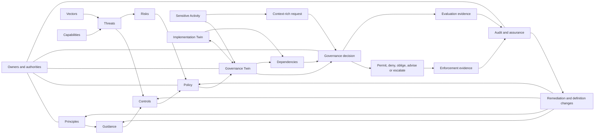
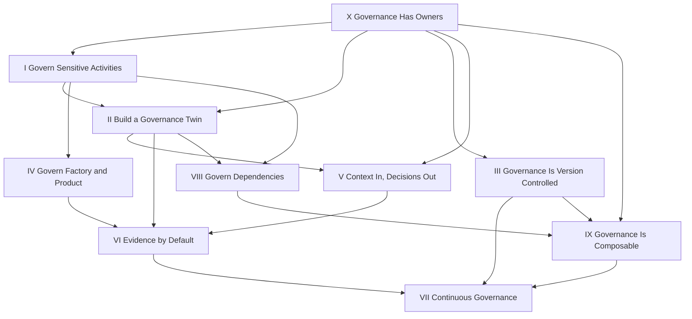
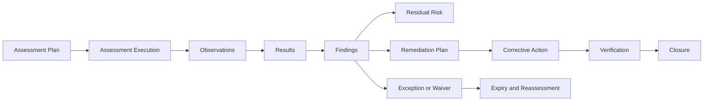
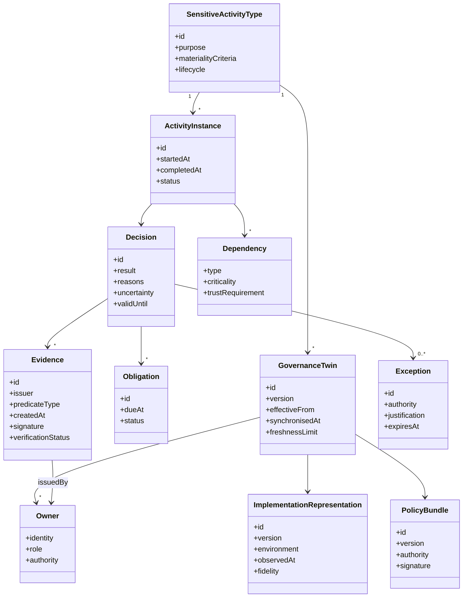
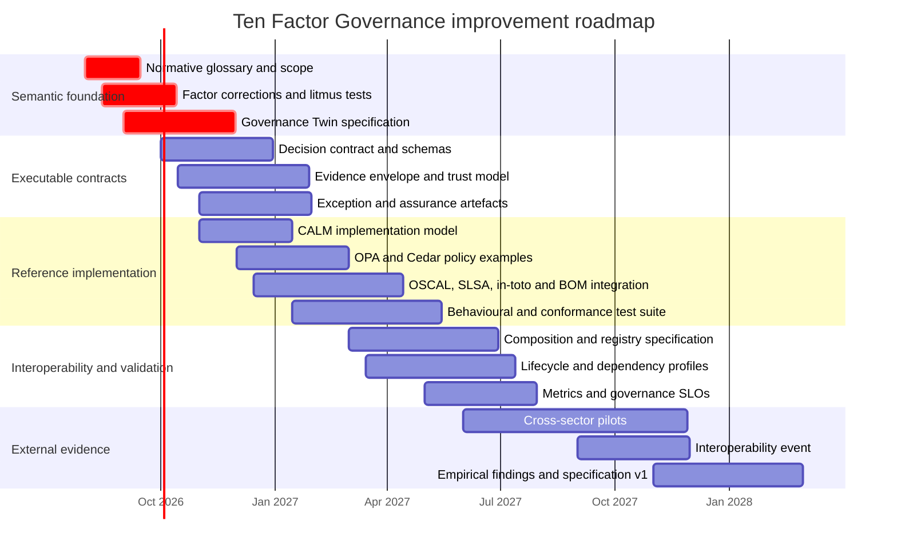

# Ten Factor Governance: Deep Architectural Review

## Executive assessment

Ten Factor Governance is **substantially right about the direction in which software governance must move**: away from static, document-centred compliance and towards governance that is activity-centred, machine-readable, versioned, continuously evaluated, evidence-producing, composable and explicitly owned. The site presents the ten factors as a shared vocabulary for “operable governance” and explicitly positions the work as analogous to the Twelve-Factor App methodology. citeturn1view0turn13search0

Its strongest contribution is not any individual practice. Policy as Code, version control, automated controls, software-supply-chain provenance, continuous monitoring, architectural modelling, explicit authorisation decisions and accountable ownership all pre-date the framework. The potentially novel contribution is the **combination** of:

1. the **sensitive activity** as the primary unit of governance;
2. a machine-readable **Governance Twin** paired with the implementation;
3. explicit decision boundaries receiving context and returning governed outcomes;
4. evidence generated as part of normal execution;
5. governance propagated through dependencies and composed from reusable artefacts.

That combination could become a useful architectural pattern. It is not yet sufficiently specified, tested or demonstrated to justify a claim comparable to the Twelve-Factor App. At present, it is best described as a **promising pattern language and architectural thesis**, rather than a complete methodology, interoperability standard or proven operating model.

### Overall judgement

| Criterion | Assessment | Principal reason |
|---|---|---|
| **Fidelity** | **Generally strong, with several consequential overstatements** | The site accurately reflects Policy as Code, continuous controls, supply-chain evidence and architecture-as-code ideas, but sometimes generalises beyond what tools or standards guarantee. |
| **Usefulness** | **Strong as an explanatory vocabulary; moderate as practitioner guidance** | The examples and anti-patterns are unusually helpful, but there is no complete reference implementation, conformance test or measurable adoption path. |
| **Completeness** | **Partial** | Lifecycle, exceptions, assurance, evidence trust, privacy, human judgement, regulatory obligations, metrics, stakeholder outcomes and incident handling are underdeveloped. |
| **Novelty** | **Low at the component level; potentially meaningful at the synthesis level** | Almost all individual factors have direct predecessors. Activity-centred Governance Twins joined to continuous evidence and composable decisions are the distinctive synthesis. |
| **Internal consistency** | **Good conceptual coherence, but uneven abstraction** | Some factors are foundational principles, some are implementation techniques, and one is a special lifecycle decomposition. Several overlap or imply one another. |
| **Minimality** | **The set is not minimal** | Factors III, VII and IX substantially overlap; Factor IV can be derived from I, II and VIII; VI is partly an operational consequence of V. |
| **Maturity** | **Manifesto or early specification** | The site explains what good governance should look like, but does not yet provide the protocols, schemas, assurance model, metrics and empirical evidence needed for a mature architectural standard. |

The central recommendation is therefore: **do not broaden the manifesto first; deepen it**. Define the semantics of activity identity, twin synchronisation, decision contracts, evidence trust, composition and ownership. Then prove them in one end-to-end implementation.

## Research scope and conceptual model

The review covered the landing page, factors index, all ten factor pages, their discussions, examples, anti-patterns, related-factor links and references, the complete first-party governance-artifact hierarchy, the sensitive-activity page, the evaluation, enforcement and audit artefacts, the tools catalogue, and the individual tool mappings most relevant to the requested comparison. The repository confirms that the first-party documentation is organised into three principal families—factors, artefacts and tools—and contains ten factor documents, the Gemara-derived artefact hierarchy and a catalogue of tool integrations. citeturn23view0turn12view1turn22view1turn22view2

The site’s internal model is more substantial than the front page suggests. It defines:

- Layer-one principles, vectors and guidance;
- layer-two capabilities, threats and controls;
- layer-three risks and policies;
- layer-four sensitive activities;
- layer-five evaluation logs;
- layer-six enforcement logs;
- layer-seven audit logs. citeturn25view0turn25view1turn25view2turn28view0turn28view1turn28view2

The following diagram reconstructs the conceptual architecture implicit across the site.

This is a coherent closed-loop model. The weakness is that several edges in the diagram are only rhetorical. The site does not yet define, for example, how an Implementation Twin is linked to a Governance Twin, how often they synchronise, what constitutes drift, how decision obligations are enforced, how evidence is authenticated, or how an audit finding becomes an authorised change.

### What the site gets most clearly right

**Governance should attach to consequential behaviour, not merely to technology inventories.** The sensitive-activity model is a useful corrective to governance programmes organised around applications, databases, cloud accounts or vendors. A mortgage approval, model recommendation, trade, deployment or public source-code contribution is closer to the event whose outcome creates harm, benefit, obligation and evidence. The site’s artefact model reinforces this by making the activity the hinge between definitions and measurements. citeturn2view3turn25view1

**Governance should have an explicit relationship to implementation.** Architecture-as-code initiatives such as CALM already make architecture machine-readable, version-controlled and validatable. Ten Factor Governance adds the valuable proposition that the governed representation should include policy, risk, controls, decisions and evidence rather than topology alone. CALM provides nodes, relationships, interfaces, controls, patterns, standards and timelines, making it a natural candidate for the implementation side of such a relationship. citeturn19search0turn19search2turn19search21

**Decisions and evidence should be first-class interfaces.** OPA is designed to receive structured data and return policy decisions, including arbitrary structured JSON; Cedar formalises authorisation requests around principal, action, resource and context. OSCAL makes controls, implementation descriptions, assessment plans, assessment results, findings and remediation information machine-readable. SLSA and in-toto provide provenance and attestations for supply-chain activities. These technologies strongly support the direction of Factors V and VI. citeturn13search1turn13search9turn13search34turn13search3turn13search35turn14search0turn14search1

**Governance should be operated continuously but proportionately.** GitOps calls for declarative, versioned state that is automatically pulled and continuously reconciled. NIST’s continuous-monitoring guidance explicitly ties assessment frequency to volatility, criticality and organisational priorities rather than requiring a uniform cadence. Ten Factor Governance is therefore correct to place evaluation in delivery and runtime feedback loops, but it should define “continuous” as risk- and change-responsive rather than constant. citeturn15search6turn17search11

### Where the framing is too broad

The landing page implies that regulations such as the GDPR, EU DORA and the EU AI Act are primarily concerned with activities rather than individual technologies. Activity-centred analysis is valuable, but this formulation is too categorical. EU DORA establishes detailed requirements concerning ICT risk management, incident reporting, resilience testing and third-party ICT risk; it regulates organisations, systems, processes, contracts and operational capabilities as well as activities. citeturn1view0turn18search0turn18search3

The site also uses the term “DORA” in a context where two different things can easily be confused:

- **EU DORA** is the Digital Operational Resilience Act.
- **Google’s DORA research programme** studies software-delivery performance and currently describes five delivery metrics organised around throughput and instability.

The first is a regulatory obligation; the second is an empirical software-delivery measurement framework. Both are relevant, but in entirely different ways. EU DORA should inform obligation, resilience and third-party-risk modelling, while Google DORA can inform the operational metrics of continuous governance. citeturn18search0turn16search2turn16search6

## Factor-by-factor critique

The dependency structure implied by the factor text is not linear. Several later factors depend on earlier ones, while ownership is actually a prerequisite for most of the set.

### Detailed factor table

| Factor and site proposition | Where it is right and corresponding frameworks | Where it is wrong, incomplete or internally difficult | Suggested revision |
|---|---|---|---|
| **I — Govern Sensitive Activities**. Governance should attach to human or automated activities that create material risk rather than to systems in the abstract. citeturn2view3 | This is one of the framework’s strongest propositions. It aligns governance with business outcomes and decision instances, and prevents a platform inventory from masquerading as a risk model. NIST AI RMF similarly asks organisations to map intended purposes, contexts, impacts and affected parties before measuring and managing AI risk. citeturn15search8turn15search14 | “Sensitive” is not operationally defined. There is no discovery procedure, materiality test, harm taxonomy, risk threshold, activity-instance identity or rule for nested activities. The site also understates governance obligations that attach to organisations, data sets, systems, products, suppliers and records independently of a single activity. | Define a **Sensitive Activity Descriptor** containing purpose, actors, affected parties, assets, jurisdictions, lifecycle state, potential harms, inherent risk, materiality threshold, dependencies and accountable owner. State that activities are the primary organising unit, not the only governable entity. |
| **II — Build a Governance Twin**. Each implementation of a sensitive activity should have a corresponding machine-readable representation of how that activity is governed. citeturn2view4 | This is the framework’s clearest candidate for genuine conceptual differentiation. Pairing implementation state with policy, risk, controls and evidence could connect CALM-style architecture models to executable governance. citeturn19search2turn19search5 | The term “twin” carries established semantics. The Digital Twin Consortium defines a digital twin as a data-driven virtual representation with synchronised interaction at a specified frequency and fidelity. Ten Factor Governance does not specify synchronisation, fidelity, state reconciliation or reciprocal interaction. It therefore currently describes a **governance model associated with an implementation**, not necessarily a digital twin. citeturn18search1turn18search27 The page also says a twin is scoped to a single activity, while the composition page presents a Governance Twin for an entire mortgage journey, blurring atomic activity and aggregate process. citeturn2view4turn9view2 | Either adopt rigorous twin semantics—identity, cardinality, synchronisation frequency, fidelity, freshness, drift, reconciliation and source-of-truth—or rename the concept **Governance Contract** or **Governance Model**. Explicitly distinguish an atomic activity twin from a composite journey twin. |
| **III — Governance Is Version Controlled**. Governance artefacts should be reviewed, tested, versioned, promoted and deployed with software-like discipline. citeturn8view0 | This accurately embodies Policy as Code, Infrastructure as Code and GitOps. IaC uses declarative, reusable and version-controlled configuration; GitOps adds immutability, automated pull and continuous reconciliation. citeturn16search3turn16search7turn15search6 | “Treat governance as code” can obscure the difference between authoritative law, organisational interpretation, reusable control definitions, executable policy and evidence schemas. Not all normative governance can or should be executable. The factor omits provenance, signatures, segregation of duties, effective dates, compatibility, migrations, rollback, emergency changes, legal holds and deprecation. It also substantially overlaps Factors VII and IX. | Rename to **Governance Is Released and Traceable**. Define artefact classes and their authority, plus semantic versioning, signed releases, effective dates, approval records, compatibility rules, promotion gates, rollback and deprecation. |
| **IV — Govern the Factory and the Product Separately**. The system that creates a product and the running product are different sensitive activities requiring separate governance. citeturn8view1 | The distinction is essential in software-supply-chain security. SLSA focuses on build integrity and provenance; in-toto models the authorised steps, actors and signed evidence in a supply chain; SPDX and CycloneDX describe components and related supply-chain information. citeturn14search14turn14search8turn14search1turn14search2turn14search10 | “Factory versus product” is too binary. Modern systems have source, build, test, release, deploy, run, observe, update and retire stages. Infrastructure can be both a factory and a product; AI systems have data acquisition, training, evaluation, deployment, inference, monitoring and retraining loops. Runtime discoveries may trigger rebuilds, while provenance produced in the factory must be verified during deployment and operation. | Generalise this to **Govern the Full Lifecycle**. Retain factory/product as a memorable example, but define producer, release, consumer, runtime, operation and retirement activities, including cross-stage evidence transfer and feedback. |
| **V — Context In, Decisions Out**. Governance should be expressed through explicit decision boundaries receiving structured context and returning explicit decisions, reasons, obligations and evidence. citeturn8view2 | The request/decision formulation is practical and maps well to OPA and Cedar. OPA separates policy decision-making from application code and can return arbitrary structured results. Cedar formalises principal, action, resource and context and can validate policies against schemas. citeturn13search1turn13search9turn13search34turn13search2 | The landing page’s “deterministic” language is too strong for governance involving human judgement, probabilistic models, incomplete information or changing external context. Cedar is primarily an authorisation system returning permit or forbid with diagnostics; obligations are not a universal built-in model across Cedar and OPA. Not all governance is pre-action permit/deny: it may be advisory, detective, retrospective, escalatory or compensating. The anti-pattern “policy as workflow” is too categorical because human approvals and remediation genuinely require orchestration. | Define a **Governance Decision Contract** with request schema, policy version, decision ID, result type, reason codes, obligations, uncertainty, missing-data semantics, conflict resolution, latency, caching, fail-open/closed behaviour and evidence references. Replace “deterministic” with “reproducible where feasible, with the context and uncertainty required to explain the result”. |
| **VI — Evidence by Default**. Sensitive activities should produce attributable, explanatory, tamper-evident evidence as a normal output of execution. citeturn8view3 | This is central to demonstrable governance. SLSA provenance, in-toto attestations, CycloneDX attestations, OSCAL assessment results and signed DSSE envelopes all support machine-verifiable claims and evidence. citeturn14search0turn14search5turn14search28turn13search35turn29search2 | “Non-repudiable” is an overclaim. A signature can support authenticity and integrity, but trust still depends on key custody, identity proofing, time sources, issuer authority and verification. Evidence produced by the governed system is not automatically trustworthy. “Every activity emits evidence” also risks excessive data collection, privacy exposure, storage cost and audit noise. The model does not distinguish telemetry, assertion, evidence, attestation, finding and proof. | Use **verifiable evidence** rather than non-repudiation. Define issuer, subject, predicate, policy version, activity instance, timestamp, provenance, signature, trust root, confidentiality, retention, redaction, completeness, freshness and verification status. Introduce risk-tiered evidence requirements and independent evidence sources for high-risk decisions. |
| **VII — Continuous Governance**. Governance definitions and controls should be tested, promoted, observed and improved through build, test and production feedback loops. citeturn9view0 | This correctly reflects DevSecOps, continuous monitoring and GitOps. NIST DevSecOps guidance integrates security into development, build, test, packaging and deployment; NIST continuous monitoring makes frequency responsive to risk and volatility. CCC demonstrates behavioural tests implemented through provider-neutral APIs, Cucumber steps and Gherkin features mapped to assessment requirements. citeturn16search1turn16search9turn17search11turn17search9 | The build/UAT/production model is narrower than modern delivery practices such as preview environments, canaries, progressive rollout, shadow evaluation, incident operation and decommissioning. “Behavioural testing” needs an explicit test oracle, coverage model and treatment of probabilistic outcomes. There are no governance SLOs, policy rollout controls, kill switches, impact monitoring or rollback criteria. This factor duplicates much of Factor III. | Define **continuous reconciliation** rather than simply CI/CD for governance. Add policy canaries, shadow decisions, safe rollout, rollback, control-health SLOs, evidence-freshness SLOs, exception-debt metrics and incident-triggered reassessment. |
| **VIII — Govern Dependencies**. Governance should follow software, data, services, infrastructure, organisations and other activities through the complete dependency chain. citeturn9view1 | This is broader and more valuable than treating dependencies as an SBOM alone. SPDX supports software, data and AI supply-chain information; CycloneDX can describe software, services, endpoints, data flows, machine-learning models and vulnerabilities. SLSA and in-toto add build provenance and authorised process steps. citeturn14search6turn14search18turn14search19turn14search25turn14search1 | The phrase “must trust the things it depends upon” conflicts with zero-trust reasoning. Dependencies should be identified, verified, constrained and monitored, not implicitly trusted. NIST Zero Trust explicitly rejects implicit trust based on ownership or location. citeturn29search0turn29search4 The stopping rule—follow dependencies until risk can no longer materially affect the activity—is sensible but undefined. The site omits cycles, dynamic dependencies, unknown dependencies, concentration risk, substitutes, fallback, degradation and confidence in inherited claims. | Rephrase as **Govern and Verify Dependencies**. Define dependency types, criticality, transitive scope, trust claims, evidence requirements, verification cadence, concentration thresholds, fallbacks and propagation rules. Treat inherited assurance as a claim with confidence and expiry, not a Boolean status. |
| **IX — Governance Is Composable**. Governance should be assembled from reusable, versioned definitions, profiles, contracts, extensions and parameterised modules. citeturn9view2turn10view0turn10view1turn10view2 | This is the most concrete and technically ambitious factor. OSCAL profiles compose and tailor control catalogues; CALM patterns and standards provide reusable architectural structures and schema extensions; OPA bundles distribute policy and data; CCC provides technology-neutral controls with assessment requirements that can be specialised and tested. citeturn13search3turn19search6turn19search33turn13search21turn17search0 | The page combines at least four propositions: reuse, parameterisation, modular release, and interoperability contracts. It is far more expansive than the other factors. Composition semantics are not defined: precedence, conflict resolution, namespace, version negotiation, transitive dependencies, trust, signatures, exception overlays and conformance are unresolved. Governance modules differ from ordinary software libraries because they carry authority, obligations and potentially conflicting normative sources. | Divide the specification beneath the factor into **modules**, **profiles**, **contracts** and **registries**. Define deterministic merge and conflict rules, authority ranking, compatible-version ranges, signed manifests, conformance tests and exception overlays. Keep the factor statement concise. |
| **X — Governance Has Owners**. Every twin, artefact and decision should have an accountable owner with authority and resources. citeturn11view0turn11view1turn11view2 | Ownership is indispensable. CISA’s Secure by Design principles emphasise taking ownership of customer security outcomes, transparency and executive leadership. ISO 42001 similarly places governance, leadership, roles, objectives, monitoring and continual improvement around AI management. citeturn16search4turn16search0turn15search1turn15search9 | “Owner” is too undifferentiated. Policy owner, activity owner, control operator, risk owner, decision-service owner, evidence custodian, approver, auditor and risk-acceptance authority may be different people. The site gives insufficient attention to independence, conflict of interest, delegation, succession, competence, capacity and escalation. Its suggestion that a standards body’s authority makes it the owner of downstream governance also risks confusing authorship with accountability for adoption. | Move this factor near the beginning. Define a role and authority model including accountable owner, responsible operator, approver, risk acceptor, evidence issuer, independent assessor and affected-stakeholder representative. Require delegated authority, succession, competence and escalation records. |

### Dependency, redundancy and ordering

The published order reads well as a narrative, but it does not reflect logical prerequisites.

**Ownership should not be last.** Identifying a sensitive activity without identifying who owns its outcomes and risk is incomplete. A more logical beginning is: activity, owner, governance representation.

**Factors III, VII and IX form one cluster.** Version control, continuous testing and composition are properties of governance treated as a managed product. Versioned governance is not useful without release and promotion; continuous governance presupposes versioned definitions; composition presupposes release identities and compatibility.

**Factor IV is principally a special case.** Once the framework says to govern sensitive activities, model their implementation, and follow dependencies, the build factory and runtime product naturally become separate but connected activity scopes. The factor is valuable operational advice, but it is less foundational than the others.

**Factor VI is partly implied by Factor V.** A governed decision that cannot identify its policy, context, result and reason is not a well-designed decision interface. Factor VI remains important because evidence has lifecycle, integrity and retention properties beyond the decision itself, but the relationship should be explicit.

A better ordering, while retaining all ten factors, would be:

| Proposed position | Factor | Rationale |
|---|---|---|
| First | Govern Sensitive Activities | Defines the unit of analysis. |
| Second | Governance Has Owners | Establishes authority and accountability before modelling or automation. |
| Third | Build a Governance Twin | Creates the governed representation. |
| Fourth | Govern Dependencies | Establishes system and supply-chain boundaries. |
| Fifth | Context In, Decisions Out | Defines the operational decision interface. |
| Sixth | Evidence by Default | Defines the assurance output. |
| Seventh | Governance Is Version Controlled | Establishes release and change discipline. |
| Eighth | Governance Is Composable | Enables reuse and federation. |
| Ninth | Govern the Full Lifecycle | Applies the model across build, release, run and retirement. |
| Tenth | Continuous Governance | Closes the operating and improvement loop. |

## Comparative fidelity and novelty

### Relationship to the requested frameworks

| Framework or technology | What it already contributes | What Ten Factor Governance adds or attempts to add | Fidelity of the site’s mapping |
|---|---|---|---|
| **Twelve-Factor App** | A concise methodology for portable, maintainable SaaS applications, expressed as memorable operational factors such as one codebase, externalised configuration and logs as event streams. citeturn13search0turn13search20turn13search4turn13search12 | Applies the “factor” form to governance and attempts to create a shared architectural vocabulary. | **Formally inspired, but not yet equivalent in precision.** Twelve-Factor factors usually have clear implementation consequences. Several Ten Factor propositions lack conformance criteria, and Factor IX is much more expansive than the others. |
| **Policy as Code / OPA** | Policy separated from application code, evaluated over structured data through APIs, with arbitrary structured decision outputs and testable Rego policies. citeturn13search1turn13search5turn13search9turn13search29 | Places policy evaluation inside a wider chain of activity identity, twin, evidence, dependencies, ownership and audit. | **Strong**, although the site should avoid implying that all governance policies are executable or that every result follows the same permit/deny shape. |
| **Cedar** | A purpose-built authorisation language with principal/action/resource/context requests, schema validation and analysable policy semantics. citeturn13search34turn13search2turn13search6 | Treats explicit decision interfaces as a general governance pattern beyond authorisation. | **Mostly accurate but over-generalised.** Cedar is a strong model for access decisions, not a complete representation for governance obligations, evidence or workflow. |
| **Infrastructure as Code** | Declarative, reusable, version-controlled and repeatable infrastructure lifecycle management. citeturn16search3turn16search7 | Extends code-like management to policies, controls, risks, evidence and ownership. | **Strong analogy**, provided authoritative prose and human judgement are not forced into executable code. |
| **GitOps** | Declarative desired state, immutable versioned artefacts, automatic pull and continuous reconciliation. citeturn15search6turn15search2 | Applies reconciliation to governance definitions and implementation state. | **Strong but incomplete.** The missing concept is an explicit governance reconciler and its drift semantics. |
| **OSCAL / Compliance as Code** | Machine-readable control catalogues, profiles, system-security plans, assessment plans, assessment results, findings and plans of action and milestones. citeturn13search15turn13search3turn13search35turn17search17 | Organises compliance artefacts around sensitive activities and decision/evidence loops. | **Directionally accurate but under-utilised.** The site’s three “log” measures are materially less expressive than OSCAL’s assessment and remediation models. |
| **SLSA** | Progressive levels and requirements for build integrity, provenance accuracy and trusted build processes. citeturn14search14turn14search8turn14search26 | Places SLSA evidence inside a broader Governance Twin and dependency model. | **Accurate**, but SLSA covers a narrower supply-chain problem than product or organisational governance. |
| **in-toto** | Defines authorised supply-chain steps, functionaries, materials, products and signed link metadata. citeturn14search1turn14search5 | Generalises attestable activities from software build steps to arbitrary governed activities. | **Very strong conceptual correspondence.** In-toto’s statement and attestation patterns could provide part of the evidence envelope TFG currently lacks. |
| **SPDX** | An ISO-standardised system for communicating software-bill-of-materials and wider software, data and AI supply-chain information. citeturn14search2turn14search6turn14search18 | Relates component information to governance decisions and inherited risk. | **Accurate**, but a bill of materials is evidence about composition, not assurance that dependencies are acceptable. |
| **CycloneDX** | BOMs covering components, services, data flows, machine-learning models, vulnerabilities, VEX and attestations. citeturn14search10turn14search19turn14search3turn14search25turn14search28 | Uses these artefacts as inputs to dependency governance and evidence. | **Strong.** The site could make better use of CycloneDX’s service, data-flow, ML-BOM, VEX and attestation models rather than treating it mainly as an SBOM. |
| **NIST AI RMF** | Govern, Map, Measure and Manage functions; contextual mapping of intended use, risks, impacts and affected parties; profiles and continual risk management. citeturn15search0turn15search8turn15search14turn15search20 | Offers a software architecture for operationalising these functions at activity and decision level. | **Complementary rather than competing.** TFG needs the affected-party, impact and socio-technical breadth of AI RMF. |
| **ISO/IEC 42001** | An organisational AI management system covering context, leadership, objectives, risk, lifecycle, data, transparency, performance evaluation and continual improvement. citeturn15search1turn15search9 | Could supply executable artefacts and evidence beneath a management system. | **Complementary.** TFG currently lacks much of the organisational-management-system layer, especially objectives, competence, communication and management review. |
| **Google DORA research** | Empirical software-delivery capabilities and metrics, now organised around five measures of throughput and instability. citeturn16search2turn16search6turn16search30 | Could provide quantitative measures for governance delivery and policy-change performance. | **Largely missing.** “Continuous” is described procedurally, not measured empirically. |
| **EU DORA** | Legal requirements for ICT risk management, resilience testing, incident handling and third-party ICT risk in the financial sector. citeturn18search0turn18search3 | Activity-centred models may help connect regulatory obligations to operational evidence. | **Over-simplified on the landing page.** EU DORA cannot be reduced to governing individual activities. |
| **Secure by Design** | Manufacturer ownership of security outcomes, transparency, accountability and leadership responsibility. citeturn16search4turn16search0 | Extends ownership to each governance artefact and decision. | **Strong alignment**, but affected users and customer outcomes should be more explicit. |
| **DevSecOps** | Security integrated across development, build, test, packaging, deployment and operation, supported by automation and continuous feedback. citeturn16search1turn16search21turn16search9 | Generalises this operating model to broader governance concerns. | **Strong**, although the current factory/product distinction is less complete than the lifecycle models used in DevSecOps. |
| **CALM / Architecture as Code** | A machine-readable, version-controlled architecture specification with nodes, relationships, interfaces, controls, standards, patterns, timelines and validation tools. citeturn19search0turn19search2turn19search21 | Proposes a paired governance representation and activity-level decision/evidence model. | **One of the most important integrations.** CALM is a plausible Implementation Twin substrate, but the binding to the Governance Twin must be specified. |
| **CCC and behavioural testing** | Technology-neutral capabilities, threats, controls and assessment requirements translated into scans, analyses and behavioural checks. CCC’s current validator model uses provider-neutral APIs, reusable Cucumber steps and Gherkin feature files. citeturn17search0turn17search3turn17search6turn17search9 | Supplies concrete catalogues, tests and evidence for the TFG/Gemara model. | **Strong and unusually practical.** However, CCC and Gemara materially shape the framework’s taxonomy, so they are implementation dependencies as well as examples. |

### Is it genuinely new?

The answer depends on the level at which novelty is judged.

#### The individual factors are mostly established practices

Version control, policy engines, automated evidence, supply-chain attestations, continuous controls, dependency inventories, ownership and modular policy catalogues all have mature precedents. Even the activity focus has analogues in business-process governance, risk-event modelling, zero-trust policy enforcement and in-toto supply-chain steps.

A claim that Ten Factor Governance invented these practices would therefore be unpersuasive.

#### The organising synthesis may be new enough to matter

The framework becomes distinctive when read as the following architectural proposition:

> Every risk-bearing activity has a machine-readable governance representation bound to its implementation; that representation accepts context, drives decisions and obligations, produces verifiable evidence, inherits and constrains dependencies, and evolves through versioned, owned and composable modules.

That is stronger than “Compliance as Code” alone. It connects normative intent, architecture, activity instances, policy decisions, evidence and lifecycle feedback in one pattern.

#### The Governance Twin is promising but not yet earned terminology

The accepted digital-twin definition requires synchronisation at a specified frequency and fidelity. The Ten Factor site says that the governance and implementation representations should evolve together, but it does not define:

- what state is synchronised;
- which representation is authoritative;
- whether synchronisation is one-way or reciprocal;
- the allowable age or fidelity of the representation;
- the response to drift;
- how one activity maps to multiple implementations and environments;
- how historical states are retained. citeturn2view4turn18search1turn18search4

There are therefore two defensible paths:

**Keep “Governance Twin” and make the term rigorous.** Require a stable twin identifier, binding to implementation entities, declared synchronisation events, freshness and fidelity constraints, observable drift, reconciliation, historical state and lifecycle status.

**Use a less ambitious term.** “Governance Contract”, “Governance Model” or “Governance Representation” would be more accurate if the artefact remains a versioned description without live synchronisation.

#### What is required before it can be called an architectural pattern

To move from a collection of good practices to a credible architectural pattern, the framework needs:

1. a recurring problem and explicit context;
2. a defined solution structure;
3. named components and interfaces;
4. forces and trade-offs;
5. known failure modes;
6. consequences and limitations;
7. at least one independently reproducible implementation;
8. evidence that the pattern improves outcomes.

The site currently covers the problem, solution direction, examples and anti-patterns. It is weakest on formal interfaces, trade-offs, conformance and empirical results.

## Site-level strengths, weaknesses and omissions

### Editorial and explanatory strengths

The pages use a consistently effective pattern: principle, problem, characteristics, examples, anti-patterns, practice steps, related factors and references. This makes abstract governance ideas more approachable than a conventional controls catalogue. The anti-patterns are especially useful because they reveal the intended boundary of each concept. citeturn2view3turn8view0turn8view2turn9view0

The artefact pages also contain concrete worked examples, including FOSS contributions, mortgage approval, AI recommendations and cloud object storage. Evaluation, enforcement and audit are shown as a linked sequence rather than a single generic “compliance log”. citeturn25view1turn27view1turn28view0turn28view1turn28view2

The tools catalogue is appropriately described as non-exhaustive and not an endorsement list. It covers policy engines, architecture models, control languages, supply-chain evidence, BOMs, CMDBs, GitOps and ownership mechanisms. citeturn2view2

### Uneven level of abstraction

The ten factors are not all the same kind of thing:

| Category | Factors |
|---|---|
| **Unit and model** | Sensitive Activities; Governance Twin |
| **Engineering properties** | Version Controlled; Composable |
| **Operational interfaces** | Context In, Decisions Out; Evidence by Default |
| **Lifecycle practices** | Factory and Product; Continuous Governance |
| **Boundary management** | Govern Dependencies |
| **Organisational prerequisite** | Governance Has Owners |

This is not inherently wrong, but it weakens the Twelve-Factor analogy. A reader cannot apply the same conformance question to “Governance Has Owners” and “Context In, Decisions Out”. One is an accountability principle; the other is an interface pattern.

The site should either acknowledge that the ten factors form different architectural dimensions or rewrite them at a common level, such as “Every governed activity shall…”.

### The artefact model is too security-centred for general governance

The Governance Definitions index describes:

- vectors as attack vectors and compromise techniques;
- threats as specifically scoped opportunities for negative impact;
- controls as technology-specific, threat-informed **security** controls;
- risks as organisational categories, severity and appetite;
- policy as risk-informed organisational guidance. citeturn25view0turn26view1turn27view0turn27view1turn27view2turn27view3

That taxonomy works reasonably well for cyber and cloud security, particularly because it is influenced by Gemara and CCC. It is less complete for:

- fair lending and discrimination;
- consumer duty;
- market conduct;
- model validity;
- accessibility;
- environmental or sustainability obligations;
- records management;
- operational resilience;
- safety;
- intellectual property;
- labour and human-rights concerns.

For general governance, the model needs positive and normative concepts as well as security threats:

| Missing concept | Why it is needed |
|---|---|
| **Objective or valued outcome** | Governance is not only the avoidance of threats; it is also the reliable achievement of organisational and societal outcomes. |
| **Obligation or requirement** | A traceable representation of what a law, contract, policy or authority requires. |
| **Affected party** | Someone may bear harm without operating or owning the activity. |
| **Impact or harm** | Threats are not a sufficient representation of discrimination, safety loss, denial of service, financial detriment or rights interference. |
| **Claim** | A statement being asserted about a control, system, supplier or activity. |
| **Assurance argument** | The reasoning connecting claims, evidence and conclusions. |
| **Exception or waiver** | A time-bounded authorised departure from a rule. |
| **Risk acceptance decision** | Who accepted residual risk, under what authority and until when. |
| **Issue, finding and remediation** | The closed-loop objects between failed evaluation and corrected governance. |
| **Metric and threshold** | The quantitative basis for control health and governance effectiveness. |

### The measurement model is too log-centric

The site defines evaluation, enforcement and audit as “logs”. Evaluation records pass/fail results; enforcement records prevention or remediation; audit reviews organisational policy and conformance. citeturn25view2turn28view0turn28view1turn28view2

This separation is useful, but “log” is not an adequate abstraction for all three:

- An **evaluation** may be a plan, execution, observation, test result and conclusion.
- **Enforcement** may be an obligation, action request, action result, exception or remediation state.
- An **audit** is a governed, potentially independent assurance process with scope, criteria, sampling, evidence, findings, conclusions and follow-up.

OSCAL’s separation of assessment plans, assessment results, observations, findings, risks and plans of action and milestones is a better starting point than three generic record streams. citeturn13search3turn13search35

A stronger model would retain event logs for traceability while defining durable domain objects:

### Missing decision semantics

The policy-decision material needs a normative protocol. At minimum, a decision should identify:

| Field | Purpose |
|---|---|
| `decision_id` | Correlation and replay |
| `activity_type` and `activity_instance` | Governed subject |
| `policy_bundle` and version | Rules in force |
| `request_schema` and version | Input interpretation |
| `context` or context digest | Material facts used |
| `decision` | Permit, deny, advise, escalate, defer, indeterminate or not applicable |
| `reasons` | Stable human- and machine-readable reason codes |
| `obligations` | Actions required before or after proceeding |
| `uncertainty` | Confidence, missing inputs and judgement boundaries |
| `issuer` | Decision service or authorised human |
| `owner` | Accountable authority |
| `evidence_refs` | Supporting observations or attestations |
| `validity` | Effective time, expiry and conditions |
| `appeal_or_override` | Authorised challenge and exception route |

OPA can produce arbitrary structured results, which makes such a contract feasible; Cedar can be used for the authorisation subset. citeturn13search9turn13search29turn13search34

### Missing evidence trust and privacy model

Evidence by Default is one of the most compelling ideas, but the site focuses more on evidence production than evidence assurance.

A credible evidence architecture must answer:

- Who issued the evidence?
- What authority does the issuer have?
- Was the issuer authenticated?
- Is the artefact signed?
- Which key and identity system were used?
- Was the relevant software or policy version itself verified?
- Is the timestamp reliable?
- Can evidence be altered or selectively omitted?
- What is the chain of custody?
- Does evidence contain personal, secret or regulated data?
- How long should it be retained?
- Can an affected person inspect or challenge it?
- What independent evidence corroborates self-produced records?

W3C PROV provides a domain-neutral model of entities, activities, agents and provenance relationships. In-toto attestations signed through DSSE/Sigstore can provide authenticity and verification. OpenTelemetry semantic conventions can standardise operational events, traces, metrics and logs, but telemetry should remain distinguishable from assurance evidence. citeturn29search1turn29search8turn29search2turn29search6turn29search24

### Human and probabilistic governance is underdeveloped

The framework is strongest for machine-enforced software controls. It is less developed where:

- an authorised human must make a judgement;
- evidence is incomplete or disputed;
- decisions have probabilistic outputs;
- fairness or explainability requires cohort-level analysis rather than per-event policy;
- affected people have rights of explanation, appeal or remedy;
- controls are procedural, contractual or cultural;
- governance outcomes emerge over time.

NIST AI RMF and ISO 42001 both treat governance as socio-technical and organisational, encompassing context, affected parties, lifecycle management, monitoring, transparency and continual improvement. Ten Factor Governance should explicitly say that machine-readable governance supports—but does not replace—human authority and institutional processes. citeturn15search8turn15search14turn15search9

### Exceptions and residual risk are conspicuously absent

Real governance systems cannot simply permit or deny every activity. They need:

- temporary exceptions;
- compensating controls;
- risk acceptance;
- emergency break-glass procedures;
- retrospective approval;
- time-bounded waivers;
- appeals;
- remediation commitments;
- renewal or expiry;
- escalation when no authorised decision-maker is available.

Without this, the framework risks describing only the compliant “happy path” and automatic rejection. Exceptions should be first-class, owned, evidenced, expiring governance artefacts—not comments in tickets.

### Effectiveness is not measured

The framework measures whether controls ran, but not whether governance works.

A complete framework should distinguish:

| Measurement class | Example |
|---|---|
| **Conformance** | Percentage of applicable activity instances evaluated |
| **Control operation** | Enforcement success rate |
| **Evidence quality** | Freshness, completeness and verification rate |
| **Decision quality** | False-positive, false-negative, override and appeal rates |
| **Outcome effectiveness** | Reduction in incidents, detriment or policy violations |
| **Delivery performance** | Time to test and promote a governance change |
| **Governance debt** | Open exceptions, overdue findings and unsupported policies |
| **Human impact** | Disparate outcomes, complaints, reversals and remedy time |
| **Resilience** | Detection, containment, recovery and reassessment time |

Google DORA demonstrates the value of empirically validated operational measures rather than measuring only process adoption. TFG needs an equivalent research agenda for governance outcomes. citeturn16search2turn16search6turn16search30

## Recommended architecture and artefacts

### A normative core model

The site should publish a small, technology-neutral metamodel before adding more prose. The minimum entities should be:

The model should specify identity, cardinality and lifecycle. In particular:

- One activity type may have many instances.
- One activity may have multiple implementation representations by environment, region or version.
- A Governance Twin may be composed, but the atomic and aggregate forms must be distinguishable.
- Every decision must point to the exact policy bundle and context schema in force.
- Every evidence item must state who issued it, what it asserts and how it can be verified.
- Every exception must expire or be reassessed.

### Interoperability profile

The framework should not invent replacements for every existing standard. It should define a thin interoperability profile.

| TFG concern | Recommended primary representation | Role |
|---|---|---|
| Architecture and implementation topology | **CALM** | Nodes, relationships, interfaces, flows, controls, patterns, timelines and versioned architecture |
| Governance definitions and activity model | **Gemara**, extended where necessary | Principles, guidance, capabilities, threats, controls, risks, policies and sensitive activities |
| Control and compliance exchange | **OSCAL** | Catalogues, profiles, implementation descriptions, assessment plans/results, findings and remediation |
| Authorisation decisions | **Cedar** | Analysable principal/action/resource/context policy |
| General policy decisions | **OPA/Rego** | Structured policy evaluation and rich decision responses |
| Build assurance | **SLSA and in-toto** | Build provenance, authorised steps and attestations |
| Composition inventory | **SPDX or CycloneDX** | Components, services, dependencies, data, models and vulnerabilities |
| Evidence envelope | **in-toto Statement plus DSSE/Sigstore** | Signed, typed assertions |
| Provenance graph | **W3C PROV** | Entity, activity and agent lineage |
| Runtime correlation | **OpenTelemetry** | Traces, logs, events, metrics and common resource identity |
| Deployment reconciliation | **OpenGitOps-compatible workflow** | Desired state, versioned releases and reconciliation |
| Behavioural controls | **CCC-style Gherkin/Cucumber tests** | Executable, provider-neutral assessment requirements |

This should be implemented as profiles and adapters rather than a single universal file. OSCAL, CALM, Cedar, OPA and CycloneDX have different purposes; forcing them into one schema would destroy useful semantics.

### A complete reference implementation

The site needs one canonical example that crosses all ten factors. The current examples are individually useful, but they are distributed across pages.

A suitable reference could be **AI-assisted mortgage approval**, because it includes consequential decisions, human and automated actors, data and model dependencies, fairness, explainability, deployment supply chains and appeal.

The repository should include:

1. **Activity definition**  
   `approve-mortgage`, `generate-credit-recommendation`, `human-credit-review`, `deploy-credit-model` and `retrain-credit-model`.

2. **CALM architecture**  
   Origination service, decision API, policy decision point, model endpoint, feature store, evidence store, appeal service and external data providers.

3. **Governance Twin**  
   Scope, owners, affected parties, legal and policy obligations, risks, controls, decision contracts and evidence requirements.

4. **Policy implementations**  
   Cedar for access and authority; OPA for eligibility, data-use, deployment and evidence-completeness policies.

5. **OSCAL artefacts**  
   Control profile, implementation description, assessment plans, assessment results, findings and remediation.

6. **Supply-chain artefacts**  
   SLSA provenance and in-toto attestations for policy bundles, model packages and application images.

7. **BOMs**  
   CycloneDX ML-BOM and service BOM, or SPDX equivalents, including model, data and software dependencies.

8. **Behavioural tests**  
   Positive, negative, boundary, missing-context, conflicting-policy, fairness and break-glass scenarios.

9. **Evidence receipts**  
   Signed decision and deployment attestations with W3C PROV relationships and OpenTelemetry correlation identifiers.

10. **Operational demonstration**  
    A policy change progressing through pull request, validation, shadow evaluation, approval, deployment, evidence generation, drift detection, rollback and audit.

### Conformance tests

Each factor should have a short “litmus test”, analogous to the practical clarity of the Twelve-Factor App.

| Factor | Proposed conformance question |
|---|---|
| Sensitive Activities | Can the organisation identify the exact activity instance, purpose, actors, affected parties and material risks being governed? |
| Governance Twin | Can the current governance representation be resolved from the implementation, and can drift or staleness be detected? |
| Version Controlled | Can every decision be traced to an immutable, approved governance release? |
| Full Lifecycle | Are build, release, deployment, runtime, update and retirement activities separately governed and linked? |
| Context In, Decisions Out | Is there a documented, versioned request-and-response contract including error and uncertainty semantics? |
| Evidence by Default | Does normal execution produce verifiable, privacy-appropriate evidence without manual audit reconstruction? |
| Continuous Governance | Are material implementation, dependency or policy changes automatically reassessed at a risk-appropriate cadence? |
| Dependencies | Are critical direct and transitive dependencies known, verified, monitored and covered by fallback or acceptance decisions? |
| Composable | Can governance modules be reused without ambiguous precedence, untracked modification or incompatible versions? |
| Owners | Can an accountable authority, responsible operator and risk-acceptance authority be resolved for every material artefact and decision? |

### Recommended textual corrections

Several small wording changes would materially improve precision.

| Current idea | Recommended wording |
|---|---|
| “Governance decisions are deterministic” | “Governance decisions are reproducible where feasible, and record the context, judgement and uncertainty needed to explain their outcome.” |
| “Evidence is non-repudiable” | “Evidence is attributable, integrity-protected and independently verifiable against declared trust anchors.” |
| “A sensitive activity must trust its dependencies” | “A sensitive activity must identify, verify and constrain the dependencies on which its governed outcome relies.” |
| “Govern the factory and product separately” | “Govern each material lifecycle activity separately while preserving provenance and feedback between them.” |
| “Policy as workflow is an anti-pattern” | “Do not hide decision semantics inside workflow orchestration; use workflow to implement authorised human review, obligations, escalation and remediation.” |
| “Regulation governs activities rather than systems” | “Many regulatory obligations become operationally meaningful when mapped to concrete activities, while others attach to organisations, systems, data, suppliers and records.” |
| “Every implementation has a Governance Twin” | “Every material implementation is resolvably bound to a current governance representation, with declared synchronisation and fidelity.” |

### A more minimal formulation

If conceptual minimality is more important than preserving the number ten, the framework can be reduced to six axioms:

1. **Govern risk-bearing activities.**
2. **Bind governance intent to implementation reality.**
3. **Make governed decisions explicit.**
4. **Produce verifiable evidence as part of execution.**
5. **Continuously reconcile governance across lifecycle and dependencies.**
6. **Compose versioned governance under accountable authority.**

Under this formulation:

- Factor IV becomes guidance beneath lifecycle reconciliation.
- Factors III, VII and IX become aspects of versioned and composable governance.
- Factor X becomes part of accountable authority.
- Factor VI remains distinct because assurance evidence has different semantics from a decision.

If retaining ten is important for identity and memorability, the six-axiom structure can instead serve as an explanatory grouping.

## Prioritised roadmap

The roadmap should prioritise semantic precision and proof over adding more factor prose.

### Recommended delivery sequence

| Priority | Workstream | Concrete outputs | Why it comes first |
|---|---|---|---|
| **Critical** | **Normative vocabulary** | Definitions of activity type/instance, twin, implementation representation, decision, obligation, evidence, dependency, owner, exception, finding and remediation | The framework cannot be implemented interoperably while its core nouns remain informal. |
| **Critical** | **Factor corrections and litmus tests** | Revised overclaims, common page template, one conformance question and one failure mode per factor | Makes the framework falsifiable and comparable to Twelve-Factor. |
| **Critical** | **Governance Twin semantics** | Identity, binding, cardinality, synchronisation, fidelity, freshness, drift and reconciliation specification | This is the framework’s most distinctive concept and currently its most consequential ambiguity. |
| **High** | **Decision and evidence contracts** | Versioned JSON Schemas, result taxonomy, obligation handling, signed evidence envelope and verification procedure | Turns Factors V and VI into implementable interfaces. |
| **High** | **End-to-end reference repository** | Mortgage or AI-credit example using CALM, Gemara/OSCAL, OPA/Cedar, SLSA/in-toto and CycloneDX/SPDX | Demonstrates that the ten factors form one architecture rather than a collection of adjacent ideas. |
| **High** | **Exception and assurance model** | Waiver, compensating control, risk acceptance, independent assessment, appeal and expiry artefacts | Necessary for real regulated operations. |
| **High** | **Composition specification** | Modules, profiles, namespaces, precedence, compatibility, signatures, registries and conformance tests | Prevents Factor IX from remaining an attractive but ambiguous analogy to software reuse. |
| **Medium** | **Lifecycle and dependency profile** | Build/release/run/update/retire model; transitive dependency and trust-claim semantics | Replaces the overly binary factory/product formulation. |
| **Medium** | **Operational metrics** | Governance SLOs, decision quality, evidence freshness, exception debt, control effectiveness and delivery metrics | Allows the framework’s value to be measured rather than asserted. |
| **Medium** | **Sector profiles** | Cloud, AI, open-source contribution, financial decision and software-delivery examples | Tests whether the activity model generalises beyond cyber controls. |
| **Later** | **Independent pilots and standardisation** | Multiple implementers, interoperation events, case studies and proposed FINOS/OpenSSF specification process | Architectural legitimacy should follow implementation evidence. |

### Indicative content and implementation timeline

### Success criteria

The framework should not declare itself mature merely because the documentation is complete. A credible first stable release should demonstrate that:

- two independent implementations can resolve the same activity, policy and evidence identifiers;
- an implementation change can automatically trigger twin drift and reassessment;
- the same governance module can be composed into two environments with predictable conflict and override behaviour;
- decisions can be replayed or explained using retained context and policy versions;
- evidence can be independently verified;
- expired evidence, dependencies and exceptions are detected;
- human approvals and automated decisions share a coherent evidence model;
- an auditor can move from an organisational obligation to policy, control, activity, implementation, decision, evidence and remediation without a manual spreadsheet crosswalk;
- at least one pilot measures improved governance outcomes rather than merely increased automation.

The site is already more than a front-page manifesto: it contains a coherent factor set, a detailed Gemara-derived artefact hierarchy, worked examples, anti-patterns and tool mappings. Its weakness is not lack of ideas. It is that the most important ideas—Governance Twins, activity identity, decision contracts, evidence trust and composition—remain at the level of persuasive explanation rather than normative architecture.

The strongest defensible positioning would be:

> **Ten Factor Governance is an architectural pattern language for binding governance intent to risk-bearing software activities through machine-readable models, explicit decisions, verifiable evidence and continuous reconciliation.**

That is a meaningful and potentially distinctive claim. To establish something stronger—an industry methodology comparable to the Twelve-Factor App—the next phase must replace analogy with contracts, diagrams with schemas, examples with a complete implementation, and assertions of good governance with measurable evidence that the pattern works.