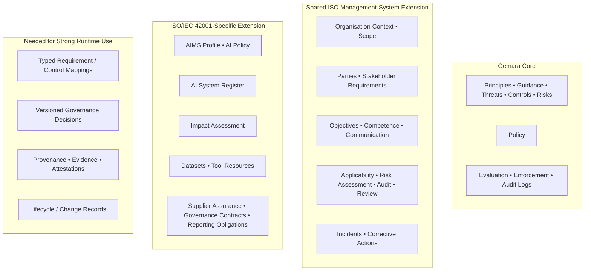

# ISO/IEC 42001 → Gemara extension schema: analytical review

## Executive summary

The `ISO-analysis` branch is a **substantive and well-conceived proof of concept**, not merely a thin translation of ISO/IEC 42001 into YAML/CUE. It introduces 23 ISO-related CUE schema files under `src/schemas/iso`: a shared ISO management-system layer and an ISO/IEC 42001-specific layer, plus worked examples. The design explicitly divides responsibility between Gemara's existing governance primitives and new management-system artefacts: Gemara continues to represent principles, guidance, controls, threats, risks, policies and measurement logs, while the extension adds context, scope, interested parties, objectives, applicability, competence, communication, reviews, corrective actions and AI-specific objects such as AI systems, datasets and impact assessments. citeturn53view0turn55view2

My overall assessment is:

| Dimension | Assessment | Why |
|---|---|---|
| **Completeness against ISO/IEC 42001** | **Good, but not complete** | Most of Clauses 4–10 and Annex A have credible schema homes. The most material residual gaps are the AIMS process model itself, planned change, explicit organisation-wide responsibility/authority assignments, performance-measurement planning, concern reporting and stronger lifecycle/change evidence. citeturn55view2turn57view0turn57view3turn57view7turn57view9 |
| **Fidelity to ISO terminology and intent** | **Generally strong** | The schemas use recognisable concepts such as AIMS, AI Policy, Statement of Applicability, risk assessment, impact assessment, management review, competence and corrective action. Some invented abstractions are useful but create terminology friction, notably `ApplicabilityProfile`, `GovernanceContractRegister` and `ToolResourceRegister`. citeturn55view0turn56view1turn56view12turn56view15 |
| **Practical usability as governance-as-code** | **Good for authoring and audit preparation; moderate for automated runtime enforcement** | CUE validation, stable IDs, registers and document references are good foundations. Generic references, incomplete requirement/evidence binding and a lack of a typed process/change model make automated reasoning harder than it needs to be. citeturn56view0turn55view2turn57view18 |
| **Cleanliness as a Gemara extension** | **Architecturally clean, schema compatibility mixed** | The branch sensibly avoids changing Gemara's core model and reuses several Gemara primitives. The important exception is `#AIPolicy`: because `gemara.#Policy` is closed, the extension is explicitly *not* substitutable for a strict Gemara `#Policy`. citeturn55view0turn12view0turn12view1 |
| **Fit for a governance runtime** | **Promising but not yet sufficient as the sole runtime contract** | It can describe what governance should exist, but runtime enforcement needs stronger immutable version references, exact requirement/control mappings, decision/evidence linkage, provenance and attestations. Gemara already supplies Evaluation, Enforcement and Audit Logs, so the right answer is largely to connect those primitives more tightly rather than invent another runtime-log hierarchy. citeturn12view0turn9search6turn9search10 |

The strongest design decision is the **division of labour**. The branch does not try to turn ISO/IEC 42001 into a replacement GRC ontology. Instead, it treats ISO 42001 as a management-system envelope around Gemara. That is consistent with Gemara's own architecture: its model is deliberately stable, with definition layers for governance artefacts and measurement layers for evaluation, enforcement and audit evidence. citeturn55view2turn12view0turn12view1

The biggest problem is at the boundary between **descriptive compliance** and **machine-enforceable governance**. The branch can say, for example, that an AIMS references a risk assessment, impact assessment, applicability profile, audit programme and management review; it is less rigorous about proving that a reference resolves to the expected artefact type and exact version, that an ISO requirement maps to a specific Gemara control, and that a runtime decision is backed by evidence produced under those exact versions. That is the area I would address before treating the model as a governance-runtime contract. citeturn55view2turn56view1turn57view21

There is also a notable **documentation/schema synchronisation issue**. The branch's gap analysis still recommends adding artefacts that now exist—for example an AI-system descriptor and `ManagementReview`—and says no incident/communications artefact exists even though `incident.cue` and `communication-plan.cue` are now present. The gap analysis is therefore useful design history, but no longer a reliable machine-readable statement of current coverage. This should be generated from, or tested against, the schemas. citeturn57view10turn55view1turn57view8turn56view5turn57view16turn53view0

One important qualification: ISO publishes only limited public material from ISO/IEC 42001; the normative standard is licensed. The branch itself explicitly warns that its clause descriptions are paraphrases and that conformity assessment requires the standard. I have therefore treated the repository's clause catalogue as its **claimed mapping**, checked its overall structure against ISO's official public description of ISO/IEC 42001, but I would not regard this report as certification of word-for-word normative fidelity. ISO's own public overview confirms the central themes of organisational context and leadership, AI policy and objectives, AI risk management, data and lifecycle governance, transparency, performance evaluation and continual improvement. citeturn55view2turn16search12turn0search0

## Scope and structure of the proposed extension

The branch is currently an open pull request described as adding the governance artefacts for the AI Portfolio Analysis proof of concept. The PR contained 16 commits when inspected and the CUE schemas themselves are marked `experimental`, which is the correct maturity signal: this is a serious design proposal, but it should not yet be treated as a stable interchange contract. citeturn50view0turn55view0turn55view2

The schema has three conceptual strata:



That decomposition is sound. `aims.cue` states the intent directly: Gemara represents governance content and measurement logs; `iso/common` provides the general management-system envelope; and `iso42001` provides the elements specifically needed to govern AI systems. The `#AIMS` type is deliberately a **profile of references**, not a giant embedded document, so its constituent artefacts can be independently versioned. That is a particularly good architectural choice for governance-as-code. citeturn55view2

The ISO-specific package contains `#AIPolicy`, an AI-system register, audit programme, dataset register, governance-contract register, impact assessment, reporting-obligation register, supplier-assurance register and tool-resource register. The common package adds applicability, communications, competence, corrective action, document metadata, governance scope, incidents, management objectives, management review, organisation context, parties, risk assessments and stakeholder requirements. citeturn53view0

The branch also maintains a machine-readable ISO/IEC 42001 guidance catalogue with stable-looking identifiers such as `iso42001-4.4.1`, `iso42001-7.5.2.1` and `iso42001-9.1.5`. That is potentially extremely valuable: it gives the project the raw material for an explicit requirement → control → evaluation → evidence graph. At present, however, that graph is more implicit than the runtime use case warrants. citeturn57view18turn57view19turn57view20

## Mapping quality against ISO/IEC 42001

The table below uses the clause identifiers and requirement decomposition used by the repository. The wording is intentionally paraphrased rather than reproducing the ISO standard. Exact normative interpretation should be checked against a licensed ISO/IEC 42001:2023 copy, as the branch itself recommends. citeturn55view2

| ISO 42001 area | Schema element(s) | Assessment |
|---|---|---|
| **4.1 — organisational context** | `iso.#OrganisationContext`; `#AIMS.context` | **Strong.** Internal/external issues, organisational purpose and jurisdictions have a natural home. This is an appropriate addition because Gemara does not model the management-system exercise of establishing organisational context. citeturn56view8turn55view2 |
| **4.2 — interested parties and their requirements** | `iso.#PartyRegister`, stakeholder-requirements schema; `#AIMS.parties`, `#AIMS.requirements` | **Strong.** The distinction between parties and requirements is useful, and the party register intentionally covers interested, affected, accountable and contractually related parties. citeturn56view7turn55view2turn53view0 |
| **4.3 — AIMS scope** | `iso.#GovernanceScope`; `#AIMS.scope` | **Strong.** Scope is a first-class referenced artefact rather than an unstructured string embedded in the AIMS. citeturn55view2turn53view0 |
| **4.4 — establish, maintain and improve the AIMS and its processes/interactions** | `#AIMS` | **Partial.** `#AIMS` is an excellent completeness manifest, but it does not model management-system processes or interactions. The repo's own gap analysis explicitly identified the absence of an AIMS object/process model. citeturn55view2turn57view0 |
| **5.1 — leadership and commitment** | Policy approval, `ManagementReview`, owners/RACI, Party Register | **Partial.** There are artefacts from which leadership can be evidenced, but no explicit representation of the leadership/accountability obligations of the AIMS. citeturn55view0turn56view5turn57view1 |
| **5.2 — AI policy** | `iso42001.#AIPolicy` extending `gemara.#Policy` | **Strong semantically.** Purpose, commitments, objective linkage, alignment with other policies, top-management approval, review and communication have explicit homes. There is, however, a Gemara schema-compatibility problem discussed below. citeturn55view0 |
| **5.3 — roles, responsibilities and authorities** | `PartyRegister`, `gemara.#RACI`, `owner` fields | **Partial.** Ownership is well represented at artefact/system level, but the repo itself identifies the lack of an organisation-wide role/authority catalogue. Authority and responsibility are not the same thing as simply identifying an owner. citeturn56view7turn55view1turn57view2turn57view9 |
| **6.1.2 / 8.2 — AI risk assessment** | `iso.#RiskAssessment` + Gemara `RiskCatalog` | **Strong.** This is a good separation: Gemara holds the standing risk definition while the ISO artefact records a dated assessment instance, criteria, assessor, findings and decisions. citeturn56view2 |
| **6.1.3 / 8.3 — AI risk treatment and Statement of Applicability** | `iso.#ApplicabilityProfile`, Gemara Policy/Controls/Risks | **Good, but treatment needs clearer modelling.** The profile explicitly exists to record whether each control applies, why and what risk it treats. The missing piece is a more explicit first-class treatment plan/status model joining risk → chosen treatment → control implementation → evidence. citeturn56view1turn55view0 |
| **6.1.4 / 8.4 — AI system impact assessment** | `iso42001.#ImpactAssessment` | **Strong.** Impact is correctly kept distinct from the ordinary risk-assessment record and explicitly addresses affected individuals/groups and distribution/reversibility of impacts. citeturn56view3 |
| **6.2 — objectives and planning to achieve them** | `iso.#ManagementObjectiveCatalog` | **Strong.** The model deliberately couples objectives to metrics/results, filling an important gap in Gemara's control-oriented measurement model. citeturn56view4 |
| **6.3 — planning changes** | No dedicated schema | **Missing / weak.** The gap analysis recommends a `GovernanceChange` record containing changed artefacts, rationale, impact, owner, approvals, resources and rollout. No corresponding CUE file exists in the inspected schema tree. citeturn57view3turn53view0 |
| **7.1 — resources** | `ToolResourceRegister`, `DatasetRegister`, Competence Register | **Partial.** Relevant resources are represented, but `ToolResourceRegister` is semantically overloaded because it claims to contain tooling, compute **and human** resources. citeturn56view15turn56view11turn57view4 |
| **7.2 — competence** | `iso.#CompetenceRegister` | **Strong.** Requirements and evidence of competence are represented explicitly. citeturn56view10 |
| **7.3 — awareness** | `CompetenceRegister.awareness` | **Good.** Awareness is explicitly distinguished from competence rather than being treated as the same concept. citeturn56view10 |
| **7.4 — communication** | `iso.#CommunicationPlan` | **Strong.** Communication requirements are explicitly planned rather than inferred from incident/escalation mechanisms. citeturn56view9 |
| **7.5 — documented information** | `iso.#Document`, `#Metadata`, approvals, retention and references | **Partial–strong.** Identification, approvals and retention have homes, but runtime/audit usage would benefit from stronger immutable provenance, content digests, classification, supersession and attestation semantics. The repository's own analysis previously identified records-management semantics as incomplete. citeturn57view21turn57view23turn57view19turn57view6 |
| **8.1 — operational planning and control** | Primarily Gemara Policy, Controls, Evaluation/Enforcement plus ISO references | **Architecturally strong, explicitly modelled only partially.** The runtime primitives exist in Gemara, but the ISO extension lacks a first-class operational-process/criteria model tying them together. citeturn57view6turn12view0 |
| **9.1 — monitoring, measurement, analysis and evaluation** | `ManagementObjectiveCatalog` + Gemara Evaluation/Enforcement/Audit Logs | **Partial–strong.** Metrics/results and measurement logs exist, but ISO's broader concern with what is measured, method, timing, responsible analyser and retained evidence deserves a dedicated measurement/evaluation plan. citeturn56view4turn57view7turn57view20 |
| **9.2 — internal audit** | `iso42001.#AuditProgramme` + Gemara `AuditLog` | **Strong conceptual split.** The ISO schema governs audit planning, coverage, criteria and independence; Gemara is the natural place for audit results. The relationship between those two should be made explicit and typed. citeturn55view3turn56view16turn12view0 |
| **9.3 — management review** | `iso.#ManagementReview` | **Strong.** Period, chair, attendees and review inputs/decisions are represented as a management-level artefact rather than conflated with ordinary governance review. citeturn56view5turn57view20 |
| **10.1 — continual improvement** | Management Review, objectives, corrective actions | **Partial.** The constituent mechanisms exist but there is no explicit improvement backlog/decision chain showing an identified opportunity becoming a governed change and being verified as effective. citeturn57view8turn56view6 |
| **10.2 — nonconformity and corrective action** | `iso.#CorrectiveActionLog` | **Strong.** The schema goes beyond an enforcement event to root cause, recurrence, corrective activity and effectiveness, which is exactly the distinction needed between runtime enforcement and management-system corrective action. citeturn56view6 |
| **Annex A.2 — AI policy controls** | `#AIPolicy` | **Strong.** citeturn55view0 |
| **Annex A.3 — internal organisation** | Party Register and ownership/RACI | **Partial.** In particular, the branch analysis identifies **A.3.3 reporting of concerns** as uncovered directly. citeturn57view9 |
| **Annex A.4 — AI resources** | Dataset Register + Tool Resource Register | **Good breadth**, with the resource-abstraction issue noted above. citeturn56view11turn56view15 |
| **Annex A.5 — impact assessment** | `#ImpactAssessment` | **Strong.** citeturn56view3 |
| **Annex A.6 — AI lifecycle** | `#AISystemRegister`, lifecycle stage, documentation references, monitoring and event logging | **Good descriptive coverage; weaker lifecycle governance.** The system registry models stage, intended use, oversight, dependencies, documentation and logging, but not lifecycle gates and transition decisions as first-class auditable objects. citeturn55view1turn57view12turn57view13turn57view14turn57view15 |
| **Annex A.7 — data for AI systems** | `#DatasetRegister` | **Strong foundation.** Origin, permitted use and quality are deliberately attached to datasets; lineage/provenance is referenced externally rather than reinvented, which is sensible, provided the reference is strongly typed and integrity-protected. citeturn56view11 |
| **Annex A.8 — information, reporting and incidents** | Communication Plan, Reporting Obligation Register, System documentation, Incident schema | **Broad coverage.** The current schemas have overtaken the older gap analysis, which still says an incident/communications artefact is absent. citeturn56view9turn56view14turn53view0turn57view16 |
| **Annex A.9 — responsible use** | `#AISystem.intended-use`, human oversight, limitations and prohibited/foreseeable misuse | **Good system-level representation.** A separate operational responsible-use process could still be valuable. citeturn55view1 |
| **Annex A.10 — third-party/customer relationships** | Governance Contract Register + Supplier Assurance Register | **Strong.** Responsibility allocation and assurance are deliberately separated, which is a useful distinction. citeturn56view12turn56view13 |

### Completeness and fidelity

Taken as a whole, this is **considerably more complete than a simple “ISO controls catalogue” mapping**. It recognises that ISO/IEC 42001 is a management-system standard, not merely a list of technical controls. Context, parties, objectives, competence, communications, audit, management review and corrective actions are all modelled because they cannot sensibly be represented as ordinary Gemara controls. That is the right conceptual reading of the standard. citeturn55view2turn16search12

The terminology is strongest where the schema stays close to ISO concepts: `AIMS`, `AIPolicy`, `RiskAssessment`, `ImpactAssessment`, `ManagementReview`, `CompetenceRegister`, `CommunicationPlan` and `CorrectiveActionLog`. It becomes less clear where implementation vocabulary is substituted for standard vocabulary. `ApplicabilityProfile`, for example, is explicitly intended to be the Statement of Applicability; using the ISO term in the type name would make an auditor's job easier. citeturn56view1

The schema's comments are generally excellent at recording **why** an artefact exists and how it differs from Gemara. That is valuable design documentation. But some explanatory statements should not become ontology. The `ImpactAssessment` commentary, for example, characterises risk assessment as asking what can go wrong for the organisation and impact assessment as asking what can go wrong for everyone else. That is a useful teaching device, but it is too absolute as a formal distinction: risk analysis can itself encompass consequences to multiple stakeholders. The CUE types should encode the distinction through subjects, affected parties, criteria and consequences rather than rely on that conceptual shorthand. citeturn56view3

## Abstractions that should be clearer

The most important abstraction issue is **references**. `#AIMS` is full of fields such as `scope: iso.#Reference`, `context: iso.#Reference`, `systems: iso.#Reference` and `objectives: iso.#Reference`. This gives modularity but not enough semantic type-safety. A syntactically valid reference to the wrong artefact could satisfy the local CUE type unless a separate resolver performs semantic checking. For a governance runtime, the reference should assert the target's artefact type, identifier and immutable version or digest. citeturn55view2

There is also a naming problem in `#AIMS`: names such as `systems`, `datasets`, `tools`, `parties` and `requirements` **sound like arrays of entities but are actually references to registers/catalogues**. A runtime developer reading the schema has to know that `systems` points to one `AISystemRegister`. `system-register`, `dataset-register`, `resource-register`, `party-register` and `stakeholder-requirements` would be less ambiguous. citeturn55view2

`ToolResourceRegister` is the clearest semantic overloading. Its documentation says it inventories tooling, computing and human resources. A human resource is not a tool. This should become either a general `ResourceRegister` with a discriminated `kind`, or separate resource types under a common base type. Datasets can reasonably remain separate because the current model gives them much richer governance semantics. citeturn56view15turn56view11

`PartyRegister` makes an intelligent attempt to deduplicate people/groups/organisations across interested parties, affected parties, owners and contractual actors. The problem is that **party identity**, **stakeholder relationship**, **organisational role** and **governance authority** are different dimensions. The current design needs a clearer `RoleDefinition`/`RoleAssignment` layer rather than letting RACI and party categories carry all those semantics. The branch's own gap analysis reaches essentially the same conclusion, identifying the lack of an organisation-wide role/authority catalogue. citeturn56view7turn57view9

`GovernanceContractRegister` is also somewhat narrower in name than in semantics. It is intended to allocate governance responsibilities across organisational boundaries, including supplier and customer relationships. Not every such allocation is literally contractual; some may derive from service agreements, operating models, statutory duties or organisational relationships. `ExternalResponsibilityAgreement` or `ResponsibilityAllocation` would describe the semantic object more accurately, with `basis: Contract | Regulation | Agreement | Policy | Other`. citeturn56view12

`CommunicationPlan` and `ReportingObligationRegister` are **correctly distinguished**—one models planned communication; the other externally owed reporting where missing a deadline may itself constitute nonconformance. But they could share a lower-level primitive for audience, trigger/deadline, channel, responsible party and evidence of delivery rather than evolving as two structurally similar families. citeturn56view9turn56view14

The same consolidation principle applies to **approval, review, evidence and action** concepts. The common ISO package already creates reusable approval/review/evidence concepts, which is good. Those should be treated as cross-cutting primitives and consistently reused rather than allowing each specialised schema to grow slightly different variants. The common `#Document` already provides a promising base convention with title, metadata, groups, approval and retention. citeturn57view21turn57view23turn57view24

Finally, the repository currently has **two competing truth sources** for coverage: the CUE schema and the human-authored gap-analysis document. Because the latter is already stale relative to the former, coverage itself should become machine-readable. Each schema should declare the ISO requirements it implements, and CI should derive the coverage matrix and documentation. The existing ISO guidance catalogue already supplies stable clause/statement identifiers, making that feasible. citeturn57view10turn55view1turn57view18

## How cleanly it extends Gemara

At the **model level**, the extension is very clean. Gemara's official schema set already covers Guidance, Vectors, Principles, Controls, Capabilities, Threats, Risks, Policy and Evaluation/Enforcement/Audit Logs. Gemara's model documentation says the model is intentionally stable, while its CUE schemas provide the machine-validation layer. Adding a sibling ISO management-system package rather than inserting “ISO management review”, “ISO competence” or “ISO AIMS” into Gemara's core seven-layer model is therefore the right architectural approach. citeturn12view0turn12view1turn12view2

The branch also reuses actual Gemara primitives rather than merely copying their names. Examples include `gemara.#Policy`, `#RACI`, `#Actor`, `#Contact`, `#Datetime` and `#Group`. The `RiskAssessment` schema explicitly distinguishes a persistent Gemara `RiskCatalog` from a dated ISO assessment event, and `AuditProgramme` similarly distinguishes audit governance from Gemara's measurement-layer Audit Log. Those are examples of genuinely complementary modelling. citeturn55view0turn55view1turn56view2turn55view3

The package separation—`iso` for shared management-system concepts and `iso42001` for AI-specific concepts—is also good. It creates a plausible path for reuse by ISO/IEC 27001 and other harmonised management-system standards, while avoiding contamination of the Gemara namespace. citeturn56view0turn55view2

There are, however, three important compatibility caveats.

**First, `#AIPolicy` is not substitutable for `gemara.#Policy`.** The source explicitly explains that Gemara's Policy type is closed: the ISO schema embeds `gemara.#Policy` and adds fields, but a strict consumer validating the resulting document against `#Policy` alone will reject those additions. The consumer must know about `#AIPolicy`. That is an extension in CUE's composition sense, but not transparent backwards compatibility for existing Gemara clients. citeturn55view0

**Second, `iso.#Document` mirrors Gemara catalogue conventions rather than directly being a Gemara catalogue.** That is probably appropriate because an impact assessment or management review is not really a `ControlCatalog`, but it means consumers need a common artefact abstraction above both families if they want one Governance Twin repository. The comment explicitly says the goal is for the two families to “sit in the same twin”; the schema should make that repository-level contract explicit rather than relying on convention. citeturn56view0turn57view21

**Third, the extension is not yet making maximum use of Gemara's mapping machinery.** Gemara includes mapping primitives and Mapping Documents, and the Ten Factor composability material already demonstrates versioned mapping references between governance artefacts/frameworks. ISO requirement/control relationships should preferentially use those mechanisms rather than free-form strings or generic references. That would keep cross-framework composition in one idiom. citeturn12view0turn9search4

Gemara's schema lifecycle is also relevant. Its official documentation uses semantic versioning and distinguishes experimental, stable and deprecated schemas, with stable schemas protecting compatibility within a major version. The ISO branch appropriately labels its new schemas `experimental`; before publication it should adopt the same compatibility discipline and test against the specific Gemara v1 schema version imported by the CUE packages. citeturn12view0turn55view0turn55view2

The practical migration cost is therefore **low for new applications, moderate for existing strict Gemara consumers**. Most new ISO artefacts are additive and can simply live alongside Gemara. The problematic migration is a Gemara Policy consumer encountering the flattened ISO-extended policy. I would change that shape before declaring the extension stable.

A cleaner compatibility pattern would be to keep a pure Gemara artefact independently valid and make the ISO layer a typed sidecar or binding.

Current conceptual pattern:

```cue
// Simplified representation of the current design
#AIPolicy: gemara.#Policy & {
    purpose:     string
    commitments: [...]
    approval:    iso.#Approval
    review:      iso.#Review
}
```

The benefit is convenience: one document contains both operational Gemara policy and management-system information. The cost is that the combined document is no longer a plain, strictly valid `gemara.#Policy`. citeturn55view0

A stronger interoperability pattern would be:

```cue
#ISO42001PolicyBinding: {
    policy: #ArtifactRef & {
        type: "GemaraPolicy"
    }

    iso42001: {
        standard: {
            id:      "ISO/IEC 42001"
            edition: "2023"
        }

        purpose:      string
        commitments:  [...#PolicyCommitment]
        approval:     #Approval
        review:       #Review
        requirements: [...#RequirementRef]
    }
}
```

The pure Gemara Policy can then pass unchanged through Gemara-native tools, while an ISO-aware Governance Twin joins it to the ISO binding by immutable reference. This adds one dereference but removes a significant compatibility trap.

## Missing ISO concepts and governance-runtime gaps

The most significant missing concept is **the management-system process graph required by the AIMS itself**. `#AIMS` is a manifest of governance documents, which is valuable, but ISO 42001's management-system model also cares about processes and their interaction. The repo's own analysis acknowledges this for Clause 4.4. A new `AIMSProcessCatalog` should describe processes, owners, inputs, outputs, dependencies, criteria, required records, controls and interactions. This would also provide the bridge from management-level requirements to the Sensitive Activities that Gemara governs. citeturn57view0turn57view18

**Planning of changes** is the clearest clause-level omission. The gap analysis recommends a `GovernanceChange` record, and the schema tree does not yet contain one. This is more than administrative paperwork in an AI governance runtime: a change to a model, dataset, prompt, tool permission, vendor model or decision threshold can invalidate earlier impact/risk assessments and evaluations. The change artefact should therefore identify affected artefacts/systems, risk and impact reassessment requirements, approvals, rollout/rollback plan and evidence. citeturn57view3turn53view0

**Roles, responsibilities and authorities** need another level of modelling. There are owners, contacts, RACI values and parties, but an AIMS should be able to answer machine-readably: who is responsible for conformity; who may approve an AI deployment; who accepts residual risk; who reports AIMS performance to top management; who can grant an exception; and who may override an automated decision. The repo already recognises this gap. citeturn56view7turn55view1turn57view2turn57view9

**Reporting of AI concerns** is a substantive Annex A omission. The gap analysis explicitly marks A.3.3 as not directly covered. This deserves an artefact distinct from an incident because a reported concern may precede any confirmed incident. A `ConcernReport`/`ConcernHandlingProcess` should support confidential reporting, source protection where appropriate, triage, responsible handler, related system/activity, outcome, escalation and linkage to incidents or corrective actions. citeturn57view9

**Performance evaluation is represented more strongly at the objective level than at the measurement-programme level.** `ManagementObjectiveCatalog` sensibly holds measurable objectives and results, and Gemara supplies measurement logs, but the branch's own ISO catalogue decomposes Clause 9.1 into what is monitored, methods, timing, responsible analysis, evaluation of effectiveness and retained evidence. A `PerformanceEvaluationPlan` or reusable `MetricDefinition` would make this machine-executable. citeturn56view4turn57view20

**AI lifecycle governance is descriptive rather than decisional.** `AISystemRegister` has a strong lifecycle-stage enum running from conception through retirement, together with intended use, human oversight, dependencies, documentation, monitoring and event logging. What is missing is the auditable transition: *why* version X was allowed to move from verification to deployment, based on which evaluations, controls, approvals and residual risks. The branch's gap analysis already recognises deployment attestations and evaluation evidence as the natural mechanism. citeturn55view1turn57view12turn57view13turn57view14

This suggests adding a generic lifecycle event rather than a huge AI-development schema:

```yaml
kind: LifecycleGateDecision
id: lgd-ai-assistant-2026-09-13

subject:
  id: ai-portfolio-assistant
  version: 1.8.0
  digest: "sha256:..."

transition:
  from: VerificationAndValidation
  to: Deployment

basis:
  requirements:
    - framework: ISO/IEC-42001
      edition: "2023"
      id: A.6.2.5

  evaluations:
    - id: eval-agent-safety-184
      digest: "sha256:..."

  controls:
    - catalog: portfolio-assistant-controls
      id: CTL-AI-017
      version: "2.1"

decision:
  outcome: Approved
  approvedBy: release-authority
  decidedAt: 2026-09-13T10:15:00Z

attestation:
  signer: release-governance-service
  signature: "..."
```

That sort of artefact turns a lifecycle *stage* into a lifecycle *governance decision*.

### Evidence, provenance and auditability

The schema is not devoid of evidence. The common package has an `#Evidence` concept; completion actions can carry evidence; AI-system event logging can point to evidence; competence, supplier assurance and other artefacts are designed with evidence in mind. This is a significant strength. citeturn57view22turn55view1turn56view10turn56view13

But for runtime governance there is a difference between **“this object has some evidence attached”** and a reproducible evidence chain:

> governance requirement → mapped control → policy/evaluation plan → exact input/context → decision → exact governance version → observation/result → evidence → attestation.

Ten Factor Governance's own “Evidence by Default” principle says evidence should be attributable and tamper-evident and discusses signatures, attestations, provenance and timestamps; its “Context In, Decisions Out” principle similarly emphasises structured governance decisions and recording the decision context. The ISO extension does not yet make that chain a compulsory interoperability contract. citeturn9search6turn9search10

That is probably the single most important change for the AI Portfolio Assistant use case. A runtime denial of, for example, an AI attempt to execute orders should eventually be able to prove:

```text
AI activity attempted
      +
exact application/model identity and versions
      +
ISO/AIGF/Gemara requirements in force
      +
specific controls and policy version
      +
evaluation evidence
      +
ALLOW / DENY / REQUIRE-APPROVAL decision
      +
signed decision receipt
```

The ISO extension should **not invent a second enforcement log to do this**. Gemara already has Evaluation, Enforcement and Audit Logs. The extension should supply precise ISO requirement references and evidence/provenance bindings into those existing Gemara measurement artefacts. citeturn12view0turn9search4

### Control identifiers and Statement of Applicability

`ApplicabilityProfile` is conceptually important and already better than simply having a control catalogue: its declared purpose is to record applicability, rationale, implementation and treated risk, including deliberately excluded controls. The weakness is that `reference-set` is currently a string such as the name of an Annex A set. A governance engine needs a canonical, versioned catalogue identity and typed control references. citeturn56view1

For example, instead of:

```cue
"reference-set": string
```

use something closer to:

```cue
referenceSet: {
    framework: "ISO/IEC 42001"
    edition:   "2023"
    catalog:   "Annex A"
    digest?:   string
}

decisions: [...{
    control: {
        framework: "ISO/IEC 42001"
        edition:   "2023"
        id:        string
    }

    applicability: "Applicable" | "NotApplicable"
    rationale:     string

    treatments: [...#ArtifactRef]
    evidence?:  [...#EvidenceRef]
}]
```

This matters particularly because the repository **already has stable requirement IDs in its ISO guidance catalogue**. Those identifiers should not merely appear in documentation; they should be the join keys that connect ISO requirements to Gemara mappings and runtime evidence. citeturn57view18turn57view19turn57view20

## Recommended schema changes and runtime fit

The changes below are ordered by architectural leverage rather than by how much code they require.

| Recommended change | Rationale / impact | Backwards-compatible? | Migration cost |
|---|---|---:|---:|
| **Introduce a typed, immutable `ArtifactRef`** containing at least `id`, expected `type`, version/revision and preferably content digest | Current generic references preserve modularity but do not prove that `systems` actually identifies the correct register/version. Critical for reproducible evaluation. citeturn55view2 | **Yes**, if added alongside existing `#Reference`, then migrated gradually | **Low–medium** |
| **Rename AIMS reference fields to what they actually reference**: `system-register`, `dataset-register`, `party-register`, etc. | Removes collection/reference ambiguity and makes the profile understandable without opening target schemas. citeturn55view2 | Alias old names for one experimental revision | **Low**, especially while experimental |
| **Adopt a canonical `RequirementRef` and use Gemara mapping primitives** | Makes ISO → Gemara control → evaluation → evidence traversable instead of relying on prose/free strings. Gemara already provides Mapping Documents/primitives. citeturn12view0turn9search4 | **Yes** | **Low–medium** |
| **Add `AIMSProcessCatalog`** | Addresses the substantive Clause 4.4 gap: processes, interactions, owners, criteria, inputs/outputs and required records. citeturn57view0turn57view18 | **Yes** | **Medium** |
| **Add `GovernanceChange`** | Directly addresses planned change and provides the trigger for risk/impact reassessment, reapproval and controlled rollout. citeturn57view3 | **Yes** | **Low–medium** |
| **Replace `ToolResourceRegister` with a generic `ResourceRegister` plus discriminated resource kinds** | The existing type contains tools, compute and humans despite its name. Separating identity from resource kind improves fidelity and queries. citeturn56view15 | Keep old type as alias/deprecated profile | **Medium** |
| **Rename/alias `ApplicabilityProfile` to `StatementOfApplicability`** | Keeps the implementation term aligned with the recognised ISO management-system term and reduces audit/documentation translation. citeturn56view1 | **Yes**, via alias | **Low** |
| **Create reusable `RoleDefinition` and `RoleAssignment` primitives** | Parties, stakeholder relationships, RACI, accountability and authority are currently too intertwined. Explicit authority is important for approvals, risk acceptance and override. citeturn56view7turn57view9 | **Yes** | **Medium** |
| **Add `PerformanceEvaluationPlan` / `MetricDefinition`** | Makes Clause 9.1 operational: metric, method, source, cadence, analyser, threshold, expected evidence and associated objective/control. citeturn57view20turn56view4 | **Yes** | **Medium** |
| **Add an explicit risk-treatment record or strengthen treatment linkage in the SoA** | Risk assessment + applicability is close, but runtime traceability benefits from explicit proposed treatment, control implementation, residual risk, acceptance authority and completion evidence. citeturn56view1turn56view2 | **Yes** | **Medium** |
| **Add a concern-reporting schema/process** | Fills A.3.3 and distinguishes a reported concern from a confirmed incident/nonconformity. citeturn57view9 | **Yes** | **Low** |
| **Add lifecycle gate/change decision records** linked to Gemara evaluations | Converts `AISystem.stage` from descriptive inventory into auditable lifecycle governance without duplicating engineering documentation. citeturn55view1turn57view13turn57view14 | **Yes** | **Medium** |
| **Strengthen evidence references with provenance and attestation**: subject version/digest, issuer, time, collection method, signature/attestation, applicable requirement/control | Needed for non-repudiable runtime assurance and to satisfy the project's own Evidence-by-Default design goals. citeturn9search6turn57view22 | Mostly **additive** | **Medium** |
| **Link AuditProgramme → Gemara AuditLog → finding → CorrectiveAction explicitly** | The parts exist, but the audit chain should be traversable automatically. citeturn55view3turn56view6turn12view0 | **Yes** | **Low–medium** |
| **Change `#AIPolicy` from flattened extension to sidecar/binding, or establish an upstream Gemara extensibility point** | Prevents ISO-aware policy instances from failing strict `gemara.#Policy` validation. This is the main compatibility defect. citeturn55view0 | Sidecar is compatible going forward; migration needed for current experimental examples | **Medium** |
| **Generate the coverage matrix/gap analysis from schemas and mappings in CI** | Current gap-analysis prose has already drifted behind implementation. Machine-derived coverage prevents contradictory documentation. citeturn57view8turn56view5turn57view16turn53view0 | Tooling-only | **Low** |

A second concrete improvement is the treatment of references. The current model is approximately:

```cue
#AIMS: {
    scope:       iso.#Reference
    context:     iso.#Reference
    parties:     iso.#Reference
    systems:     iso.#Reference
    objectives:  iso.#Reference
}
```

That is elegant but semantically weak. citeturn55view2

For runtime use I would make the target contract explicit:

```cue
#AIMS: {
    scope: #ArtifactRef & {
        type: "GovernanceScope"
    }

    "organisation-context": #ArtifactRef & {
        type: "OrganisationContext"
    }

    "party-register": #ArtifactRef & {
        type: "PartyRegister"
    }

    "system-register": #ArtifactRef & {
        type: "AISystemRegister"
    }

    "objective-catalog": #ArtifactRef & {
        type: "ManagementObjectiveCatalog"
    }
}

#ArtifactRef: {
    id:      string
    type:    string
    version: string
    digest?: string
}
```

This small change materially improves integrity. A runtime can now reject an AIMS that points to an unexpected artefact type, can retrieve the exact version used in a governance decision, and can optionally verify the content against a digest.

Finally, I would make ISO mapping a first-class join rather than an annotation:

```yaml
mapping:
  source:
    framework: ISO/IEC-42001
    edition: "2023"
    requirement: "9.1.5"

  target:
    artifact: evaluation-plan
    id: EV-AI-PORTFOLIO-01
    version: "3.2"

evidenceRequirement:
  type: EvaluationLog
  subjectVersionRequired: true
  governanceVersionRequired: true
  attestationRequired: true
```

The repository's own ISO guidance catalogue already contains requirement IDs granular enough to support this approach; Gemara already supplies the mapping and measurement concepts. The extension mostly needs to make the join mandatory and typed. citeturn57view20turn12view0

### Overall fit for a governance runtime

| Runtime capability | Current fit | Assessment |
|---|---|---|
| **Store machine-readable ISO governance artefacts** | **Strong** | CUE schemas, registers, common metadata and examples provide a credible foundation. citeturn53view0turn56view0 |
| **Validate that an AIMS has the major required artefact classes** | **Strong** | This is exactly what the `#AIMS` profile is designed to do. citeturn55view2 |
| **Model organisational and AI-system context** | **Strong** | Organisation context, parties, scope, AI systems, intended use, dependencies and resources are all represented. citeturn56view8turn56view7turn55view1 |
| **Perform deterministic ISO requirement-to-control reasoning** | **Moderate** | Requirement IDs and Gemara controls exist, but typed mandatory mappings between them need strengthening. citeturn57view18turn12view0 |
| **Make real-time permit/deny/approval decisions** | **Moderate, via Gemara rather than the ISO layer** | Gemara Policy and Enforcement/Evaluation concepts are the correct foundation; ISO artefacts should supply context and obligations rather than become a second policy engine. citeturn55view0turn12view0turn9search10 |
| **Prove why a decision was made** | **Moderate** | Evidence concepts exist, but exact requirement/control/governance-version/context/result linkage is not yet systematic enough. citeturn57view22turn9search6 |
| **Reproduce a historical governance decision** | **Moderate–weak** | Stronger immutable artefact references, digests, decision receipts and provenance are needed. citeturn9search6turn9search7 |
| **Support ISO audit and continual improvement** | **Good** | Audit programme, management review, objectives and corrective actions are unusually well represented for a governance-as-code model. citeturn55view3turn56view5turn56view6 |
| **Interoperate with unmodified Gemara consumers** | **Mixed** | Companion ISO documents can coexist cleanly, but the flattened `#AIPolicy` extension breaks strict plain-Policy substitutability. citeturn55view0 |

For the governance-runtime architecture we have been discussing, I would therefore position the schema as the **Governance Twin / management-system layer**, not as the runtime engine itself. Gemara Policy, Controls, Evaluation Logs, Enforcement Logs and Audit Logs should remain the execution-facing governance model; the ISO extension supplies organisational scope, responsibilities, AI-system state, risk/impact context, applicability and assurance obligations. A runtime decision should then cite both sets of artefacts by immutable identity and version. That preserves the cleanest feature of this branch—its deliberate separation of ISO management-system concerns from Gemara's operational governance primitives. citeturn55view2turn12view0turn9search9

The practical adoption sequence I would recommend is:

| Priority | Action | Outcome |
|---|---|---|
| **Immediate** | Stabilise typed `ArtifactRef` and canonical ISO `RequirementRef` | Gives every later artefact dependable identity, versioning and mapping semantics. |
| **Immediate** | Resolve the `#AIPolicy` closed-schema compatibility issue before declaring the package stable | Avoids baking a known Gemara interoperability break into published data. citeturn55view0 |
| **Immediate** | Generate a requirement → schema → Gemara primitive → example coverage manifest from CI | Eliminates the current drift between gap analysis and implementation. citeturn57view10turn55view1 |
| **Near term** | Add AIMS process, change, roles/authority, concern reporting and performance-evaluation artefacts | Closes the largest remaining management-system gaps. citeturn57view0turn57view3turn57view9turn57view20 |
| **Near term** | Define lifecycle gate and risk-treatment decision bindings to Gemara Evaluation/Enforcement Logs | Makes AI-system lifecycle governance and risk treatment demonstrably executable rather than descriptive. citeturn57view13turn57view14turn12view0 |
| **Before production runtime use** | Define evidence receipts, provenance, digests, attestations and exact governance-version linkage | Enables reconstructable, tamper-evident governance decisions and meaningful audit evidence. citeturn9search6turn9search7 |
| **Before stable release** | Validate the full requirement/control mapping against a licensed ISO/IEC 42001:2023 copy and publish a versioned mapping manifest | Converts a strong engineering interpretation into a defensible standards mapping; the repository itself notes that its paraphrases are not normative ISO text. citeturn55view2 |

The bottom line is that the branch has chosen the **right architecture**: ISO/IEC 42001 should mostly be a composable management-system profile around Gemara, not a fork of Gemara and not a wholesale reimplementation of GRC concepts. Its coverage is already surprisingly broad. The next iteration should therefore resist adding many more standalone document types merely to “cover clauses”. The higher-value work is to make the existing artefacts **more strongly connected**: typed and immutable references, canonical requirement/control mappings, explicit authority, lifecycle/change decisions, and cryptographically meaningful evidence provenance. Those changes would move the design from an impressive machine-readable representation of an AIMS towards something capable of supporting the governance runtime we actually want: **context in, governed decision out, with a reproducible evidence chain explaining exactly which requirement, control, policy version and evidence caused that decision**. citeturn55view2turn9search10turn9search6